# 7.1: Bar Admission 

In the United States, admission to the bar and the regulation of attorneys is governed primarily by state law. Specifically, the highest court of each state establishes the standards for admission to the state's bar and the rules of professional responsibility regulating the conduct of the members of the state's bar. Courts uniformly delegate those responsibilities to administrative organizations. Typically, courts delegate admission to the bar to a board of bar examiners and delegate the regulation of the bar to a disciplinary board. But the court always retains the ultimate authority over both admission to the bar and regulation of the bar. 

Historically, the practice of law was primarily local. The overwhelming majority of attorneys and law firms practiced law only in one state and were members of only one state bar. But as the practice of law has become increasingly national and international and law firms open offices in multiple states and even foreign countries, the localized regulation of the bar has come into tension with the non-local practice of law. Members of the state bar may have an incentive to discourage non-members from joining their bar or practicing in their state. While the desire to reduce competition is understandable, it can harm the consumers of legal services, by reducing their options and increasing the price. 
 

# Admission to the Bar 

Originally, the qualifications for bar membership were quite relaxed. In 18th and 19th centuries, there were few law schools, and few attorneys attended or graduated from them. The majority of attorneys qualified for the bar by apprenticing or "reading law" in a law office. Examination for admission was typically oral and often cursory. But legal education and admission to the bar gradually became more formalized in the 20th century. 

Today, most states have adopted similar requirements for admission to the state bar. The overwhelming majority of states require applicants to the state bar to have graduated from a law school accredited by the American Bar Association, passed the state's bar examination and professional responsibility examination, and demonstrated good moral character. But there are exceptions. Some states offer independent accreditation of law schools. Some states still allow applicants to qualify for the bar by "reading law" for prescribed period of time, rather than attending law school. Some states allow the graduates of certain law schools to qualify for the bar without taking a bar exam. And some states do not require a professional responsibility exam. But all states require a showing of good moral character. 

107 

Liz Phair, 
Shitloads of Money,
 whitechocolatespaceegg (1998). 

 

# Residency Requirements 

Until relatively recently, many states imposed explicit residency requirements for bar membership. This enables the members of the state bar to limit or prevent competition, by preventing attorneys from practicing in multiple states. But in 
Supreme Court of NH
 v. 
Piper,
 470 U.S. 274 (1985)
, 
the Supreme Court invalidated many of those residency requirements, holding that they violated the Privileges and Immunities Clause of the Constitution, unless a state can show "substantial" reasons for discriminating against nonresidents. 

Notably, the federal courts have their own bars. The Supreme Court, each federal circuit and district court, and the District of Columbia, all maintain their own independent federal bars. Their bars have different requirements. District court bars typically requirement membership in the bar of the state in which the district court sits, and circuit courts typically require membership in any state bar. Some have even had residency requirements, but the Supreme Court invalidated those residency requirements in 
Frazier v. Heebe,
 482 U.S. 641 (1987)
. 

An attorney who is not a member of the bar of a court but wishes to represent a client in that court may petition to appear pro 
hac vice
 or "for this turn only." The court is not required to grant a motion to appear pro 
hac vice
 and each new action requires a separate application. In many jurisdictions, an attorney may appear pro 
hac vice
 only if they affiliate with a member of the court's bar as co-counsel. In theory, this requirement ensures compliance with local rules, but it also provides employment to the members of the bar. 

Barnard v. Thorstenn,
 
489 U.S. 546 (1989) 

Summary: 
The Bar of the District Court of the Virgin Islands has a residency requirement for admission, providing that applicants must have resided in the Virgin Island for one year and intend to continue residing in the Virgin Islands. Thorstenn and DeVos of New York applied for the bar examination, but were rejected for failure to satisfy the residency requirement. The District Court allowed them to take the bar examination, which they passed, but upheld the residency requirement. The Third Circuit reversed, and the Supreme Court affirmed, holding that the District Court provided no substantial or legitimate reason for excluding nonresidents. 

JUSTICE KENNEDY delivered the opinion of the Court. 

In order to be admitted to the Bar of the District Court of the Virgin Islands, an otherwise qualified attorney must demonstrate that he or she has resided in the Virgin Islands for at least one year and that, if admitted, the attorney intends to continue to reside and practice in the Virgin Islands. The question before us is whether these residency requirements are lawful. 

Local Rule 56(b) of the District Court of the Virgin Islands provides that before an otherwise qualified attorney is admitted to the Virgin Islands Bar, he must "allege and prove to the satisfaction" of the Committee of Bar Examiners that he has "resided in the Virgin Islands for at least one year immediately preceding his proposed admission to the Virgin Islands Bar," and that, "if admitted to practice, he intends to continue to reside in and to practice law in the Virgin Islands." The rule applies not only to practice before the District Court, but also to practice before the local territorial courts. 

Respondents Susan Esposito Thorstenn and Lloyd DeVos are attorneys who are members in good standing of the Bars of the States of New York and New Jersey, and who practice law in New York City. Neither respondent resides in the Virgin Islands. In the spring of 1985, respondents applied to take the Virgin Islands bar examination, but their applications were rejected by the Committee of Bar Examiners because they did not satisfy the residency requirements of Local Rule 56(b). Respondents filed this suit in the District Court against petitioner Geoffrey W. Barnard, the Chairman of the Committee of Bar Examiners, seeking a declaration that the residency requirements of Rule 56(b) violate the Privileges and Immunities Clause of Article IV of the Constitution, as interpreted by our decision in 
Supreme Court of New Hampshire v. Piper.
 Respondents also sought to enjoin the enforcement of Rule 56(b) against them. 

On June 21, 1985, while reserving a decision on the merits, the District Court ordered that respondents be allowed to take the bar examination. They took the examination and passed. Petitioner Virgin Islands Bar Association intervened, and all parties submitted motions for summary judgment with supporting affidavits. The District Court granted summary judgment for petitioners, concluding that the reasons offered for Rule 56(b)'s residency requirements, grounded in the unique conditions in the Virgin Islands, were substantial enough to justify the discrimination against nonresidents. 

While the District Court's decision was pending on appeal in the Third Circuit, we decided Frazier v. Heebe
, where we invoked our supervisory power to invalidate certain residency requirements contained in the local rules of the United States District Court for the Eastern District of Louisiana. A divided panel of the Court of Appeals reversed the District Court's judgment for petitioners, concluding that the reasons given for Rule 56(b) were in essence the same as those we rejected in 
Heebe.
 The case was reheard en banc, and a majority of the full Court of Appeals agreed with the original panel decision that the residency requirements of Rule 56(b) were invalid under 
Heebe.
 The en banc court emphasized that alternative and less restrictive means, short of a residency requirement, were available to the District Court to assure that nonresident bar members would bear professional responsibilities comparable to those imposed on resident attorneys. In view of its determination that 
Heebe
 controlled the case, the Court of Appeals did not address respondents' claim under the Privileges and Immunities Clause. 

We granted certiorari and now affirm. 

II 

In 
Heebe,
 we invoked supervisory power over district courts of the United States to invalidate discriminatory residency requirements for admission to the Bar of the United States District Court for the Eastern District of Louisiana. The Court of Appeals in the case now before us expressed "no doubt" that our supervisory power extends to the bar requirements of the District Court of the Virgin Islands. 

Without attempting to define the limits of our supervisory power, we decline to apply it in this case. Both the nature of the District Court of the Virgin Islands and the reach of its residency requirements implicate interests beyond the federal system. As to the former, the District Court, which was given its current form and jurisdiction by Congress in the Revised Organic Act of 1954, is not a United States district court, but an institution with attributes of both a federal and a territorial court. Although it is vested with the jurisdiction of a United States district court, the District Court also has original jurisdiction over certain matters of local law not vested in the local courts of the Virgin Islands, as well as concurrent jurisdiction with the local courts over certain criminal matters. It also serves as an appellate court for decisions rendered by the local courts. In fact, Congress provides in the Revised Organic Act that, for certain purposes, the District Court "shall be considered a court established by local law." The application of Rule 56(b) itself similarly extends beyond practice in the federal system. Unlike the rule in Heebe, which was confined to practice before the United States District Court, Rule 56(b) applies to admission to the Bar of the Virgin Islands, and so governs practice before the territorial courts. 

Because these territorial interests are intertwined with the operation of Rule 56, we decline to examine this case as an issue of supervisory power. 

Respondents also contend that Rule 56(b) violates the Privileges and Immunities Clause of Article IV of the Constitution, which Congress has made applicable to the Virgin Islands in the Revised Organic Act. Petitioners concede that the District Court is an instrumentality of the Government of the Virgin Islands and is subject to the Privileges and Immunities Clause through the Revised Organic Act. 

Article IV, § 2, of the Constitution provides that the "Citizens of each State shall be entitled to all Privileges and Immunities of Citizens in the several States." When a challenged restriction deprives nonresidents of a privilege or immunity protected by this Clause, it is invalid unless "(i) there is a substantial reason for the difference in treatment; and (ii) the discrimination practiced against nonresidents bears a substantial relationship to the State's objective." In deciding whether the discrimination bears a substantial relation to the State's objectives, we consider, among other things, whether less restrictive means of regulation are available. 

It is by now well settled that the practice of law is a privilege protected by Article IV, § 2, and that a nonresident who passes a state bar examination and otherwise qualifies for practice has an interest protected by the Clause. We need consider here only whether there are substantial reasons to support treating qualified nonresident attorneys differently, and whether the means chosen by the District Court, total exclusion from the Bar, bear a close or substantial relation to the Territory's legitimate objectives. 

Petitioners offer five justifications for the residency requirements of Rule 56(b), which track the reasons recited by the District Court. First, petitioners contend that the geographical isolation of the Virgin Islands, together with irregular airline and telephone service with the mainland United States, will make it difficult for nonresidents to attend court proceedings held with little advance notice. Second, petitioners cite the District Court's finding that the delay caused by trying to accommodate the schedules of nonresident attorneys would increase the massive caseload under which that court suffers. Third, petitioners contend that delays in publication and lack of access to local statutes, regulations, and court opinions will prevent nonresident attorneys from maintaining an adequate level of competence in local law. Fourth, petitioners argue that the Virgin Islands Bar does not have the resources for adequate supervision of a nationwide bar membership. Finally, petitioners exert much energy arguing that the residency requirements of Rule 56(b) are necessary to apply Local Rule 16 in a strict and fair manner. That Rule requires all active members of the Bar to represent indigent criminal defendants on a regular basis. We find none of these justifications sufficient to meet the Virgin Island's burden of demonstrating that the discrimination against nonresidents by Rule 56(b) is warranted by a substantial objective and bears a close or substantial relation to that objective. 

The answer to petitioners' first justification, based on the geographical isolation of the Virgin Islands and the unreliable airline and telephone service, is found in 
Piper.
 In that case, as here, the Bar argued that "even the most conscientious lawyer residing in a distant State may find himself unable to appear in court for an unscheduled hearing or proceeding." We did not find this a sufficient justification for a residency requirement for two reasons. First, we found it likely that a high percentage of nonresidents who took the trouble to take the state bar examination and to pay the annual dues would reside in a place convenient to New Hampshire. Although that observation is not applicable here, we went on to hold in 
Piper
 that, for lawyers who reside a great distance from New Hampshire, the State could protect its interests by requiring the lawyer to retain a local attorney who will be available for unscheduled meetings and hearings. The same solution is available to the Virgin Islands. The exclusion of nonresidents from the bar is not substantially related to the District Court's interest in assuring that counsel will be available on short notice for unscheduled proceedings. 

Petitioners' second proffered justification is similar to their first. The District Court found that because of its unusually large and increasing caseload, it could not countenance interruptions caused by nonresident lawyers attempting to reach the Virgin Islands from the mainland, or conflicts with their appearances on the mainland. To the extent this justification reiterates the point we have addressed above, the same response applies. Any burden on the Virgin Islands court system to accommodate travel schedules of nonresidents can be relieved in substantial 

part by requiring nonresidents to associate with local counsel. The large caseload of the Virgin Islands District Court does not alter the analysis. Quite aside from the paradox in citing extreme caseload as the reason to exclude more attorneys, it is clear that a State, or a Territory to which the Privileges and Immunities Clause applies, may not solve the problem of congested court dockets by discriminating against nonresidents. Nor do we see the problem of conflicting court appearances as justifying the exclusion of nonresidents from the bar. The problem is not unique to the Virgin Islands. A court in New Jersey may be inconvenienced to some extent by a request to accommodate the conflicting court appearances of a nonresident attorney in New York. But that does not justify closing the New Jersey Bar to New York residents. Further, the District Court may make appropriate orders for prompt appearances and speedy trials. 

Nor are we persuaded by petitioners' claim that the delay in publication of local law requires exclusion of nonresidents because they will be unable to maintain an adequate level of professional competence. As we said in Piper, we will not assume that "a nonresident lawyer—any more than a resident—would disserve his clients by failing to familiarize himself with the local law." We can assume that a lawyer who anticipates sufficient practice in the Virgin Islands to justify taking the bar examination and paying the annual dues will inform himself of the laws of the Territory. And although petitioners allege that the most recent legal materials, such as District Court opinions and local statutes and regulations, are not available on a current basis, this does not justify exclusion of nonresidents. If legal materials are not published on a current basis, we do not see how this is more of a problem for nonresidents than residents. All that petitioners allege on this point is that residents can review slip opinions by visiting the offices of the law clerks for the District Court judges. We do not think it either realistic or practical to assume that residents resort to this practice with regularity, or that nonresidents, faced with the occasional need to do so, cannot find some adequate means to review unpublished materials. We note, moreover, that the record discloses that after the initial affidavits were submitted by petitioners in this case, the Virgin Islands Bar Association Committee on Continuing Legal Education began a subscription service for all opinions of the District Court and the territorial courts, available to all members of the bar.In short, we do not think the alleged difficulties in maintaining knowledge of local law can justify the drastic measure of excluding all nonresidents as a class. 

Petitioners' fourth contention, that the Virgin Islands Bar Association does not have the resources and personnel for adequate supervision of the ethics of a nationwide bar membership, is not a justification for the discrimination imposed here. Increased bar membership brings increased revenue through dues. Each lawyer admitted to practice in the Virgin Islands pays an initial fee of $200 to take the bar examination, annual bar association dues of $100, and an annual license fee of $500. There is no reason to believe that the additional moneys received from nonresident members will not be adequate to pay for any additional administrative burden. To the extent petitioners fear that the Bar will be unable to monitor the ethical conduct of nonresident practitioners, respondents note that petitioners can, and do, rely on character information compiled by the National Conference of Bar Examiners. In this regard, the monitoring problems faced by the Virgin Islands Bar are no greater than those faced by any mainland State with limited resources. 

The final reason offered by petitioners for Rule 56(b)'s residency requirements is somewhat more substantial, though ultimately unavailing. Under District Court Rule 16, each active member of the Virgin Islands Bar must remain available to accept appointments to appear on behalf of indigent criminal defendants. According to the affidavit of the President of the Virgin Islands Bar Association, each member can expect to receive appointments about four times per year. Once appointed, it is the duty of the lawyer "to communicate with the defendant at his place of incarceration as promptly as possible and not later than five days from the date of the clerk's mailing of the order of appointment." Although the statute does not specifically so provide, the District Court interprets Rule 16 to require that only the appointed attorney may appear on behalf of the criminal defendant. The District Court found that, in light of this individual appearance requirement and the strict time constraints imposed by the Speedy Trial Act, it would be virtually impossible for this system of appointed counsel to work with nonresident attorneys. 

In 
Piper
, we recognized that a State can require nonresidents to share in the burden of representing indigent criminal defendants as a condition for practice before the Bar. That, however, is not quite what is at issue here. The question in this case is whether bar admission can be denied to a nonresident because at times it may not be feasible for him to appear personally to represent his share of indigent defendants. We determine that this requirement is too heavy a burden on the privileges of nonresidents and bears no substantial relation to the District Court's objective. Petitioners offer no persuasive reason why the strong interests in securing representation for indigent criminal defendants cannot be protected by allowing an appointed nonresident attorney to substitute a colleague in the event he is unable to attend a particular appearance. Further, contrary to the District Court's characterization of the personal appearance requirement as a hard and fast rule, we must assume that in some circumstances it would in fact be detrimental to the goal of competent representation for criminal defendants to require the appointed attorney, whether a resident or nonresident, to appear personally. For instance, where the bar member is an expert in trusts and estates, but has no prior experience in criminal procedure, it would seem counterproductive to the interests that Rule 16 is designed to serve to require the appointed attorney to make an individual appearance. The text of Rule 16 appears to recognize as much in its explicit provision that, where the interests of justice so require, the District Court may substitute one appointed counsel for another. 

Petitioners' only effort to explain why this seemingly more sensible and less intrusive alternative would not work is to predict that resident attorneys would not be willing to make the additional appearances required where nonresidents are unavailable. Such speculation, however, is insufficient to justify discrimination against nonresidents. As respondents point out, if handling indigent criminal cases is a requirement of admission to the Bar, a nonresident knows that he must either appear himself or arrange with a resident lawyer to handle the case when he is unavailable. If the nonresident fails to make all arrangements necessary to protect the rights of the defendant, the District Court may take appropriate action. This possibility does not, however, justify a blanket exclusion of nonresidents. 

IV 

In sum, we hold that petitioners neither advance a substantial reason for the exclusion of nonresidents from the Bar, nor demonstrate that discrimination against nonresidents bears a close or substantial relation to the legitimate objectives of the court's Rule. When the Privileges and Immunities Clause was made part of our Constitution, commercial and legal exchange between the distant States of the Union was at least as unsophisticated as that which exists today between the Virgin Islands and the mainland United States. Nevertheless, our Founders, in their wisdom, thought it important to our sense of nationhood that each State be required to make a genuine effort to treat nonresidents on an equal basis with residents. By extending the Privileges and Immunities Clause to the Virgin Islands, Congress has made the same decision with respect to that Territory. 

The residency requirements of Rule 56(b) violate the Privileges and Immunities Clause, as extended to the Virgin Islands. Accordingly, the judgment of the Court of Appeals is affirmed. 

CHIEF JUSTICE REHNQUIST, with whom JUSTICE WHITE and JUSTICE O'CONNOR join, dissenting. 

In 
Supreme Court of New Hampshire v. Piper
, the Court held that a rule of the New Hampshire Supreme Court which limited bar admission to state residents violated the Privileges and Immunities Clause. Today the Court extends the reasoning of 
Piper
 to invalidate a Virgin Islands rule limiting bar admission to attorneys who demonstrate that they have resided in the Virgin Islands for at least one year and will, if admitted, continue to reside and practice there. I agree that the durational residency requirement is invalid under our prior cases dealing with the "right" of interstate travel. But I cannot agree with the Court's conclusion that the simple residency requirement is invalid under the Privileges and Immunities Clause. Accepting 
Piper's
 view of the Privileges and Immunities Clause, I think the unique circumstances of legal practice in the Virgin Islands, as compared to the mainland States, could justify upholding this simple residency requirement even under that view. Because the record reveals the existence of genuine factual disputes about the nature of these circumstances and their relationship to the challenged residency requirement, I would reverse the judgment below and remand for trial on those issues. 
 

# Questions: 

1. The majority held that the District Court Bar's residency requirement was unconstitutional because it demonstrated neither a substantial reason for discriminating against nonresidents, nor a substantial relationship to any legitimate purpose. The dissent argued that the might be a legitimate purpose for the restriction. Do any of the reasons provided by the District Court Bar seem legitimate to you? 

2. Are residency restrictions ever legitimate? When and why should a state bar be able to limit the membership of non-resident attorneys, if ever? What standard should courts apply in evaluating residency requirements? 

3. Could requirements for state bar membership that do not explicitly require residency effectively discriminate against out-of-state attorneys? When are such requirements legitimate, if ever? How should courts review those requirements, if at all? 
    

    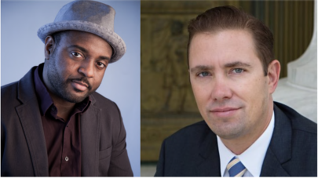
    
  

Reginald Dwayne Betts & Shon Hopwood 

# Character and Fitness 

All states limit bar admission to candidates of "good moral character," but the contours of the requirement can vary widely from state to state and examiner to examiner. The substance of the good moral character requirement are vague—perhaps deliberately vague?—but typically include honestly, respect for the law, and respect for the rights of others. Typically, applicants are rejected for failing to satisfy the requirement on the basis of failure to disclose material facts on the bar exam application, criminal conduct or convictions, and fraudulent or dishonest behavior. 

In theory, applicants who have engaged in past disqualifying conduct may qualify for admission by proving their rehabilitation. But historically, many bar examiners have rejected applicants based on criminal convictions, irrespective of any evidence of rehabilitation. In recent years, this tendency has begun to change. Among other things, the Washington Bar Association approved the admission of 
Shon Hopwood
, 
who pled guilty to bank robbery in 1998 and served 10 years in federal prison, where he taught himself the law and drafted a successful petition for certiorati to the Supreme Court for one of his fellow inmates, in 
Fellers v. United States,
 540 U.S. 519 (2004)
. 
After his release from prison, Hopwood graduated from the University of Washington School of Law and clerked on the D.C. Circuit. He is currently an 
Associate Professor of Law
 
at Georgetown University Law Center. You can read more about Hopwood's story in his book 
Law Man: My Story of Robbing Banks, Winning Supreme Court Cases, and Finding Redemption 

(
2012
). 
    

    
    
    
    

    
    
  

In 1996, when he was 16 years old, 
Reginald Dwayne Betts
 
participated in a carjacking. He was convicted and served 8 years in prison, where he finish high school and began writing poetry. Betts was released from prison in 2005, and immediately enrolled in community college. Two years later he received a full scholarship from the University of Maryland. After graduating, he received a poetry fellowship from Harvard's Radcliffe Institute for Advanced Study, before enrolling in Yale Law School. After graduation, he passed the Connecticut bar examination, but was initially 
denied admission
 
to the Connecticut bar because of his criminal record. On appeal, the Connecticut Bar Examining Committee 
reversed itself
 
and granted Betts's application for admission. He is 
current!'
 
completing a Ph.D. in Law at Yale and plans to become a law professor. 

Other formerly incarcerated people have also rehabilitated themselves and become lawyers, including 
Cleodis Floyd
, 
Allan P. Haber
, 
and 
Tarra Simmons
. 
Jarrett M. Adams
 
was wrongfully convicted of sexual assault at 17 and served 10 years in prison before he was exonerated. He graduated from the Loyola University Chicago School of Law and is currently practicing law in Chicago. 

Other formerly incarcerated people have graduated from law school, but been denied bar admission for poor moral character, based on their conviction. 
Bruce Reilh
 
pled guilty to second-degree murder in 1993, when he was 20, and served 12 years in prison, where he became a jailhouse lawyer. Upon release, he applied to 30 law schools before being admitted at Tulane Law School. But after graduation, the bar refused to admit him, based on his conviction. Similarly, 
Guy Hamilton-Smith pled guilty
 
to possession of child pornography in 2006, when he was 22, and was placed on the Kentucky Sex Offender Registry. He graduated from the University of Kentucky College of Law, but was denied admission to the Kentucky bar, based on his conviction and registration status. He is currently a 
legal fellow
 
at the Mitchell-Hamline School of Law Sex Offense Litigation and Policy Resource Center. 

# Questions: 

1. When should state bar associations be permitted to refuse admission based on an applicant's moral character? What factors should they be permitted to consider in evaluating an applicant's moral character? 

2. Should state bar associations be permitted to refuse admission based on criminal convictions, if the applicant has shown compelling evidence of rehabilitation? 

3. Why do state bar examiners refuse admission to applicants with criminal records who have demonstrated compelling evidence of rehabilitation? Are they trying to protect the integrity of the profession, or the appearance of the integrity of the profession? 

4. Courts routinely readmit attorneys who have been disbarred for crimes like tax evasion and defrauding their clients. Should state bar associations evaluate applications for readmission more or less strictly than initial applications for admission? 
    

    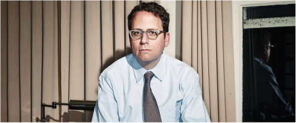
    
  

Stephen Randall Glass (2014) 

# In re Glass,
 316 P. 3d 1199 (Cal. 2014) 

Summary: 
Stephen Glass was a journalist for several national magazines, including the New Republic. Between 1996 and 1998, he wrote dozens of articles that consisted in part or whole of fabrications. He also fabricated evidence to substantiate his reporting. At the same time, he was a student at Georgetown University Law Center. After graduation, he applied for membership in the New York bar, but his application was rejected for poor moral character. In 2006, he applied for membership in the California bar. The State Bar Court ultimately recommended admission, but the California Supreme Court reversed, based on poor moral character. 

Stephen Randall Glass made himself infamous as a dishonest journalist by fabricating material for more than 40 articles for The New Republic magazine and other publications. He also carefully fabricated supporting materials to delude The New Republic's fact checkers. The articles appeared between June 1996 and May 1998, and included falsehoods that reflected negatively on individuals, political groups, and ethnic minorities. During the same period, starting in September 1997, he was also an evening law student at Georgetown University's law school. Glass made every effort to avoid detection once suspicions were aroused, lobbied strenuously to keep his job at The New Republic, and, in the aftermath of his exposure, did not fully cooperate with the publications to identify his fabrications. 

Glass applied to become a member of the New York bar in 2002, but withdrew his application after he was informally notified in 2004 that his moral character application would be rejected. In the New York bar application materials, he exaggerated his cooperation with the journals that had published his work and failed to supply a complete list of the fabricated articles that had injured others. 

Glass passed the California Bar examination in 2006 and filed an application for determination of moral character in 2007. It was not until the California State Bar moral character proceedings 

that Glass reviewed all of his articles, as well as the editorials The New Republic and other journals published to identify his fabrications, and ultimately identified fabrications that he previously had denied or failed to disclose. In the California proceedings, Glass was not forthright in acknowledging the defects in his New York bar application. 

At the 2010 State Bar Court hearing resulting in the decision under review, Glass presented many character witnesses and introduced evidence regarding his lengthy course of psychotherapy, along with his own testimony and other evidence. Many of his efforts from the time of his exposure in 1998 until the 2010 hearing, however, seem to have been directed primarily at advancing his own well-being rather than returning something to the community. His evidence did not establish that he engaged in truly exemplary conduct over an extended period. We conclude that on this record he has not sustained his heavy burden of demonstrating rehabilitation and fitness for the practice of law. 

I. FACTS 

A. Committee of Bar Examiners's evidence 

Stephen Glass was born in September 1972, in a suburb of Chicago, Illinois. After early success as a journalist in college and a developing interest in the law, in 1994 Glass was admitted to New York University School of Law but deferred his intended legal training to accept a position in Washington, D.C., with Policy Review magazine. 

In September 1995 Glass accepted a position at The New Republic magazine. In early June 1996 he began fabricating material for publication. The fabrications continued and became bolder and more comprehensive until he was exposed and fired in May 1998. 

Glass's fabrications began when an article entitled 
The Hall Monitor
 was published containing a fabricated quotation from an unnamed source disparaging United States Representative Pete Hoekstra for behaving in Congress like an elementary school "super hall monitor." He started by fabricating quotations or sources, and ended by publishing wholesale fictions. He testified that "all but a handful" of the 42 articles he published in The New Republic contained fabrications or were entirely fabricated. He also routinely prepared elaborate reporter's notes and supporting materials to give the false impression to the magazine's fact checkers that he had done all the background work for each article and that his informants had spoken words he falsely attributed to them. 

Glass testified at the State Bar Court hearing that he "wrote nasty, mean-spirited, horrible" things about people: "My articles hurt, and they were cruel." He testified that the fabrications gave him "A-plus" stories that afforded him status in staff meetings and also gave particular enjoyment to his colleagues. He said: "Overwhelmingly, what everyone remembers about my pieces are the fake things." 

A notable 1996 article was entitled 
Taxis and the Meaning of Work.
 It was Glass's first cover article and one he viewed as "key" to his successful period of writing for The New Republic. Its theme was that Americans, and in particular, African-Americans, were no longer willing to work hard or to take on employment they consider menial. The article falsely recounted as factual supposed encounters between Glass and three entirely fabricated characters, one a limousine driver, one a taxicab driver, and one a criminal. The limousine driver was depicted as an African-American man who had driven a cab at one time, but now drove a limousine instead because he was "sick of those curry people" and found that limousines attracted beautiful women, or, in the purported words of the driver, gave him "the woo quotient." The author went on to say that he had been permitted to ride along for journalistic purposes with a taxi driver of Middle Eastern descent. The article recounted that the driver stopped for a young AfricanAmerican passenger—''the type of fare Imran would normally refuse" but felt he had to accept because of nearby police observation. The article describes the pounding music audible from the young fare's headphones, and claims that as they neared his destination, the young AfricanAmerican man threatened the driver with a knife, hurled coarse abuse at him, and took his wallet. According to the article: "These things happen,' Imran said coldly on the drive back downtown. 'I give them whatever they want. I just want my life.'" 

Spring Breakdown, published in March 1997, was another example of Glass's fabrications. The theme of the article was that young, conservative Republicans had given up on electoral politics and had turned to drugs and sex. Glass invented a fictional group of male college students attending the Conservative Political Action Conference. To convey the young men's view that conservatives had lost their direction, he attributed to one of them the comment that conservatives were "like a guy who has to pee lost in the desert, searching for a tree." Glass described the young men using marijuana for an hour, then embarking on a search for a young woman to humiliate. The plan was "to choose the ugliest and loneliest they can find," a person the young men described as "a real heifer, the fatter the better, bad acne," for a few of them to lure to their hotel room and persuade to undress. At that point, the remaining men would emerge from under the bed, shout "we're beaching. Whale spotted!" and photograph the woman. After turning to a discussion of asserted losses in popularity experienced by the conservative movement, the article went on to recount the execution of the plot described above. It asserted that a woman in fact emerged from the young men's room unclothed and in tears, while the perpetrators congratulated each other. The article went on: "This repellent scene was only a little beyond the norm of the conference. A wash of despair and alcohol and brutishness hung over the whole thing." More examples of drug use ensued, along with examples of shameless sexual behavior. All of this was fabricated. 

In another article, entitled 
Deliverance
, published in November 1996, Glass recounted receiving unsatisfactory service from a named computer company, and claimed that his complaints to a telephone customer service representative were met with an anti-Semitic slur. In truth, no such slur ever was uttered. Glass also wrote a letter to the president of the company, repeating the accusation, and sent a copy to the Anti-Defamation League. 

Glass also engaged in fabrications in freelance articles published by other magazines. An example was 
Prophets and Losses,
 an article published in Harper's Magazine in February 1998, at which time Glass was also a law student. In that article, Glass represented that he had worked for a telephone psychic service for a time, and recounted fabricated conversations with management, represented as mercenary and either stupid or cynical, and also fabricated conversations with callers, who were depicted as ignorant and desperate. In one case a caller, a fabricated character to whom Glass had attributed an African-American dialect, could not be persuaded to use his money to feed and clothe his seven children by five different mothers instead of buying VCRs and calling telephone psychics for advice on lottery numbers. The article was almost entirely a fabrication. Glass explained at the hearing that his intent was to expose "how the telephone psychic industry preys on minorities. It uses minority celebrities to advertise and shows that are watched predominantly by minorities to lure them into paying insane amounts of money. I was angry about that, and I wanted to attack that, and I used terrible, horrible stereotypes to create, essentially, straw men to knock down." 

In another example, Glass wrote an article entitled 
The Vernon Question
 for George magazine. The lengthy article, published in April 1998, concerned Vernon Jordan, an advisor to then President Clinton during the then emerging Monica Lewinsky scandal. In two paragraphs, Glass used nonexistent sources to describe Jordan's supposed reputation as a "boor" and attributed various fictitious statements to "political operatives," "socialites," "political hostesses" and officials. These persons assertedly stated that Jordan was well known for sexually explicit comments, unwanted sexual advances, and crude stares, and added that he was known in their circles as "Vern the Worm" or "Pussyman," and that young women needed protection against him. Another paragraph attributed to a fictional "watchdog" group contained certain claims about Jordan's asserted conflicts of interest and questionable corporate ethics along with statements attributed to fictional "senior officials" at companies on whose boards Jordan sat, saying that Jordan is "totally unaware of the issues" but "we get what we want, access, and he gets what he wants, cash." These were all fabrications. 

Charles Lane, who was the editor of The New Republic at the time of Glass's exposure, testified for the Committee of Bar Examiners that he had received an early complaint about Glass concerning an article entitled 
Boys on the Bus,
 depicting the actor Alec Baldwin and his brother as silly celebrities whose efforts during a bus tour to campaign on the issue of campaign finance reform were based on ignorance. A representative of Baldwin's disputed the assertion in the article that the actor had been giving out autographs during the bus tour, but Glass repudiated the accusation in print in The New Republic. It was not until Glass prepared his application to the California State Bar that he acknowledged that this article contained fabricated evidence to the effect that interest in the bus tour came from movie fans seeking autographs and referred to a fabricated person who opined that Baldwin lacked real understanding of campaign finance reform. 

Although at the time, the 
Boys on the Bus
 incident seemingly was resolved in Glass's favor, Lane's suspicions were aroused in May 1998 when a journalist employed by Forbes Digital Tool telephoned to warn him that factual assertions in Glass's recent article for The New Republic 

magazine, 
Hack Heaven,
 did not seem to be true. The article had described a teenager hacking a California software company and extorting money to stop the intrusion. The article described a convention in Bethesda, Maryland, where some of the events occurred, and when Lane challenged Glass, the latter journeyed with Lane to Bethesda, purporting to identify the building where the convention had been held. A person working in the building denied such a convention had occurred, and Lane became persuaded that Glass was lying. Lane pressed Glass about the factual basis for the article, and although Glass was evasive, he insisted the article was accurate. Glass spent the night at home fabricating what he would assert were his reporter's notes from interviews, fake business cards, a voicemail box, a website, and newsletters. He also induced his brother to impersonate a source. 

Upon their return to the office from Bethesda, Glass lobbied the executive editor and others to intervene on his behalf with Lane, urging that he was being treated unfairly. Lane, now suspecting that other fabrications may have occurred, wanted to fire him, but in response to the lobbying, suspended him. The next day, a Saturday, Lane was surprised to discover Glass at the office. Thinking Glass had been told not to return, Lane suspected he had altered his computer files. He confronted Glass with evidence that Glass had used his brother as a false source in the 
Hack Heaven
 piece. Ultimately, during this exchange Glass admitted the article was fabricated, and Lane fired him. Lane found on Glass's desk a letter Glass had written to his landlord, falsely stating he had been transferred by The New Republic to New York and needed his security deposit refunded. Lane also found the letter Glass had written to the chief executive of Gateway computers, again stating the falsehood that a customer service employee had used an anti-Semitic slur against Glass. 

Lane reviewed all of Glass's articles over the course of the following three or four weeks. He received a letter from Glass apologizing and saying he had instructed his lawyers to cooperate with The New Republic. Lane compiled a summary of the material in Glass's articles that he found suspicious and submitted the summary to Glass's counsel, who it was agreed would stipulate to those findings of Lane's that Glass believed to be correct. At the time, Lane concluded that 27 of the 42 articles Glass had written for the magazine contained fabrications, and Lane wrote two editorial articles informing the magazine's readership to this effect. 

Lane was very surprised to learn for the first time in the California State Bar proceeding that there were four articles Glass identified in his California Bar application as fabrications that he, Lane, had not even suspected were flawed. Lane was also surprised that four of the articles he had identified to Glass's counsel as suspicious, but which Glass had declined to stipulate contained fabrications, were now admitted in the California State Bar application to involve fabrications—including the disturbing 
Taxis and the Meaning of Work
, along with 
Deliverance, with its false claim of anti-Semitism, and 
Boys on the Bus,
 which had involved the magazine in a dispute over authenticity even before Glass's exposure. 

Lane testified that he thought Glass had perpetrated an elaborate hoax on readers and was engaged in a con game, not journalism. He testified that Glass's case had been highlighted at the Newseum, a Washington, D.C., museum of journalism, as one of the worst examples of 

misconduct in journalistic history. Lane noted that The New Republic was put to the expense of hiring a private investigator to analyze Glass's articles and incurred legal fees in the tens of thousands of dollars. He testified that Glass had not offered him reimbursement for the magazine's expenses, nor did he offer to refund any portion of the salary he had been paid. Lane added that the fabrications hurt the magazine's reputation, relationships between employees, and of course hurt those maligned in the articles. Lane was not mollified by a letter of apology he received from Glass in August 2003, around the time Glass's novel, 
The Fabulist, was published. Lane considered the letter fawning. Lane considered Glass "flagrantly incapable of producing honest journalism," and concluded that his record of systematic deception and lack of thorough confession made him unemployable as a journalist. 

Richard Bradley, who was Washington affairs editor for George magazine and Glass's editor for his freelance articles for that magazine, testified on behalf of the Committee. Bradley stated that when he learned of the scandal involving Glass at The New Republic, he investigated the background for the three freelance articles Glass had published, as well as a fourth article that Glass had submitted and that was being edited. On investigation, the article on Vernon Jordan "blew apart like a dandelion in a strong wind." Assertions in the other articles were difficult to substantiate. When, within a week of learning there were problems with Glass's work, Bradley contacted Glass for help in identifying problems in the articles, Glass responded that he was psychologically incapable of doing so and that he was suicidal, and hung up. The magazine published an editorial indicating that significant portions of the Vernon Jordan article appeared to be false, and that the fabrications were woven into reliable reporting so that it was difficult to distinguish them. Glass never contacted Bradley to tell him what was true or false in his articles in George magazine, nor was Bradley contacted by Glass's lawyer. (Glass did send a letter of apology to the magazine's editor-in-chief.) Bradley believed that Glass had discredited journalism, contributing to the misconception that journalists are "craven and dishonest." 

Bradley commented that Glass's articles "caricatured and mocked their subjects and I felt that the perceptions promoted by Glass's fabrications, in these examples of African-American people and conservatives, could not be corrected as easily as a factual mistake could be." Because he would not be credible, Bradley would not hire Glass as a journalist. 

Joseph Landau, who later became a law professor at Fordham University Law School, was a fact checker at The New Republic while Glass worked there. He testified that Glass had a superior reputation for accuracy among fact checkers because his notes were so thorough and he was apparently so forthcoming, but he tended to push the fact-checking process to the last minute so that it was rushed and could not be done face-to-face. At times Glass could not verify certain facts but would promise Landau to telephone the source. Glass would soon return with confirmation and updated material, a process that reaffirmed the witness's sense that the fact checking was working. Landau had trusted him. Landau received a letter of apology from Glass in the summer of 2004, some six years after Glass had been exposed, and found it to be general and vague. 

Louis Miller, a lawyer and chairperson of the board of D.A.R.E., testified that Glass published falsehoods in articles in The New Republic in March 1997 and Rolling Stone in March 1998 that 

impaired the organization's reputation, because the articles claimed D.A.R.E. was ineffective. According to Miller, the articles contained fabricated "evidence" that the organization had engaged in a widespread campaign of heavyhanded and even violent criminal tactics to counter academic and journalistic criticism of the program. D.A.R.E. sued Glass for libel and settled after Glass agreed the challenged information was fabricated, issued a retraction, and paid the organization's legal expenses of between $25,000 and $50,000. D.A.R.E. did not receive a letter of apology from Glass before it filed suit. D.A.R.E. sued Rolling Stone for defamation but lost on the ground that D.A.R.E. had failed to establish actual malice. 

Glass graduated from law school in 2000, when he also took and passed the New York bar examination. He applied to become a member of the New York bar in 2002. After an evidentiary hearing before a subcommittee of a committee on character and fitness, and pursuant to apparent custom, in September 2004, a representative of that committee informed Glass informally that his application would be rejected, so he withdrew it. The record does not disclose the reason for the tentative decision. 

In his application to the New York bar, Glass described his misconduct and firing. His application and supporting materials included only 20 articles containing fabrications. Glass wrote that he had apologized to the editor of The New Republic, saying, "I also worked with all three magazines (referring to The New Republic, Harper's, and George magazines) and other publications where I had written freelance articles to identify which facts were true and which were false in all of my stories, so they could publish clarifications for their readers." 

At the hearing, Lane challenged the quoted statement as untrue. Lane believed that Glass had failed to come forward to actively assist The New Republic in identifying his fabrications, and instead had placed the entire burden of identifying his errors on Lane. Lane testified: "Well, he didn't work with us. The effort we went through, over the course of nearly a month, to investigate all those stories would have been unnecessary if he had worked with us, and simply come forward and laid bare everything that was untrue in his stories. Instead, he sought legal counsel and, in effect, clammed up. When I read the statement that he's laid out in this proceeding, I discovered that, even to this day, he has not—or had not—come clean about everything. So I'm a little amazed to see that he was representing to somebody that he worked with The New Republic to separate fact from fiction in his articles. That was definitely not my experience." 

B. Applicant's evidence 

According to Glass, during his childhood and young adulthood his parents exerted extremely intense and cruel pressure upon him to succeed academically and socially. Glass felt that The New Republic offered an extremely competitive atmosphere and that his journalistic efforts there failed to make a mark sufficient to ensure his retention after his year term had elapsed. It was after a visit to the family home, when his parents berated him for his apparent failure even in what they considered the worthless career of journalism, that he began fabricating material for publication. He also fabricated reporter's notes and supporting materials for his articles. His aim was to impress his parents and colleagues. 

Once he was fired from The New Republic, Glass was distraught, suicidal, and unable to focus, almost immediately entering therapy. He nonetheless hired counsel whom he directed to "work with The New Republic." Glass testified that he believed that The New Republic wanted to conduct its own investigation because it did not trust him and testified that "I came to understand that they were going to provide me with a list of fabricated articles, and that I was to affirm whether or not the article was fabricated that they showed me or that they listed." He had fabricated more than The New Republic had discovered in its investigation, although he testified that due to his distress he did not realize this when he reviewed the list or later when he glanced at The New Republic's editorials listing his fabrications. Four of his articles containing fabrications were not on the list and he had erroneously denied there were fabrications in four articles that were on the list, including 
Boys on the Bus
, 
Deliverance
, and 
Taxis and the Meaning of Work.
 He did not read the editorials—incomplete, as it turned out—that Lane published listing his fabricated articles. In fact, he closely read those articles for the first time when the California State Bar asked him to list all of his fabricated articles. Glass testified that he had "no information" indicating that his lawyers had failed to convey information to The New Republic. 

Glass did well in law school. Within a few days of his firing, he rescheduled an exam and within a week, managed to earn a B-plus grade on an exam. He explained, however, that this was a poor grade for him. 

Members of Georgetown University's law school faculty testified on his behalf at the hearing. Professor Susan Bloch telephoned him when the scandal first broke and asked if he needed someone to talk to. She appointed him as her research assistant, praising him as one of the brightest and best workers she ever had encountered. She found him to be honest and developed complete trust in him. She recommended him for a judicial internship during law school and a clerkship after graduation. Bloch maintained friendly contact with Glass over the years, including after he moved to California, and testified on his behalf when Glass applied for admission to the New York bar. She testified that she believed Glass had learned from his wrongdoing, that the trauma of his exposure would keep him from ever repeating such behavior, and that she had never observed any dishonesty on his part. She did not read his fabricated articles but was generally aware of their content. 

Professor Stephen Cohen, also of the Georgetown law school, testified that Glass took full responsibility for his misconduct. They became friends and Glass was a welcome visitor with Cohen's family. Cohen believed Glass would be honest and ethical as an attorney; in sum, he believed Glass to be fully rehabilitated. Cohen deemed it "presumptuous" and "offensive" when counsel for the Committee of Bar Examiners asked him whether the Georgetown law school application should be read to have required Glass to notify the school that the journalistic honors he listed in his application may have been based in part on fabricated journalism. 

In 2001, at the end of his clerkship, Glass moved to New York to be with his girlfriend, and underwent psychoanalysis on a four-day-a-week basis. In June 2001 Glass entered into a 

contract to write a novel based on his experiences at The New Republic, testifying that his psychiatrists advised him that it would be therapeutic to write the book, which he hoped would serve as a warning to young journalists. He was paid an advance of $175,000 and sold subsidiary rights for $15,000. He wrote the novel, 
The Fabulist
, and appeared on the television program 60 Minutes in May 2003 (just prior to the date of publication) to discuss his experiences. He claimed that it was not his intent to use the appearance to sell his book, but rather to offer a public apology. 

During his residence in New York, and mostly between 2001 and 2004, Glass also undertook to handwrite approximately 100 letters of apology to journalists affected by his fabrications, as well as to the persons who were injured by his articles. He also spoke at a journalism forum at George Washington University in 2003, where he was loudly berated by other journalists. He spoke at a journalism class at Columbia and to a civics organization for high school students. In addition, he worked at a senior center on a regular basis for approximately one year in New York. 

Concerning the questions that had arisen about the accuracy of his New York bar application, specifically his assertion that he had "worked with" the affected magazines "to identify which facts were true and which were false in all [his] stories, so they could publish clarifications," Glass testified that perhaps he should have written that he "offered to work with all three magazines," or in fact, that he "offered to work through counsel," but added that he did not intend to make any misrepresentation or exaggeration. He testified that he assumed his lawyer had contacted George magazine, as Glass had instructed him to do, and that he did not prepare a list of fabrications for George magazine. He explained that he attached to his New York bar application the editorials The New Republic had published incompletely listing his fabrications, but he did not read them, or at least did not read them carefully at that time. He also attached the notice that George magazine had published about his work—an article that did not refer to two of his three articles for George that contained fabrications. He reviewed these carefully for the first time in preparation for the California State Bar hearing. 

When asked at the hearing in the present matter whether it would be accurate to say that he offered to work with The New Republic to identify which facts were true and which were false in all of his stories, he answered, "I believe that was my intention at the time, yes, and I believe I tried to do that." He explained that what he meant by this was that he asked his counsel to offer to go through the articles to identify fabrications, and then a "joint defense agreement was entered into, proposed by The New Republic, and we entered into a joint defense agreement that constructed this system." 

Similarly, Glass explained, he did not actually undertake any work with Harper's Magazine to identify what was true and what was false in his articles, but "offered to work with them, or asked counsel to offer." He did not "have a memory of asking" his attorney whether counsel had contacted Harper's. When asked whether, when he prepared his New York bar application, he noticed or was troubled by the absence of any article from Harper's about his fabrications, he testified that he still assumed counsel had offered to exchange information or to enter into an 

agreement with Harper's. When pressed on his failure to confirm counsel's contact with Harper's, he testified: "I confirmed—well in my head I asked counsel to do something and he didn't tell me otherwise, I believed it to have occurred." 

Concerning his decision to list only 20 articles containing fabrications in his New York bar application materials, Glass emphasized that he had not been asked for a complete list of articles containing fabrications, but rather in a telephone conversation, an employee of the committee on character and fitness asked for "a list of articles that contained a statement about a real person or real entity, as opposed to a fake person or a fake entity, that reflected something negative upon that real person or real entity." He wrote a letter to that committee memorializing this telephone conversation, saying he had been asked to list instances in which his fabrications "had a harmful impact on real persons. In response, I've gone back through all of my articles to identify those in which potentially harmful false statements were made about actual persons and actual organizations," and also warning that there might be inadvertent omissions. He did not list 
Deliverance
, 
Boys on the Bus,
 or an article concerning Ted Turner entitled 
Gift of the Magnate
, although these contained fabrications. He explained at the California hearing that the customer service agent to whom he attributed the anti-Semitic slur in Deliverance
 was a "made-up character," and so, he insisted, the article did not harm a real person. When pressed, he admitted that the article could have caused harm to the customer service agent the company determined had assisted him, and to the company. 

Similarly, he did not include the 
Boys on the Bus
 article in his New York bar materials because the person to whom he attributed the statement that Alec Baldwin did not know much about campaign finance reform was fake, and he had created some "fake fans." When asked whether the article harmed Alec Baldwin, a real person, he responded that "Alec Baldwin, truth be told, did not know much about campaign finance reform." When pressed, he conceded that there was a potential for injury to Baldwin. 

Glass testified that he moved to California in the fall of 2004. He was hired by the Carpenter, Zuckerman and Rowley law firm as a law clerk. The firm has many homeless clients, and in addition to the legal work he does on their cases, he has helped them with their personal problems, even with regard to matters of personal hygiene. 

Originally Glass undertook volunteer work in Los Angeles, but because his law firm encouraged him to stop taking time off during the workday, he arranged to work extra hours for deserving clients on matters for which his firm had no expectation of collecting fees. 

California Attorney Paul Zuckerman testified that he decided to give Glass a chance as a law clerk. After initially assigning Glass minor projects and exercising close oversight, Zuckerman became convinced that Glass was one of the best employees in the firm, with a fine intellect, a good work ethic, and reliable commitment to honesty. Glass exhibited great compassion, assisting at a personal level with difficult clients and helping to find resources and social services for some of the firm's many homeless clients. Other lawyers who had worked for or with the firm confirmed Zuckerman's view of Glass as an employee who conducted excellent 

legal research, was assiduous and hyperscrupulous about honesty, and stopped to think about ethical issues. 

Also offered in support of Glass's application were affidavits that had been submitted in support of his New York bar application from the judges for whom Glass had worked during and immediately after completing law school. Both found him highly competent and honest at that time. Additional declarations from attorneys and friends that had been submitted with the New York bar application were offered in support. 

Dr. Richard Friedman, a psychiatrist, testified that he had treated Glass since 2005, and believed he had developed good judgment, scrupulous honesty, and the ability to handle difficult situations well. Dr. Friedman reported that he would be astonished if Glass committed misconduct as he had in the past, both because of the growth of character and moral sense the doctor had observed, but also because of a strong instinct to protect himself from the traumatic results of his prior misconduct. He reported that Glass had no sociopathic personality traits. 

Dr. Richard Rosenthal, a psychiatrist and psychoanalyst who is known for treating gamblers and those with impulse control disorders, was approached by Glass's attorney in 2005. Rosenthal had an evaluative as well as therapeutic relationship with Glass that began in 2005 and continued with meetings once or twice a month until the time of the hearing. 

Dr. Rosenthal identified Glass's underlying psychological issues as a need for approval, a need to impress others, and a need for attention, and pointed also to Glass's fear of inadequacy, rejection, and abandonment. Rosenthal testified that when they met in 2005, Glass needed to overcome enormous shame and learn to forgive himself. Through therapy, Glass learned to be realistic about family issues and to set boundaries. Rosenthal believed that Glass had grown up in a family that exerted tremendous pressure on him to succeed yet always made him feel like a failure. In Rosenthal's opinion, Glass was rehabilitated, meaning that he was extremely conscientious and honest, avoided the appearance of impropriety, had reasonable goals and expectations, had gained empathy and tolerance, and would not allow himself to be overwhelmed by stress. The doctor saw no evidence that Glass was a sociopath. 

Glass himself described his therapy, which had commenced very shortly after his exposure and continued to the time of the 2010 hearing, that is, for 12 years. Through therapy he had learned to separate his feelings about his family from the work environment and to "set boundaries within my family." He testified that he believed the most important thing he could do to make amends was to change himself. 

Martin Peretz, who owned and managed The New Republic at the time of the fabrications, testified on Glass's behalf and had developed a charitable view of his misconduct by the time of the California State Bar hearing. He blamed himself and, even more, the magazine's editors for encouraging Glass to write zany, shocking articles and for failing to recognize the improbability of some of Glass's stories. He found the harm of the scandal to the magazine to be minimal. He had renewed social contact with Glass in the past few years and believed that Glass had been 

harshly treated. He would not rule out hiring Glass again as a journalist. He explained that in his experience as a professor "the most brilliant students plagiarize," complaining to the Committee's counsel, "I actually find your pursuing him an act of stalking." 

Additional character witnesses included Melanie Thernstrom, a journalist, memoirist, and friend who testified that she had known Glass for more than a decade because she was a close friend of his girlfriend, Julie Hilden. Her initial skepticism about him dissolved soon after she met him and she believed he had become kind, generous, loyal, responsible, empathetic and above all, honest. Thernstrom witnessed Glass during the period he wrote letters of apology and said that each letter required considerable work and caused him anguish. She found him to be very sorry for the deceptions, and believed that he had taken responsibility for his past acts and would never deceive again. She had observed that Glass was intelligent, hardworking, and empathetic with clients who were injured. She thought the Committee was "picking on" irrelevant issues— that is, the exact number of Glass's deceptive articles and whether or when he had disclosed them all. She believed the Committee's position was "sophistic." In her view, it was enough that he had admitted his misconduct and apologized for it, and she believed that there was no current, ongoing damage from his fabricated articles because Glass's work had been entirely discredited. 

Lawrence Berger, a friend, testified on Glass's behalf, saying that Glass immediately told him about the scandal when they met. He testified that Glass is especially committed to being a good person now, being remarkably ethical and a devoted friend. According to Berger, Glass's efforts during the period he wrote the letters of apology were never perfunctory. 

Julie Hilden, a freelance lawyer and aspiring scriptwriter and Glass's longtime live-in girlfriend, also testified on his behalf. He took good care of her during a prolonged, serious illness, even though she lived in New York and he was completing law school and doing his clerkship in Washington, D.C., at the time. She testified that he immediately demonstrated that he was very serious about being completely honest in every detail, and honesty is still an overriding concern. She observed the great effort he put into writing letters of apology during a prolonged period between 2002 and 2004. She explained that he takes a personal interest in clients, works very hard for them, and accepts their telephone calls at all hours, including nights and weekends. 

C. California State Bar proceedings 

Glass took and passed the California Bar examination in 2006 and in July 2007 filed an application for determination of moral character as part of his bar application. The Committee of Bar Examiners denied the application, but on Glass's request a moral character hearing was conducted in the State Bar Court in April and May of 2010. 

The State Bar Court's hearing judge found that Glass had established good moral character. The Committee sought review. The State Bar Court Review Department independently reviewed the record, and a majority of the three-judge panel agreed with the hearing judge that Glass had established good moral character. 

The Review Department majority acknowledged that Glass's misconduct had been "appalling" and "egregious," but believed that Glass had satisfied his "heavy burden of proof" and established his rehabilitation. The majority stated that Glass's burden of proof as a first-time applicant was "substantially less rigorous" than it would have been for an attorney seeking reinstatement after disbarment. Moreover, the majority declared, its "task here is not to dwell on his past misdeeds, but to determine his present moral fitness." It added that because the "policy of the state favors admission of applicants who have achieved reformation," the majority resolved any reasonable doubt concerning Glass's rehabilitation in his favor and "gave him the benefit of any conflicting but equally reasonable inferences flowing from the evidence." The majority concluded that "cumulatively, Glass's legal employment history, community service, character witnesses, progress in therapy, remorse and acceptance of responsibility" provided a more accurate picture of his moral character than his misconduct of many years ago. 

The majority acknowledged that Glass had not fully identified his fabrications until the California Bar proceedings, but observed that Glass had not asked the bar to excuse that failure. The majority also expressed some concern regarding Glass's New York bar application, observing that he had "mischaracterized the degree to which he cooperated with the magazines to identify the fabricated articles." On the other hand, in the majority's view, Glass's careful review of his prior articles in connection with the California State Bar proceedings indicated that he had fully acknowledged his wrongdoing, an "essential step towards rehabilitation." In addition, the majority concluded that Glass had left it to his attorneys to work with the magazines because of his emotional turmoil, and "the State Bar did not prove whether Glass's attorney failed to 'work with' some of the publishers and neither did Glass establish that his attorney had completed the task as requested." 

The majority commented upon Glass's excellent reputation with law professors and judicial employers, and observed that Glass's rehabilitation seemed to have occurred over a number of years. The majority recounted the course of Glass's therapy and his therapists' testimony on his behalf in support of the view that he was rehabilitated. The majority further referred to Glass's community service in New York and commented that his work commitments rendered him unable to continue non-work-related community service in Los Angeles, where he had resided since 2004. 

The majority placed great emphasis on Glass's character witnesses, saying: "We afford great weight to Glass's character witnesses, who were community leaders, employers, judges, and attorneys, and all of whom spoke with the utmost confidence in Glass's good moral character and rehabilitation." 

The majority declined to believe restitution was required of Glass. "We consider his present character in light of his previous moral shortcomings citation, and we are at a loss to understand how monetary restitution would mitigate the reputational harm that Glass had caused." The majority found more significant evidence that he has made amends both to the journalistic 

community in his public admissions concerning his fabrications and to his victims in the letters he sent them. 

The majority concluded that "even those who have committed serious, indeed egregious, misconduct, are capable of overcoming their past misdeeds" and that persons who had reformed should be rewarded with an opportunity to serve as lawyers. 

The Review Department panel's dissenting opinion concluded that Glass had not proven full rehabilitation, pointing to his "staggering" two-year period of "multi-layered, complex and harmful course of public dishonesty." The dissenting judge found especially troubling Glass's omissions and misstatements in his application to the New York bar. "To gain admission to practice law in New York, Glass understated the number of articles he had fabricated and exaggerated his efforts to help the magazines identify those articles. At a time when he should have been scrupulously honest, he presented an inaccurate application because it benefitted him—the same behavior as his earlier misconduct." The dissenting opinion concluded: "Given the magnitude of his misconduct and his subsequent misrepresentations on his New York bar application, Glass has not shown proof of reform by a lengthy period of exemplary conduct which 'we could with confidence lay before the world' to justify his admission." 

II. DISCUSSION 

A. Applicable Law 

(1) To be qualified to practice law in this state, a person must be of good moral character. Good moral character includes "qualities of honesty, fairness, candor, trustworthiness, observance of fiduciary responsibility, respect for and obedience to the law, and respect for the rights of others and the judicial process." "Persons of good character do not commit acts or crimes involving moral turpitude—a concept that embraces a wide range of deceitful and depraved behavior." A lawyer's good moral character is essential for the protection of clients and for the proper functioning of the judicial system itself. 

(2) When the applicant has presented evidence that is sufficient to establish a prima facie case of his or her good moral character, the burden shifts to the State Bar to rebut that case with evidence of poor moral character. Once the State Bar has presented evidence of moral turpitude, the burden "falls squarely upon the applicant to demonstrate his or her rehabilitation." 

Of particular significance for the present case is the principle that "the more serious the misconduct and the bad character evidence, the stronger the applicant's showing of rehabilitation must be." "Cases authorizing admission on the basis of rehabilitation commonly involve a substantial period of exemplary conduct following the applicant's misdeeds." 

Moreover, "truly exemplary" conduct ordinarily includes service to the community. 

(3) We independently weigh the evidence that was before the State Bar Court, recognizing that the applicant bears the burden of establishing good moral character. We ask whether the 

applicant is fit to practice law, paying particular attention to acts of moral turpitude and prior misconduct that bears particularly upon fitness to practice law. 

In reviewing moral fitness findings made by the State Bar, we accord significant weight to the State Bar Court hearing judge's findings of fact to the extent they are based on witness demeanor and credibility. Although "the moral character determinations of the Committee and the State Bar Court play an integral role in the admissions decision, and both bear substantial weight within their respective spheres," we are not bound by the determinations of the Committee or the State Bar Court. Rather, we "independently examine and weigh the evidence" to decide whether the applicant is qualified for admission. 

(4) Contrary to the Review Department majority's view that Glass's burden was significantly lighter than it would be for an attorney seeking readmission because he was a first-time applicant, in many respects the difference between admission and disciplinary proceedings is "more apparent than real." "Because both admission and disciplinary proceedings concern fitness to practice law as evidenced by acts of moral turpitude, this court routinely consults its disciplinary cases in deciding whether applicants for admission possess, at the outset, the requisite moral character." At both admission and disciplinary proceedings, "the common issue is whether the applicant for admission or the attorney sought to be disciplined 'is a fit and proper person to be permitted to practice law, and that usually turns upon whether he has committed or is likely to continue to commit acts of moral turpitude," particularly misconduct that bears upon the applicant's fitness to practice law. 

"However, unlike in disciplinary proceedings, where the State Bar must show that an already admitted attorney is unfit to practice law and deserves professional sanction, the burden rests upon the candidate for admission to prove his own moral fitness." 

B. Analysis 

(5) The Review Department majority believed it was reasonable to draw all inferences in favor of Glass, failing to be constrained by our discussion in 
Gossage
, as we shall explain. Although an applicant ordinarily receives the benefit of the doubt as to "conflicting, equally reasonable inferences" concerning moral fitness, the State Bar Court majority failed to recognize that this rule does not materially assist applicants who have engaged in serious misconduct. This is because "where serious or criminal misconduct is involved, positive inferences about the applicant's moral character are more difficult to draw, and negative character inferences are stronger and more reasonable." When there have been very serious acts of moral turpitude, we must be convinced that the applicant "is no longer the same person who behaved so poorly in the past," and will find moral fitness "only if he or she has since behaved in exemplary fashion over a meaningful period of time." 

Applying the 
Gossage
 standard in this case of egregious malfeasance, we begin our own independent review of the record with a focus on Glass's many acts of dishonesty and professional misconduct, and then ask whether he has established a compelling showing of 

rehabilitation and truly exemplary conduct over an extended period that would suffice to demonstrate his fitness for the practice of law. 

Glass's conduct as a journalist exhibited moral turpitude sustained over an extended period. As the Review Department dissent emphasized, he engaged in "fraud of staggering proportions" and he "used his exceptional writing skills to publicly and falsely malign people and organizations for actions they did not do and faults they did not have." As the dissent further commented, for two years he "engaged in a multi-layered, complex and harmful course of public dishonesty." Glass's journalistic dishonesty was not a single lapse of judgment, which we have sometimes excused, but involved significant deceit sustained unremittingly for a period of years. Glass's deceit also was motivated by professional ambition, betrayed a vicious, mean spirit and a complete lack of compassion for others, along with arrogance and prejudice against various ethnic groups. In all these respects, his misconduct bore directly on his character in matters that are critical to the practice of law. 

Glass not only spent two years producing damaging articles containing or entirely made up of fabrications, thereby deluding the public, maligning individuals, and disparaging ethnic minorities, he also routinely expended considerable efforts to fabricate background materials to dupe the fact checkers assigned to vet his work. When exposure threatened, he redoubled his efforts to hide his misconduct, going so far as to create a phony website and business cards and to recruit his brother to pose as a source. In addition, to retain his position, he engaged in a spirited campaign among the leadership at The New Republic to characterize Lane's obviously well-founded concerns as unfair and to retain his position. 

Glass's conduct during this two-year period violated ethical strictures governing his profession. Believing that "public enlightenment is the forerunner of justice and the foundation of democracy," the Code of Ethics of the Society of Professional Journalists provides that "the duty of the journalist is to further those ends by seeking truth and providing a fair and comprehensive account of events and issues, striving to serve the public with thoroughness and honesty. Deliberate distortion is never permissible." Glass's behavior fell so far short of this standard that Lane recounted seeing Glass featured in an exhibit in the Newseum, a Washington, D.C., museum dedicated to journalism, as embodying one of the worst episodes of deceit in journalistic history. 

Glass's misconduct was also reprehensible because it took place while he was pursuing a law degree and license to practice law, when the importance of honesty should have gained new meaning and significance for him. 

Moreover, Glass's lack of integrity and forthrightness continued beyond the time he was engaged in journalism. Once he was exposed, Glass's response was to protect himself, not to freely and fully admit and catalogue all of his fabrications. He never fully cooperated with his employers to clarify the record, failed to carefully review the editorials they published to describe the fabrications to their readership, made misrepresentations to The New Republic regarding some of his work during the period he purported to be cooperating with that magazine, and 

indeed some of his fabrications did not come to light until the California State Bar proceedings. He refused to speak to his editor at George magazine when the latter called to ask for help in identifying fabrications in the articles Glass wrote for that magazine. 

(6) The record also discloses instances of dishonesty and disingenuousness occurring after Glass's exposure, up to and including the State Bar evidentiary hearing in 2010. In the New York bar proceedings that ended in 2004, as even the State Bar Court majority acknowledged, he made misrepresentations concerning his cooperation with The New Republic and other publications and efforts to aid them identify all of his fabrications. He also submitted an incomplete list of articles that injured others. We have previously said about omissions on bar applications: "Whether it is caused by intentional concealment, reckless disregard for the truth, or an unreasonable refusal to perceive the need for disclosure, such an omission is itself strong evidence that the applicant lacks the 'integrity' and/or 'intellectual discernment' required to be an attorney." 

Our review of the record indicates hypocrisy and evasiveness in Glass's testimony at the California State Bar hearing, as well. We find it particularly disturbing that at the hearing Glass persisted in claiming that he had made a good faith effort to work with the magazines that published his works. He went through many verbal twists and turns at the hearing to avoid acknowledging the obvious fact that in his New York bar application he exaggerated his level of assistance to the magazines that had published his fabrications, and that he omitted from his New York bar list of fabrications some that actually could have injured real persons. He also testified that he told his lawyer to work with Harper's Magazine to identify his fabrications, yet evaded questions concerning whether his lawyer had done so, while insisting that he took responsibility for an inferred failure to follow what obviously were significant instructions. He asserted that he had been too distraught to recognize that the list of fabrications The New Republic gave his lawyer was incomplete—or that in his response he had denied that articles including the egregious 
Taxis and the Meaning of Work
 were in fact fabricated—while acknowledging that within a few days of his firing he made arrangements to reschedule a final examination for the end of the exam period and did well on the exam he took within a week of his exposure. Indeed, despite his many statements concerning taking personal responsibility, and contrary to what he suggested in his New York bar application, it was not until the California Bar proceedings that he shouldered the responsibility of reviewing the editorials his employers published disclosing his fabrications, thus failing to ensure that all his very public lies had been corrected publically and in a timely manner. He has "not acted with the 'high degree of frankness and truthfulness' and the 'high standard of integrity' required by this process." 

(7) Honesty is absolutely fundamental in the practice of law; without it, "the profession is worse than valueless in the place it holds in the administration of justice." "Manifest dishonesty provides a reasonable basis for the conclusion that the applicant or attorney cannot be relied upon to fulfill the moral obligations incumbent upon members of the legal profession." As the dissent in the Review Department pointed out, "if Glass were to fabricate evidence in legal matters as readily and effectively as he falsified material for magazine articles, the harm to the public and profession would be immeasurable." 

We also observe that instead of directing his efforts at serving others in the community, much of Glass's energy since the end of his journalistic career seems to have been directed at advancing his own career and financial and emotional well-being. 

(8) As Justice Kennard did in her concurring opinion in 
Kwasnik,
 we do well to repeat Justice Felix Frankfurter's "eloquent description" of the moral character required of lawyers: "It is a fair characterization of the lawyer's responsibility in our society that he or she stands "as a shield" in defense of right and to ward off wrong. From a profession charged with such responsibilities there must be exacted those qualities of truth-speaking, of a high sense of honor, of granite discretion, of the strictest observance of fiduciary responsibility, that have, throughout the centuries, been compendiously described as "moral character." 

(9) As for Glass's case for admission, although he points to his youth at the time of his employment as a journalist and an asserted period of rehabilitation of 12 years (measured between the time he was fired and the hearing in the State Bar Court), we have outlined instances of dishonesty and disingenuousness persisting throughout that period, including at the California State Bar evidentiary hearing. In addition, Glass's behavior was under the scrutiny of first the New York bar from 2002 to 2004, and then the California Bar from 2007 to 2010, reducing the probative value of the evidence of his good conduct during those periods. "Good conduct generally is expected from someone who has applied for admission with, and whose character is under scrutiny by, the State Bar." 

(10) The Review Department majority relied heavily on the testimony of Glass's character witnesses, but the testimony of character witnesses will not suffice by itself to establish rehabilitation. Moreover, stressing that Glass's reputation as a journalist had been exploded and that so many years had passed, some of the character witnesses did not sufficiently focus on the seriousness of the misconduct, incorrectly viewing it as of little current significance despite its lingering impact on its victims and on public perceptions concerning issues of race and politics. They also did not take into account, as we do, that the misconduct reflected poorly on the particular commitment to honesty that Glass might have been expected to have had as a law student. For these reasons we believe the Review Department majority accorded too much probative value to the testimony of Glass's character witnesses. 

(11) Glass emphasized the remorse he expressed through his letters to victims, and characterized his novel and his appearance on 60 Minutes as efforts to make amends. Remorse does not establish rehabilitation, however, and in any event, the weight of this evidence is diminished because the letters were not written near the time of his misconduct and exposure, when they might have been most meaningful to the victims, but rather seemed timed to coincide with his effort to become a member of the New York bar. The novel served Glass's own purposes, producing notoriety and a fee of $175,000, and the appearance on 60 Minutes was timed to coincide with the release of the novel. Glass did not offer any restitution to Lane or Bradley. It was not until approximately 2008 that he made an offer to the then friendly Peretz— who roundly disclaimed any interest in restitution—to repay his salary. This offer was made after 

Glass applied to the California Bar and was another oddly belated and, we believe, disingenuous effort at making his victims whole. 

The record of Glass's therapy does not represent "truly exemplary conduct in the sense of returning something to the community." To be sure, through therapy he seems to have gained a deep understanding of the psychological sources of his misconduct, as well as tools to help him avoid succumbing to the same pressures again. His treating psychiatrists are plainly highly competent and well regarded in their field, and they are convinced that he has no remaining psychological flaws tending to cause him to act dishonestly. Glass believed that he could best make amends by changing himself. But his 12 years of therapy primarily conferred a personal benefit on Glass himself. 

(12) Glass points to the pro bono legal work he does for clients of his firm as evidence of sustained efforts on behalf of the community, but we observe that pro bono work is not truly exemplary for attorneys, but rather is expected of them. 

(13) Glass and the witnesses who supported his application stress his talent in the law and his commitment to the profession, and they argue that he has already paid a high enough price for his misdeeds to warrant admission to the bar. They emphasize his personal redemption, but we must recall that what is at stake is not compassion for Glass, who wishes to advance from being a supervised law clerk to enjoying a license to engage in the practice of law on an independent basis. Given our duty to protect the public and maintain the integrity and high standards of the profession, our focus is on the applicant's moral fitness to practice law. On this record, the applicant failed to carry his heavy burden of establishing his rehabilitation and current fitness. 

III. CONCLUSION 

For the foregoing reasons, we reject the State Bar Court majority's recommendation and decline to admit Glass to the practice of law. 

Questions: 

1. 
Stephen Randall Glass
 
(1972-) is currently working at a Beverly Hills law firm as a paralegal. He was the subject of the motion picture 
Shattered Glass
 
(2003). Excellent journalistic accounts of the Glass affair are available from 
Vanity Fair
, 
Forbes
, 
The Los Angeles Times
, 
and 
The New Republic
. 
The New Republic's original corrections are available 
here
 
and 
here
. 
Links to several of Glass's fabricated articles are available on his 
Wikipedia page
. 

2. Did the court provide a fair assessment of Glass's fitness to practice law? Do you agree with the court's conclusion that he failed to rehabilitate himself? Do you agree with the courts assessment of his disclosures in his applications for bar membership in New York and California? 

3. The court described Glass's fabrications as acts of moral turpitude. "Moral turpitude" is generally defined as "an act or behavior that gravely violates the sentiment or accepted 

standard of the community." More specifically, the California Supreme Court has observed, "The concept of moral turpitude escapes precise definition. Moral turpitude has been described as an act of baseness, vileness or depravity in the private and social duties which a man owes to his fellowmen, or to society in general, contrary to the accepted and customary rule of right and duty between man and man. It has been described as any crime or misconduct without excuse or any dishonest or immoral act. The meaning and test is the same whether the dishonest or immoral act is a felony, misdemeanor, or no crime at all." 
Chadwick v. State Bar,
 776 P.2d 240 (Cal. 1989)
. 
Is this a helpful definition? Do you agree with the court that Glass committed acts of moral turpitude? 

4. Was the problem with Glass's articles the fabrications, the content, or both? If Glass had not fabricated any of the facts reported in the articles, would they reflect on his moral character? 

5. Was it proper for the court to reverse the State Bar Court's assessment of Glass's rehabilitation, moral character, and fitness to practice? 

6. What standard of proof did the court apply to Glass's claim of rehabilitation? Was it higher, lower, or the same as the standard applied to attorneys applying for readmission? What standard should courts apply to new applicants for bar admission, as opposed to applicants for readmission? 

7. Many prominent people testified in favor of Glass and his rehabilitation, including some of the people he directly harmed. Should that count in his favor? How seriously did the court take their testimony? 

8. If the court granted Glass's application for admission to practice, do you think it is likely that he would engage in fraudulent or misleading conduct? 

 

# 7.2: Advertising 

Call me on the line. Call me, call me any, anytime. Call me, I'll arrive. You can call me any day or night. Call me™
8 

Attorneys are "professionals" and the bar is a "professional organization." But how, if at all, should the professional status of attorneys affect their commercial behavior? Attorneys have fiduciary duties to their clients and professional duties as officers of the court. But do they have professional duties of decorum to the public as a whole? And how should the bar regulate the commercial activities of attorneys? When do professional norms justify regulation? And in whose interests should the bar regulate the commercial activities of attorneys: the public or its members? 
 

# Advertising 

In the 19th century, attorneys regularly advertised their services in newspapers and magazines. Among other things, patent attorneys solicited patent applications from inventors nationwide. 

But in the early 20th century, state bar associations began to frown on advertising. And in 1908, Canon 27
 
of the American Bar Association's original Canons of Professional Ethics explicitly discouraged advertisement and solicitation as "unprofessional." 

Gradually, the "ethical principles" motivating Canon 27 were refined by state and national bar associations to provide increasingly detailed norms governing what kinds of attorney advertising were permissible, from signage on a law office, to attorney directories, to business card and letterhead design. With the exception of patent and trademark attorneys and proctors in admiralty, most attorneys could not even publicly claim a specific area of practice. 

Unsurprisingly, these limitations on attorney advertising were observed substantially in the breach. State bar associations were hard-pressed to enforce them and enterprising attorneys were wont to avoid them. Pressure for relaxation of the norms gradually mounted, but did not come to a head until 1977, when the Supreme Court finally weighed in. 
 

# Model Rule 7.1: Communications Concerning a Lawyer's Services 
 

# Information About Legal Services 

A lawyer shall not make a false or misleading communication about the lawyer or the lawyer's services. A communication is false or misleading if it contains a material misrepresentation of fact or law, or omits a fact necessary to make the statement considered as a whole not materially misleading. 
 

# Model Rule 7.1: Comments 

108 

Blondie, 
Call Me
 (1980). 

1. This Rule governs all communications about a lawyer's services, including advertising. Whatever means are used to make known a lawyer's services, statements about them must be truthful. 

2. Misleading truthful statements are prohibited by this Rule. A truthful statement is misleading if it omits a fact necessary to make the lawyer's communication considered as a whole not materially misleading. A truthful statement is misleading if a substantial likelihood exists that it will lead a reasonable person to formulate a specific conclusion about the lawyer or the lawyer's services for which there is no reasonable factual foundation. A truthful statement is also misleading if presented in a way that creates a substantial likelihood that a reasonable person would believe the lawyer's communication requires that person to take further action when, in fact, no action is required. 

3. A communication that truthfully reports a lawyer's achievements on behalf of clients or former clients may be misleading if presented so as to lead a reasonable person to form an unjustified expectation that the same results could be obtained for other clients in similar matters without reference to the specific factual and legal circumstances of each client's case. Similarly, an unsubstantiated claim about a lawyer's or law firm's services or fees, or an unsubstantiated comparison of the lawyer's or law firm's services or fees with those of other lawyers or law firms, may be misleading if presented with such specificity as would lead a reasonable person to conclude that the comparison or claim can be substantiated. The inclusion of an appropriate disclaimer or qualifying language may preclude a finding that a statement is likely to create unjustified expectations or otherwise mislead the public. 
 

# Model Rule 7.2: Communications Concerning a Lawyer's Services: Specific Rules 

a. A lawyer may communicate information regarding the lawyer's services through any media. 

b. A lawyer shall not compensate, give or promise anything of value to a person for recommending the lawyer's services except that a lawyer may: 

1. pay the reasonable costs of advertisements or communications permitted by this Rule 

c. A lawyer shall not state or imply that a lawyer is certified as a specialist in a particular field of law, unless: 

1. the lawyer has been certified as a specialist by an organization that has been approved by an appropriate authority of the state or the District of Columbia or a U.S. Territory or that has been accredited by the American Bar Association; and 

2. the name of the certifying organization is clearly identified in the communication. 

d. Any communication made under this Rule must include the name and contact information of at least one lawyer or law firm responsible for its content. 
 

# Model Rule 7.2: Comments 

1. This Rule permits public dissemination of information concerning a lawyer's or law firm's name, address, email address, website, and telephone number; the kinds of services the lawyer will undertake; the basis on which the lawyer's fees are determined, including prices for specific services and payment and credit arrangements; a lawyer's foreign language ability; names of references and, with their consent, names of clients regularly represented; and other information that might invite the attention of those seeking legal assistance. 

9. Paragraph (c) of this Rule permits a lawyer to communicate that the lawyer does or does not practice in particular areas of law. A lawyer is generally permitted to state that the lawyer "concentrates in" or is a "specialist," practices a "specialty," or "specializes in" particular fields based on the lawyer's experience, specialized training or education, but such communications are subject to the "false and misleading" standard applied in Rule 7.1 to communications concerning a lawyer's services. 

ADVERTISEMENT 
 

# DO YOU NEED A LAWYER? <h3 class="calibre28">LEGAL SERVICES AT VERY REASONABLE FEES </h3>
    

    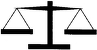
    
  

- Divorce or legal separation-uncontested (both spouses sign papers) 

$175.00 plus $20.00 court filing fee 

- Preparation of all court papers and instructions on how to do your own simple uncontested divorce 

$100.00 

- Adoption-uncontested severance proceeding $225.00 plus approximately $10.00 publication cost 

- Bankruptcy-non-business, no contested proceedings Individual 

$250.00 plus $55.00 court filing fee 

Wife and Husband 

$300.00 plus $110.00 court filing fee 

- Change of Name 

$95.00 plus $20.00 court filing fee 

Information regarding other types of cases furnished on request <h2 class="calibre2">Legal Clinic of Bates & O'Steen </h2>

617 North 3rd Street Phoenix, Arizona 85004 Telephone (502) 252-8838 

Bates v. State Bar ofAriz.,
 433 U.S. 350 (1977) 

Summary: 
Bates and O'Steen were members of the Arizona bar. In 1974, they opened a law office in Phoenix, and published a newspaper advertisement, offering basic legal services at fixed rates. The Arizona bar rules prohibited advertisements, and the Arizona Supreme Court ultimately censured Bates and O'Steen. The Supreme Court reversed, holding that the Arizona bar rule violated the 1st Amendment, because it unreasonably 

prohibited the dissemination of truthful information to the public. The dissent argued that the 1st Amendment should not prohibit the regulation of attorney advertising. 

MR. JUSTICE BLACKMUN delivered the opinion of the Court. 

As part of its regulation of the Arizona Bar, the Supreme Court of that State has imposed and enforces a disciplinary rule that restricts advertising by attorneys. This case presents two issues: whether §§ 1 and 2 of the Sherman Act, 15 U. S. C. §§ 1 and 2, forbid such state regulation, and whether the operation of the rule violates the First Amendment, made applicable to the States through the Fourteenth. 

I 

Appellants John R. Bates and Van O'Steen are attorneys licensed to practice law in the State of Arizona. As such, they are members of the appellee, the State Bar of Arizona. After admission to the bar in 1972, appellants worked as attorneys with the Maricopa County Legal Aid Society. 

In March 1974, appellants left the Society and opened a law office, which they call a "legal clinic," in Phoenix. Their aim was to provide legal services at modest fees to persons of moderate income who did not qualify for governmental legal aid. In order to achieve this end, they would accept only routine matters, such as uncontested divorces, uncontested adoptions, simple personal bankruptcies, and changes of name, for which costs could be kept down by extensive use of paralegals, automatic typewriting equipment, and standardized forms and office procedures. More complicated cases, such as contested divorces, would not be accepted. Because appellants set their prices so as to have a relatively low return on each case they handled, they depended on substantial volume. 

After conducting their practice in this manner for two years, appellants concluded that their practice and clinical concept could not survive unless the availability of legal services at low cost was advertised and, in particular, fees were advertised. Consequently, in order to generate the necessary flow of business, that is, "to attract clients," appellants on February 22, 1976, placed an advertisement in the Arizona Republic, a daily newspaper of general circulation in the Phoenix metropolitan area. As may be seen, the advertisement stated that appellants were offering "legal services at very reasonable fees," and listed their fees for certain services. 

Appellants concede that the advertisement constituted a clear violation of Disciplinary Rule 2101(B). The disciplinary rule provides in part: 

(B) A lawyer shall not publicize himself, or his partner, or associate, or any other lawyer affiliated with him or his firm, as a lawyer through newspaper or magazine advertisements, radio or television announcements, display advertisements in the city or telephone directories or other means of commercial publicity, nor shall he authorize or permit others to do so in his behalf. 

Upon the filing of a complaint initiated by the president of the State Bar, a hearing was held before a three member Special Local Administrative Committee. Although the committee took the position that it could not consider an attack on the validity of the rule, it allowed the parties to develop a record on which such a challenge could be based. The committee recommended that each of the appellants be suspended from the practice of law for not less than six months. Upon further review by the Board of Governors of the State Bar, the Board recommended only a oneweek suspension for each appellant, the weeks to run consecutively. 

Appellants then sought review in the Supreme Court of Arizona, arguing, among other things, that the disciplinary rule violated §§ 1 and 2 of the Sherman Act because of its tendency to limit competition, and that the rule infringed their First Amendment rights. The court rejected both claims. The plurality may have viewed with some skepticism the claim that a restraint on advertising might have an adverse effect on competition. But, even if the rule might otherwise violate the Act, the plurality concluded that the regulation was exempt from Sherman Act attack because the rule "is an activity of the State of Arizona acting as sovereign." The regulation thus was held to be shielded from the Sherman Act by the state-action exemption. 

Turning to the First Amendment issue, the plurality noted that restrictions on professional advertising have survived constitutional challenge in the past. Although recognizing that 
Virginia Pharmacy Board v. Virginia Consumer Council
 
and 
Bigelow v. Virginia
 
held that commercial speech was entitled to certain protection under the First Amendment, the plurality focused on passages in those opinions acknowledging that special considerations might bear on the advertising of professional services by lawyers. The plurality apparently was of the view that the older decisions dealing with professional advertising survived these recent cases unscathed, and held that Disciplinary Rule 2-101(B) passed First Amendment muster. Because the court, in agreement with the Board of Governors, felt that appellants' advertising "was done in good faith to test the constitutionality of DR 2-101(B)," it reduced the sanction to censure only. 

Of particular interest here is the opinion of Mr. Justice Holohan in dissent. In his view, the case should have been framed in terms of "the right of the public as consumers and citizens to know about the activities of the legal profession," rather than as one involving merely the regulation of a profession. Observed in this light, he felt that the rule performed a substantial disservice to the public: 

Obviously the information of what lawyers charge is important for private economic decisions by those in need of legal services. Such information is also helpful, perhaps indispensable, to the formation of an intelligent opinion by the public on how well the legal system is working and whether it should be regulated or even altered. The rule at issue prevents access to such information by the public. 

Although the dissenter acknowledged that some types of advertising might cause confusion and deception, he felt that the remedy was to ban that form, rather than all advertising. Thus, despite his "personal dislike of the concept of advertising by attorneys," he found the ban unconstitutional. 

II The Sherman Act 

We conclude that the Arizona Supreme Court's determination that appellants' Sherman Act claim is barred by the 
Parker v. Brown
 
exemption must be affirmed. 

III The First Amendment B 

The issue presently before us is a narrow one. First, we need not address the peculiar problems associated with advertising claims relating to the quality of legal services. Such claims probably are not susceptible of precise measurement or verification and, under some circumstances, might well be deceptive or misleading to the public, or even false. Appellee does not suggest, 

nor do we perceive, that appellants' advertisement contained claims, extravagant or otherwise, as to the quality of services. Accordingly, we leave that issue for another day. Second, we also need not resolve the problems associated with in-person solicitation of clients—at the hospital room or the accident site, or in any other situation that breeds undue influence—by attorneys or their agents or "runners." Activity of that kind might well pose dangers of overreaching and misrepresentation not encountered in newspaper announcement advertising. Hence, this issue also is not before us. Third, we note that appellee's criticism of advertising by attorneys does not apply with much force to some of the basic factual content of advertising: information as to the attorney's name, address, and telephone number, office hours, and the like. The American Bar Association itself has a provision in its current Code of Professional Responsibility that would allow the disclosure of such information, and more, in the classified section of the telephone directory. We recognize, however, that an advertising diet limited to such spartan fare would provide scant nourishment. 

The heart of the dispute before us today is whether lawyers also may constitutionally advertise the prices at which certain routine services will be performed. Numerous justifications are proffered for the restriction of such price advertising. We consider each in turn: 

1. The Adverse Effect on Professionalism. Appellee places particular emphasis on the adverse effects that it feels price advertising will have on the legal profession. The key to professionalism, it is argued, is the sense of pride that involvement in the discipline generates. It is claimed that price advertising will bring about commercialization, which will undermine the attorney's sense of dignity and self-worth. The hustle of the marketplace will adversely affect the profession's service orientation, and irreparably damage the delicate balance between the lawyer's need to earn and his obligation selflessly to serve. Advertising is also said to erode the client's trust in his attorney: Once the client perceives that the lawyer is motivated by profit, his confidence that the attorney is acting out of a commitment to the client's welfare is jeopardized. And advertising is said to tarnish the dignified public image of the profession. 

We recognize, of course, and commend the spirit of public service with which the profession of law is practiced and to which it is dedicated. The present Members of this Court, licensed attorneys all, could not feel otherwise. And we would have reason to pause if we felt that our decision today would undercut that spirit. But we find the postulated connection between advertising and the erosion of true professionalism to be severely strained. At its core, the argument presumes that attorneys must conceal from themselves and from their clients the reallife fact that lawyers earn their livelihood at the bar. We suspect that few attorneys engage in such self-deception. And rare is the client, moreover, even one of modest means, who enlists the aid of an attorney with the expectation that his services will be rendered free of charge. In fact, the American Bar Association advises that an attorney should reach "a clear agreement with his client as to the basis of the fee charges to be made," and that this is to be done "as soon as feasible after a lawyer has been employed." If the commercial basis of the relationship is to be promptly disclosed on ethical grounds, once the client is in the office, it seems inconsistent to condemn the candid revelation of the same information before he arrives at that office. 

Moreover, the assertion that advertising will diminish the attorney's reputation in the community is open to question. Bankers and engineers advertise, and yet these professions are not regarded as undignified. In fact, it has been suggested that the failure of lawyers to advertise creates public disillusionment with the profession. The absence of advertising may be seen to reflect the profession's failure to reach out and serve the community: Studies reveal that many persons do not obtain counsel even when they perceive a need because of the feared price of 

services or because of an inability to locate a competent attorney. Indeed, cynicism with regard to the profession may be created by the fact that it long has publicly eschewed advertising, while condoning the actions of the attorney who structures his social or civic associations so as to provide contacts with potential clients. 

It appears that the ban on advertising originated as a rule of etiquette and not as a rule of ethics. Early lawyers in Great Britain viewed the law as a form of public service, rather than as a means of earning a living, and they looked down on "trade" as unseemly. Eventually, the attitude toward advertising fostered by this view evolved into an aspect of the ethics of the profession. But habit and tradition are not in themselves an adequate answer to a constitutional challenge. 

In this day, we do not belittle the person who earns his living by the strength of his arm or the force of his mind. Since the belief that lawyers are somehow "above" trade has become an anachronism, the historical foundation for the advertising restraint has crumbled. 

2. The Inherently Misleading Nature of Attorney Advertising. It is argued that advertising of legal services inevitably will be misleading (a) because such services are so individualized with regard to content and quality as to prevent informed comparison on the basis of an advertisement, (b) because the consumer of legal services is unable to determine in advance just what services he needs, and (c) because advertising by attorneys will highlight irrelevant factors and fail to show the relevant factor of skill. 

We are not persuaded that restrained professional advertising by lawyers inevitably will be misleading. Although many services performed by attorneys are indeed unique, it is doubtful that any attorney would or could advertise fixed prices for services of that type. The only services that lend themselves to advertising are the routine ones: the uncontested divorce, the simple adoption, the uncontested personal bankruptcy, the change of name, and the like—the very services advertised by appellants. Although the precise service demanded in each task may vary slightly, and although legal services are not fungible, these facts do not make advertising misleading so long as the attorney does the necessary work at the advertised price. The argument that legal services are so unique that fixed rates cannot meaningfully be established is refuted by the record in this case: The appellee State Bar itself sponsors a Legal Services Program in which the participating attorneys agree to perform services like those advertised by the appellants at standardized rates. Indeed, until the decision of this Court in Goldfarb v. Virginia State Bar
, the Maricopa County Bar Association apparently had a schedule of suggested minimum fees for standard legal tasks. We thus find of little force the assertion that advertising is misleading because of an inherent lack of standardization in legal services. 

The second component of the argument—that advertising ignores the diagnostic role—fares little better. It is unlikely that many people go to an attorney merely to ascertain if they have a clean bill of legal health. Rather, attorneys are likely to be employed to perform specific tasks. Although the client may not know the detail involved in performing the task, he no doubt is able to identify the service he desires at the level of generality to which advertising lends itself. 

The third component is not without merit: Advertising does not provide a complete foundation on which to select an attorney. But it seems peculiar to deny the consumer, on the ground that the information is incomplete, at least some of the relevant information needed to reach an informed decision. The alternative—the prohibition of advertising—serves only to restrict the information that flows to consumers. Moreover, the argument assumes that the public is not sophisticated enough to realize the limitations of advertising, and that the public is better kept in ignorance than trusted with correct but incomplete information. We suspect the argument rests on an underestimation of the public. In any event, we view as dubious any justification that is based on 

the benefits of public ignorance. Although, of course, the bar retains the power to correct omissions that have the effect of presenting an inaccurate picture, the preferred remedy is more disclosure, rather than less. If the naivete of the public will cause advertising by attorneys to be misleading, then it is the bar's role to assure that the populace is sufficiently informed as to enable it to place advertising in its proper perspective. 

3. The Adverse Effect on the Administration of Justice. Advertising is said to have the undesirable effect of stirring up litigation. The judicial machinery is designed to serve those who feel sufficiently aggrieved to bring forward their claims. Advertising, it is argued, serves to encourage the assertion of legal rights in the courts, thereby undesirably unsettling societal repose. There is even a suggestion of barratry. 

But advertising by attorneys is not an unmitigated source of harm to the administration of justice. It may offer great benefits. Although advertising might increase the use of the judicial machinery, we cannot accept the notion that it is always better for a person to suffer a wrong silently than to redress it by legal action. As the bar acknowledges, "the middle 70% of our population is not being reached or served adequately by the legal profession." Among the reasons for this underutilization is fear of the cost, and an inability to locate a suitable lawyer. Advertising can help to solve this acknowledged problem: Advertising is the traditional mechanism in a free-market economy for a supplier to inform a potential purchaser of the availability and terms of exchange. The disciplinary rule at issue likely has served to burden access to legal services, particularly for the not-quite-poor and the unknowledgeable. A rule allowing restrained advertising would be in accord with the bar's obligation to "facilitate the process of intelligent selection of lawyers, and to assist in making legal services fully available." 

4. The Undesirable Economic Effects of Advertising. It is claimed that advertising will increase the overhead costs of the profession, and that these costs then will be passed along to consumers in the form of increased fees. Moreover, it is claimed that the additional cost of practice will create a substantial entry barrier, deterring or preventing young attorneys from penetrating the market and entrenching the position of the bar's established members. 

These two arguments seem dubious at best. Neither distinguishes lawyers from others, and neither appears relevant to the First Amendment. The ban on advertising serves to increase the difficulty of discovering the lowest cost seller of acceptable ability. As a result, to this extent attorneys are isolated from competition, and the incentive to price competitively is reduced. Although it is true that the effect of advertising on the price of services has not been demonstrated, there is revealing evidence with regard to products; where consumers have the benefit of price advertising, retail prices often are dramatically lower than they would be without advertising. It is entirely possible that advertising will serve to reduce, not advance, the cost of legal services to the consumer. 

The entry-barrier argument is equally unpersuasive. In the absence of advertising, an attorney must rely on his contacts with the community to generate a flow of business. In view of the time necessary to develop such contacts, the ban in fact serves to perpetuate the market position of established attorneys. Consideration of entry-barrier problems would urge that advertising be allowed so as to aid the new competitor in penetrating the market. 

5. The Adverse Effect of Advertising on the Quality of Service. It is argued that the attorney may advertise a given "package" of service at a set price, and will be inclined to provide, by indiscriminate use, the standard package regardless of whether it fits the client's needs. 

Restraints on advertising, however, are an ineffective way of deterring shoddy work. An attorney who is inclined to cut quality will do so regardless of the rule on advertising. And the advertisement of a standardized fee does not necessarily mean that the services offered are undesirably standardized. Indeed, the assertion that an attorney who advertises a standard fee will cut quality is substantially undermined by the fixed-fee schedule of appellee's own prepaid Legal Services Program. Even if advertising leads to the creation of "legal clinics" like that of appellants'—clinics that emphasize standardized procedures for routine problems—it is possible that such clinics will improve service by reducing the likelihood of error. 

6. The Difficulties of Enforcement. Finally, it is argued that the wholesale restriction is justified by the problems of enforcement if any other course is taken. Because the public lacks sophistication in legal matters, it may be particularly susceptible to misleading or deceptive advertising by lawyers. After-the-fact action by the consumer lured by such advertising may not provide a realistic restraint because of the inability of the layman to assess whether the service he has received meets professional standards. Thus, the vigilance of a regulatory agency will be required. But because of the numerous purveyors of services, the overseeing of advertising will be burdensome. 

It is at least somewhat incongruous for the opponents of advertising to extol the virtues and altruism of the legal profession at one point, and, at another, to assert that its members will seize the opportunity to mislead and distort. We suspect that, with advertising, most lawyers will behave as they always have: They will abide by their solemn oaths to uphold the integrity and honor of their profession and of the legal system. For every attorney who overreaches through advertising, there will be thousands of others who will be candid and honest and straightforward. And, of course, it will be in the latter's interest, as in other cases of misconduct at the bar, to assist in weeding out those few who abuse their trust. 

In sum, we are not persuaded that any of the proffered justifications rise to the level of an acceptable reason for the suppression of all advertising by attorneys. 

IV 

In holding that advertising by attorneys may not be subjected to blanket suppression, and that the advertisement at issue is protected, we, of course, do not hold that advertising by attorneys may not be regulated in any way. We mention some of the clearly permissible limitations on advertising not foreclosed by our holding. 

Advertising that is false, deceptive, or misleading of course is subject to restraint. Since the advertiser knows his product and has a commercial interest in its dissemination, we have little worry that regulation to assure truthfulness will discourage protected speech. And any concern that strict requirements for truthfulness will undesirably inhibit spontaneity seems inapplicable because commercial speech generally is calculated. Indeed, the public and private benefits from commercial speech derive from confidence in its accuracy and reliability. Thus, the leeway for untruthful or misleading expression that has been allowed in other contexts has little force in the commercial arena. In fact, because the public lacks sophistication concerning legal services, misstatements that might be overlooked or deemed unimportant in other advertising may be found quite inappropriate in legal advertising. For example, advertising claims as to the quality of services—a matter we do not address today—are not susceptible of measurement or verification; accordingly, such claims may be so likely to be misleading as to warrant restriction. Similar objections might justify restraints on in-person solicitation. We do not foreclose the possibility that some limited supplementation, by way of warning or disclaimer or the like, might 

be required of even an advertisement of the kind ruled upon today so as to assure that the consumer is not misled. In sum, we recognize that many of the problems in defining the boundary between deceptive and nondeceptive advertising remain to be resolved, and we expect that the bar will have a special role to play in assuring that advertising by attorneys flows both freely and cleanly. 

The constitutional issue in this case is only whether the State may prevent the publication in a newspaper of appellants' truthful advertisement concerning the availability and terms of routine legal services. We rule simply that the flow of such information may not be restrained, and we therefore hold the present application of the disciplinary rule against appellants to be violative of the First Amendment. 

MR. JUSTICE POWELL, with whom MR. JUSTICE STEWART joins, concurring in part and dissenting in part. 

I cannot join the Court's holding that under the First Amendment "truthful" newspaper advertising of a lawyer's prices for "routine legal services" may not be restrained. Although the Court appears to note some reservations, it is clear that within undefined limits today's decision will effect profound changes in the practice of law, viewed for centuries as a learned profession. The supervisory power of the courts over members of the bar, as officers of the courts, and the authority of the respective States to oversee the regulation of the profession have been weakened. Although the Court's opinion professes to be framed narrowly, and its reach is subject to future clarification, the holding is explicit and expansive with respect to the advertising of undefined "routine legal services." In my view, this result is neither required by the First Amendment, nor in the public interest. 

I 

A 

It has long been thought that price advertising of legal services inevitably will be misleading because such services are individualized with respect to content and quality and because the lay consumer of legal services usually does not know in advance the precise nature and scope of the services he requires. Although the Court finds some force in this reasoning and recognizes that "many services performed by attorneys are indeed unique," its first answer is the optimistic expression of hope that few lawyers "would or could advertise fixed prices for services of that type." But the Court's basic response in view of the acknowledged potential for deceptive advertising of "unique" services is to divide the immense range of the professional product of lawyers into two categories: "unique" and "routine." The only insight afforded by the opinion as to how one draws this line is the finding that services similar to those in appellants' advertisement are routine: "the uncontested divorce, the simple adoption, the uncontested personal bankruptcy, the change of name, and the like." What the phrase "the like" embraces is not indicated. But the advertising of such services must, in the Court's words, flow "both freely and cleanly." 

Even the briefest reflection on the tasks for which lawyers are trained and the variation among the services they perform should caution against facile assumptions that legal services can be classified into the routine and the unique. In most situations it is impossible—both for the client and the lawyer—to identify with reasonable accuracy in advance the nature and scope of problems that may be encountered even when handling a matter that at the outset seems 

routine. Neither quantitative nor qualitative measurement of the service actually needed is likely to be feasible in advance. 

This definitional problem is well illustrated by appellants' advertised willingness to obtain uncontested divorces for $195 each. A potential client can be grievously misled if he reads the advertised service as embracing all of his possible needs. A host of problems are implicated by divorce. They include alimony; support and maintenance for children; child custody; visitation rights; interests in life insurance, community property, tax refunds, and tax liabilities; and the disposition of other property rights. The processing of court papers—apparently the only service appellants provide for $100—is usually the most straightforward and least demanding aspect of the lawyer's responsibility in a divorce case. More important from the viewpoint of the client is the diagnostic and advisory function: the pursuit of relevant inquiries of which the client would otherwise be unaware, and advice with respect to alternative arrangements that might prevent irreparable dissolution of the marriage or otherwise resolve the client's problem. Although those professional functions are not included within appellants' packaged routine divorce, they frequently fall within the concept of "advice" with which the lay person properly is concerned when he or she seeks legal counsel. The average lay person simply has no feeling for which services are included in the packaged divorce, and thus no capacity to judge the nature of the advertised product. As a result, the type of advertisement before us inescapably will mislead many who respond to it. In the end, it will promote distrust of lawyers and disrespect for our own system of justice. 

The advertising of specified services at a fixed price is not the only infirmity of the advertisement at issue. Appellants also assert that these services are offered at "very reasonable fees." That Court finds this to be an accurate statement since the advertised fee fell at the lower end of the range of customary charges. But the fee customarily charged in the locality for similar services has never been considered the sole determinant of the reasonableness of a fee. This is because reasonableness reflects both the quantity and quality of the service. A $195 fee may be reasonable for one divorce and unreasonable for another; and a $195 fee may be reasonable when charged by an experienced divorce lawyer and unreasonable when charged by a recent law school graduate. For reasons that are not readily apparent, the Court today discards the more discriminating approach which the profession long has used to judge the reasonableness of a fee, and substitutes an approach based on market averages. Whether a fee is "very reasonable" is a matter of opinion, and not a matter of verifiable fact as the Court suggests. One unfortunate result of today's decision is that lawyers may feel free to use a wide variety of adjectives—such as "fair," "moderate," "low-cost," or "lowest in town"—to describe the bargain they offer to the public. 

B 

Even if one were to accept the view that some legal services are sufficiently routine to minimize the possibility of deception, there nonetheless remains a serious enforcement problem. The Court does recognize some problems. It notes that misstatements that may be immaterial in "other advertising may be found quite inappropriate in legal advertising" precisely because "the public lacks sophistication concerning legal services." It also recognizes that "advertising claims as to the quality of services are not susceptible of measurement or verification" and therefore "may be so likely to be misleading as to warrant restriction." After recognizing that problems remain in defining the boundary between deceptive and nondeceptive advertising, the Court then observes that the bar may be expected to have "a special role to play in assuring that advertising by attorneys flows both freely and cleanly." 

The Court seriously understates the difficulties, and overestimates the capabilities of the bar—or indeed of any agency public or private—to assure with a reasonable degree of effectiveness that price advertising can at the same time be both unrestrained and truthful. There are some 400,000 lawyers in this country. They have been licensed by the States, and the organized bars within the States—operating under codes approved by the highest courts acting pursuant to statutory authority—have had the primary responsibility for assuring compliance with professional ethics and standards. The traditional means have been disciplinary proceedings conducted initially by voluntary bar committees subject to judicial review. In view of the sheer size of the profession, the existence of a multiplicity of jurisdictions, and the problems inherent in the maintenance of ethical standards even of a profession with established traditions, the problem of disciplinary enforcement in this country has proved to be extremely difficult. 

The Court's almost casual assumption that its authorization of price advertising can be policed effectively by the bar reflects a striking underappreciation of the nature and magnitude of the disciplinary problem. The very reasons that tend to make price advertising of services inherently deceptive make its policing wholly impractical. With respect to commercial advertising, MR. JUSTICE STEWART, concurring in 
Virginia Pharmacy,
 noted that since "the factual claims contained in commercial price or product advertisements relate to tangible goods or services, they may be tested empirically and corrected to reflect the truth." But there simply is no way to test "empirically" the claims made in appellants' advertisement of legal services. There are serious difficulties in determining whether the advertised services fall within the Court's undefined category of "routine services"; whether they are described accurately and understandably; and whether appellants' claim as to reasonableness of the fees is accurate. These are not factual questions for which there are "truthful" answers; in most instances, the answers would turn on relatively subjective judgments as to which there could be wide differences of opinion. These difficulties with appellants' advertisement will inhere in any comparable price advertisement of specific legal services. Even if public agencies were established to oversee professional price advertising, adequate protection of the public from deception, and of ethical lawyers from unfair competition, could prove to be a wholly intractable problem. 

The Court emphasizes the need for information that will assist persons desiring legal services to choose lawyers. Under our economic system, advertising is the most commonly used and useful means of providing information as to goods and other services, but it generally has not been used with respect to legal and certain other professional services. Until today, controlling weight has been given to the danger that general advertising of such services too often would tend to mislead rather than inform. Moreover, there has been the further concern that the characteristics of the legal profession thought beneficial to society—a code of professional ethics, an imbued sense of professional and public responsibility, a tradition of self-discipline, and duties as officers of the courts—would suffer if the restraints on advertising were significantly diluted. 

Pressures toward some relaxation of the proscription against general advertising have gained force in recent years with the increased recognition of the difficulty that low- and middle-income citizens experience in finding counsel willing to serve at reasonable prices. The seriousness of this problem has not been overlooked by the organized bar. 

The Court observes, and I agree, that there is nothing inherently misleading in the advertisement of the cost of an initial consultation. Indeed, I would not limit the fee information 

to the initial conference. Although the skill and experience of lawyers vary so widely as to negate any equivalence between hours of service by different lawyers, variations in quality of service by duly licensed lawyers are inevitable. Lawyers operate, at least for the purpose of internal control and accounting, on the basis of specified hourly rates, and upon request—or in an appropriate case—most lawyers are willing to undertake employment at such rates. The advertisement of these rates, in an appropriate medium, duly designated, would not necessarily be misleading if this fee information also made clear that the total charge for the representation would depend on the number of hours devoted to the client's problem—a variable difficult to predict. Where the price content of the advertisement is limited to the finite item of rate per hour devoted to the client's problem, the likelihood of deceiving or misleading is considerably less than when specific services are advertised at a fixed price. 

Although I disagree strongly with the Court's holding as to price advertisements of undefined— and I believe undefinable—routine legal services, there are reservations in its opinion worthy of emphasis since they may serve to narrow its ultimate reach. First, the Court notes that it has not addressed "the peculiar problems associated with advertising claims relating to the quality of legal services." There are inherent questions of quality in almost any type of price advertising by lawyers, and I do not view appellants' advertisement as entirely free from quality implications. Nevertheless the Court's reservation in this respect could be a limiting factor. 

Second, the Court notes that there may be reasonable restrictions on the time, place, and manner of commercial price advertising. In my view, such restrictions should have a significantly broader reach with respect to professional services than as to standardized products. This Court long has recognized the important state interests in the regulation of professional advertising. And as to lawyers, the Court recently has noted that "the interest of the States in regulating lawyers is especially great since lawyers are essential to the primary governmental function of administering justice, and have historically been 'officers of the courts.'" Although the opinion today finds these interests insufficient to justify prohibition of all price advertising, the state interests recognized in these cases should be weighed carefully in any future consideration of time, place, and manner restrictions. 

Finally, the Court's opinion does not "foreclose the possibility that some limited supplementation, by way of warning or disclaimer or the like, might be required of even an advertisement of the kind ruled upon today so as to assure that the consumer is not misled." I view this as at least some recognition of the potential for deception inherent in fixed-price advertising of specific legal services. This recognition, though ambiguous in light of other statements in the opinion, may be viewed as encouragement to those who believe—as I do— that if we are to have price advertisement of legal services, the public interest will require the most particularized regulation. 

IV 

The area into which the Court now ventures has, until today, largely been left to self-regulation by the profession within the framework of canons or standards of conduct prescribed by the respective States and enforced where necessary by the courts. The problem of bringing clients and lawyers together on a mutually fair basis, consistent with the public interest, is as old as the profession itself. It is one of considerable complexity, especially in view of the constantly evolving nature of the need for legal services. The problem has not been resolved with complete satisfaction despite diligent and thoughtful efforts by the organized bar and others over a period 

of many years, and there is no reason to believe that today's best answers will be responsive to future needs. 

I am apprehensive, despite the Court's expressed intent to proceed cautiously, that today's holding will be viewed by tens of thousands of lawyers as an invitation—by the public-spirited and the selfish lawyers alike—to engage in competitive advertising on an escalating basis. 

Some lawyers may gain temporary advantages; others will suffer from the economic power of stronger lawyers, or by the subtle deceit of less scrupulous lawyers. Some members of the public may benefit marginally, but the risk is that many others will be victimized by simplistic price advertising of professional services "almost infinite in variety and nature." Until today, in the long history of the legal profession, it was not thought that this risk of public deception was required by the marginal First Amendment interests asserted by the Court. 

MR. JUSTICE REHNQUIST, dissenting in part. 

I continue to believe that the First Amendment speech provision, long regarded by this Court as a sanctuary for expressions of public importance or intellectual interest, is demeaned by invocation to protect advertisements of goods and services. I would hold quite simply that the appellants' advertisement, however truthful or reasonable it may be, is not the sort of expression that the Amendment was adopted to protect. <h4 class="calibre41">Questions: </h4>

1. What is the objection to attorney advertising? Is the concern that it will harm the public, harm the profession, or both? 

2. The majority opinion considers the objections to attorney advertising, which include harming the profession, misleading the public, encouraging litigation, increasing the cost of legal services, lowering the quality of legal services, and unenforceability, and finds all of them wanting. Do you agree? 

3. The dissent argues that attorney advertising will mislead the public, and that state bar associations can adopt reforms in a slower and more measured fashion, which will be better for the profession. Do you agree with its concerns? 

PAPE 
£ 
CHANDLER 

The Motorcycle Injury Attorneys 

1-800-PIT-BULL 
    

    
    
    <h4 class="calibre41">The Florida Bar v. Pape,
 918 So.2d 240 (Fla. 2005) </h4>

Summary: 
Pape and Chandler advertised their law firm on television, using an image of a pitbull and the the telephone number 1-800-PIT-BULL. The Florida Bar filed a complaint against them, alleging that their advertisement improperly described the quality of their services and used irrelevant and misleading elements. The referee found no violation, concluding that the advertisement described qualities of the attorneys, not their services, and that the pitbull element was informational. The Florida Supreme Court disagreed, holding that the pitbull motif made claims about the quality of their services, was not informational, and was in poor taste, and therefore was not protected by the 1st Amendment. 

PARIENTE, C.J. 

In this case we impose discipline on two attorneys for their use of television advertising devices that violate the Rules of Professional Conduct. These devices, which invoke the breed of dog known as the pit bull, demean all lawyers and thereby harm both the legal profession and the public's trust and confidence in our system of justice. 

We conclude that attorneys Pape and Chandler violated the Rules Regulating the Florida Bar by using the image of a pit bull and displaying the term "pit bull" as part of their firm's phone 

number in their commercial. Further, because the use of an image of a pit bull and the phrase "pit bull" in the firm's advertisement and logo does not assist the public in ensuring that an informed decision is made prior to the selection of the attorney, we conclude that the First Amendment does not prevent this Court from sanctioning the attorneys based on the rule violations. We determine that the appropriate sanctions for the attorneys' misconduct are public reprimands and required attendance at the Florida Bar Advertising Workshop. 

BACKGROUND AND PROCEDURAL HISTORY 

On January 12, 2004, The Florida Bar filed complaints against the attorneys, alleging that their law firm's television advertisement was an improper communication concerning the services provided, in violation of the Rules of Professional Conduct. The advertisement included a logo that featured an image of a pit bull wearing a spiked collar and prominently displayed the firm's phone number, 1-800-PIT-BULL. The Bar asserted that this advertisement violated the 2004 version of Rules Regulating the Florida Bar 4-7.2(b)(3) and 4-7.2(b)(4), which state: 

(3) Descriptive Statements. A lawyer shall not make statements describing or characterizing the quality of the lawyer's services in advertisements and written communications; provided that this provision shall not apply to information furnished to a prospective client at that person's request or to information supplied to existing clients. 

(4) Prohibited Visual and Verbal Portrayals. Visual or verbal descriptions, depictions, or portrayals of persons, things, or events must be objectively relevant to the selection of an attorney and shall not be deceptive, misleading, or manipulative. 

The referee found that the attorneys did not violate rule 4-7.2(b)(3), relying on the distinction that the logo and telephone number "describe qualities of the respondent attorneys" but do not describe or characterize "the quality of the lawyer services." The referee also rejected the Bar's assertion that the ad violated rule 4-7.2(b)(4). After noting that pit bulls are perceived as "loyal, persistent, tenacious, and aggressive," the referee found these qualities 

objectively relevant to the selection of an attorney as they are informational, because these are qualities that a consuming public would want in a trial lawyer and the ad is not improperly manipulative. The advertisement is tastefully done, the logo is not unduly conspicuous in its replacement of an ampersand between respondents' names atop the TV screen, and the large print 1-800 number is an effective mnemonic device tailored to maximize responses from potential clients. 

The referee also concluded that the ad was protected speech and therefore that an interpretation of rules to prohibit the ad would render the rules unconstitutional as applied. 

ANALYSIS 

A. Violation of Attorney Advertising Rules 

As a preliminary matter, the pit bull logo and 1-800-PIT-BULL telephone number in the ad by the attorneys do not comport with the general criteria for permissible attorney advertisements set forth in the comments to section 4-7 of the Rules of Professional Conduct. The rules contained in section 4-7 are designed to permit lawyer advertisements that provide objective information about the cost of legal services, the experience and qualifications of the lawyer and law firm, and the types of cases the lawyer handles. The comment to rule 4-7.1 provides that "a lawyer's advertisement should provide only useful, factual information presented in a nonsensational 

Ill 

manner. Advertisements using slogans fail to meet these standards and diminish public confidence in the legal system." The television commercial at issue here uses both a sensationalistic image and a slogan, contrary to the purpose of section 4-7. 

More specifically, the attorneys' ad violated rule 4-7.2(b)(3), which prohibits the use of statements describing or characterizing the quality of the lawyer's services. In 
Florida Bar v. Lange,
 we approved the referee's finding that an advertisement that stated "When the Best is Simply Essential" violated the predecessor provision to rule 4-7.2(b)(3) because it was selflaudatory and purported to describe the quality of the lawyer's services. In this case, the simultaneous display of the pit bull logo and the 1-800-PIT-BULL phone number conveys both the characteristics of the attorneys and the quality of the services they purport to provide. At the very least, the printed words and the image of a pitbull in the television commercial could certainly be perceived by prospective clients as characterizing the quality of the lawyers' services. 

On this question we disagree with the referee, who distinguished the "quality of the lawyer's services" from the qualities (i.e., traits or characteristics) of the lawyer. We conclude that this is an artificial distinction which unduly limits the scope of the rule by interpreting "quality of the lawyer's services" in the narrowest sense. From the perspective of a prospective client unfamiliar with the legal system and in need of counsel, a lawyer's character and personality traits are indistinguishable from the quality of the services that the lawyer provides. A courteous lawyer can be expected to be well mannered in court, a hard-working lawyer well prepared, and a "pit bull" lawyer vicious to the opposition. In the attorneys' advertisement, the pit bull image appears in place of an ampersand between the attorneys' names, and the ad includes the use of the words "pit bull" in the attorneys' telephone number in large capital letters. The combined effect of these devices is to lead a reasonable consumer to conclude that the attorneys are advertising themselves as providers of "pit bull"-style representation. We consider this a characterization of the quality of the lawyers' services in violation of rule 4-7.2(b)(3). 

We also conclude that the ad violates rule 4-7.2(b)(4), which requires that visual or verbal depictions be "objectively relevant" to the selection of an attorney, and prohibits depictions that are "deceptive, misleading, or manipulative." The comment to this rule explains that it 

prohibits visual or verbal descriptions, depictions, or portrayals in any advertisement which create suspense, or contain exaggerations or appeals to the emotions, call for legal services, or create consumer problems through characterization and dialogue ending with the lawyer solving the problem. Illustrations permitted are informational and not misleading, and are therefore permissible. As an example, a drawing of a fist, to suggest the lawyer's ability to achieve results, would be barred. Examples of permissible illustrations would include a graphic rendering of the scales of justice to indicate that the advertising attorney practices law, a picture of the lawyer, or a map of the office location. 

The logo of the pit bull wearing a spiked collar and the prominent display of the phone number 1-800-PIT-BULL are more manipulative and misleading than a drawing of a fist. These advertising devices would suggest to many persons not only that the lawyers can achieve results but also that they engage in a combative style of advocacy. The suggestion is inherently deceptive because there is no way to measure whether the attorneys in fact conduct themselves like pit bulls so as to ascertain whether this logo and phone number convey accurate information. 

In addition, the image of a pit bull and the on-screen display of the words "PIT-BULL" as part of the firm's phone number are not objectively relevant to the selection of an attorney. The referee found that the qualities of a pit bull as depicted by the logo are loyalty, persistence, tenacity, and aggressiveness. We consider this a charitable set of associations that ignores the darker side of the qualities often also associated with pit bulls: malevolence, viciousness, and unpredictability. Further, although some may associate pit bulls with loyalty to their owners,
109
 the manner in which the pit bull is depicted in the attorneys' ad in this case certainly does not emphasize this association. The dog, which is wearing a spiked collar, directly faces the viewer and is shown alone, with no indication that it is fulfilling its traditional role as "man's best friend." 

Pit bulls have a reputation for vicious behavior that is borne of experience. According to a study published in the Journal of the American Veterinary Medical Association in 2000, pit bulls caused the greatest number of dog-bite-related fatalities between 1979 and 1998. The dangerousness of pit bulls has also been recognized in a number of court decisions. 

In 
State v. Peters
, the Third District Court of Appeal upheld a City of North Miami ordinance imposing substantial insurance, registration, and confinement obligations on owners of pit bulls. The City of North Miami ordinance contained findings that pit bulls have a greater propensity to bite humans than all other breeds, are extremely aggressive towards other animals, and have a natural tendency to refuse to terminate an attack once it has begun. The current Miami-Dade County ordinance provides that it is illegal to own a pit bull. 

This Court would not condone an advertisement that stated that a lawyer will get results through combative and vicious tactics that will maim, scar, or harm the opposing party, conduct that would violate our Rules of Professional Conduct. Yet this is precisely the type of unethical and unprofessional conduct that is conveyed by the image of a pit bull and the display of the 1 -800PIT-BULL phone number. We construe the prohibitions on advertising statements that characterize the quality of lawyer services and depictions that are false or misleading to prohibit a lawyer from advertising his or her services by suggesting behavior, conduct, or tactics that are contrary to our Rules of Professional Conduct. 

Further, we reject the referee's finding that the use of the words "pit bull" in the phone number is merely a mnemonic device to help potential clients remember the attorneys' number. Phrasebased phone numbers are memorable because of the images and associations they evoke. The "1-800-PIT-BULL" phone number sticks in the memory precisely because of the image of the pit bull also featured in the ad, the association of pit bulls with the characteristics discussed herein, and the "go for the jugular" style of advocacy that some persons attribute to lawyers. In short, this is a manipulative and misleading use of what would otherwise be content-neutral information to create a nefarious association. 

Indeed, permitting this type of advertisement would make a mockery of our dedication to promoting public trust and confidence in our system of justice. Prohibiting advertisements such as the one in this case is one step we can take to maintain the dignity of lawyers, as well as the integrity of, and public confidence in, the legal system. Were we to approve the referee's finding, images of sharks, wolves, crocodiles, and piranhas could follow. For the good of the legal profession and the justice system, and consistent with our Rules of Professional Conduct, this 

109
 Even the perception of loyalty may be unwarranted. In June, a twelve-year old boy was mauled to death in San Francisco by his family's two pit bulls. That same month a Bay Area woman suffered severe injuries in an attack by her nine-year-old pit bull. A St. Louis man was killed in May by his two pit bulls that had "no apparent history of aggression and were described as well-kept." 

type of non-factual advertising cannot be permitted. We therefore conclude that the 1-800-PITBULL ad aired by the attorneys violates rules 4-7.2(b)(3) and 4-7.2(b)(4). 

B. First Amendment Protection of Lawyer Advertising 

We also disagree with the referee's conclusion that the application of rules 4-7.2(b)(3) and 47.2(b)(4) to prohibit this advertisement violates the First Amendment. Lawyer advertising enjoys First Amendment protection only to the extent that it provides accurate factual information that can be objectively verified. This thread runs throughout the pertinent United State Supreme Court precedent. 

The seminal lawyer advertising case is 
Bates v. State Bar of Arizona,
 which involved the advertising of fees for low cost legal services. In 
Bates,
 the Supreme Court held generally that attorney advertising "may not be subjected to blanket suppression," and more specifically that attorneys have the constitutional right to advertise their availability and fees for performing routine services. The cost of legal services, the Supreme Court concluded, would be "relevant information needed to reach an informed decision." 

After 
Bates,
 in 
R.M.J.
 the Supreme Court considered a Missouri rule that restricted lawyer advertising to newspapers, periodicals, and the yellow pages, and limited the content of these advertisements to ten categories of information (name, address and telephone number, areas of practice, date and place of birth, schools attended, foreign language ability, office hours, fee for an initial consultation, availability of a schedule of fees, credit arrangements, and the fixed fee charged for specified "routine" services). Even the manner of listing areas of practice was restricted to a prescribed nomenclature. In violation of the state restrictions, the lawyer advertised areas of practice that did not use the prescribed terminology, listed the states in which the lawyer was licensed, specified that he was admitted to practice before the United States Supreme Court, and did not restrict the recipients of announcement cards to lawyers, clients, former clients, personal friends, and relatives. 

Writing for a unanimous Court, Justice Powell summarized the commercial speech doctrine in the context of advertising for professional services: 

Truthful advertising related to lawful activities is entitled to the protections of the First Amendment. But when the particular content or method of the advertising suggests that it is inherently misleading or when experience has proved that in fact such advertising is subject to abuse, the States may impose appropriate restrictions. Misleading advertising may be prohibited entirely. But the States may not place an absolute prohibition on certain types of potentially misleading information, e.g., a listing of areas of practice, if the information also may be presented in a way that is not deceptive. 

In holding the Missouri restrictions per se invalid as applied to the lawyer, the Supreme Court concluded that the state had no substantial interest in prohibiting a lawyer from identifying the jurisdictions in which he or she was licensed to practice. The Court noted that this "is factual and highly relevant information." Although the Court found the lawyer's listing in large capital letters that he was a member of the Bar of the Supreme Court of the United States to be "somewhat more troubling" and in "bad taste," this alone could not be prohibited without a finding by the Missouri Supreme Court that "such a statement could be misleading to the general public unfamiliar with the requirements of admission to the Bar of this Court." 

In 
Zauderer
, the Supreme Court addressed whether a state could discipline a lawyer who ran newspaper advertisements containing nondeceptive illustrations and legal advice. One advertisement published the lawyer's willingness to represent women injured from the use of the Daikon Shield intrauterine device. The parties had stipulated that the advertisement was entirely accurate. 

In holding that the lawyer could not be disciplined on the basis of the content of his advertisement, the Supreme Court observed that the advertisement did not promise results or suggest any special expertise but merely conveyed that the lawyer was representing women in Daikon Shield litigation and was willing to represent other women with similar claims. Turning to the lawyer's use of an illustration of the Daikon Shield, the Court first held that illustrations are entitled to the same First Amendment protection as that afforded to verbal commercial speech. The Court then concluded that "because the illustration for which appellant was disciplined is an accurate representation of the Daikon Shield and has no features that are likely to deceive, mislead, or confuse the reader, the burden is on the State to present a substantial governmental interest justifying the restriction." 

The most recent United States Supreme Court decision to address restrictions on the content of lawyer advertising involved an attorney who held himself out as certified by the National Board of Trial Advocacy. The state supreme court had concluded that the claim of NBTA certification was "misleading because it tacitly attests to the qualifications of petitioner as a civil trial advocate." The state court had not addressed "whether NBTA certification constituted reliable, verifiable evidence of petitioner's experience as a civil trial advocate." After applauding the development of state and national certification programs, a plurality of the Supreme Court concluded that the facts as to NBTA certification were "true and verifiable." The plurality pointed out the important "distinction between statements of opinion or quality and statements of objective facts that may support an inference of quality." A majority of the Court concluded that the letterhead was not actually or inherently misleading, and thus that the attorney could not be prohibited from holding himself out as a civil trial specialist certified by the NBTA. 

The pit bull logo and "1 -800-PIT-BULL" phone number are in marked contrast to the illustration of the Daikon Shield intrauterine device at issue in 
Zauderer
, which the United States Supreme Court found to be "an accurate representation and have no features that are likely to deceive, mislead, or confuse the reader." The Daikon Shield illustration informed the public that the lawyer represented clients in cases involving this device. The "pit bull" commercial produced by the attorneys in this case contains no indication that they specialize in either dog bite cases generally or in litigation arising from attacks by pit bulls specifically. Consequently, the logo and phone number do not convey objectively relevant information about the attorneys' practice. Instead, the image and words "pit bull" are intended to convey an image about the nature of the lawyers' litigation tactics. We conclude that an advertising device that connotes combativeness and viciousness without providing accurate and objectively verifiable factual information falls outside the protections of the First Amendment. 

CONCLUSION 

We disapprove the referee's finding that the television commercial at issue is constitutionally protected speech that does not violate our attorney advertising rules. We find John Robert Pape and Marc Andrew Chandler guilty of violating the Rules Regulating the Florida Bar. We order that each attorney receive a public reprimand, which shall be administered by the Board of Governors of The Florida Bar upon proper notice to appear. We also direct Pape and Chandler 

to attend and complete the Florida Bar Advertising Workshop within six months of the date of this opinion. 
    

    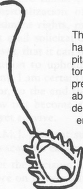
    
    

# DID YOU USE THIS IUD? 

The Daikon Shield Interuterine Device is alleged to have caused serious pelvic infections resulting in hospitalizations, tubal damage, infertility, and hysterectomies. It is also alleged to have caused unplanned pregnancies ending in abortions, miscarriages, septic abortions, tubal or ectopic pregnancies, and full-term deliveries. If you or a friend have had a similar experience do not assume it is too late to take legal action against the Shield's manufacturer. Our law firm is presently representing women on such cases. The cases are handled on a contingent fee basis of the amount recovered. If there is no recovery, no legal fees are owed by our clients. 

For free information call 1-614-444-1113 The Law Firm of <h2 class="calibre2">Philip Q. Zauderer & Associates </h2><h3 class="calibre28">52 West Whittier Street Columbus, Ohio 43206 </h3>

Questions: 

1. This disciplinary action prompted a great deal of discussion, much of it critical of the Florida Supreme Court's decision. You can read more about the case in 
Legal Affairs
, the 
Sun-Sentinel
, 
the 
Florida Bar News
, 
and the 
Broward-Palm Beach New Times
, among 
other places
. 

2. You can watch the television advertisements for Pape & Chandler 
here
 
and 
here
. 
Do you find them misleading? Do you find them in poor taste? Do you think the Florida Bar and the Florida Supreme Court objected to the advertisements primarily because they made misleading claims about the quality of the legal services provided, because they found the advertisements in poor taste, or because the advertisements criticize other attorneys? 

3. Are the Pape & Chandler advertisements primarily claims about the quality of the legal services they provide or an effort to establish a brand identity for their legal practice? Should attorneys be permitted to use branding to promote their businesses? 

4. The oldest and largest law firms in the United States rely on the recognition and goodwill associated with their firm names to communicate quality to the consumers of legal services. Should newer and smaller law firms also be required to rely only on their firm names or should they be permitted to pursue other branding strategies? If branding is 

permissible, should state bars limit what kinds of branding are permissible? Are limitations on law firm branding consistent with the First Amendment? 

5. In 
Matal v. Tam
, 137 S.Ct. 1744 (2017)
, 
the Supreme Court held that the Trademark Office's refusal to register a trademark on the ground that the mark was disparaging violated the First Amendment. Can state-imposed limits on law firm branding survive Tam'? 

6. Kentucky attorney 
Darryl Isaacs
 
refers to himself as "The Hammer" and is well-known for his advertisements, which feature him in parodies of popular television shows and movies like Captain America, Game of Thrones, and Transformers. You can watch the commercials on his 
website
. 
Is this branding and advertising consistent with the Florida Supreme Court's decision in Pape? Do you find them misleading? Do you find them distasteful? Should the Kentucky Bar be able to prohibit branding and advertisement of this kind? 
    

    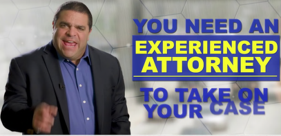
    
  

EXPERIENCED 

# ATTORNEY 
    

    
    
    <h3 class="calibre28">r
 
Darryl Isaacs </h3><h6 class="calibre48">-THE HAMMER </h6>

CALL 
or 
TEXT <h4 class="calibre41">(800) 800-8888 </h4>

CallTheHammer.com 
    

    
    
    
    

    
    
  <h7>7.3: Solicitation </h7>

Sweet cream ladies, forward march, the world
 owes 
you a living. Sweet cream ladies, do your part, think of what you're giving, to the lost and lonely people of the night
,
110 

In addition to prohibiting advertising, bar associations historically also prohibited attorneys from "soliciting" clients, or approaching potential clients directly, rather than as members of the general public. For example, Canon 28 of the 1908 ABA Canons of Professional Ethics specifically proscribed attorneys from volunteering legal advice to a stranger or seeking out injured parties in the hope of providing legal advice. 

Indeed, bar associations typically monitored and punished solicitation considerably more aggressively than advertisement. The stated objection to solicitation was the concern that unscrupulous attorneys might take advantage of unsophisticated members of the public, who lacked the capacity to evaluate the quality of their legal services or the fairness of their fees. Of course, the bar associations were also dominated by successful attorneys at large firms, who tended to represent corporate defendants, rather than injured plaintiffs. <h7>Model Rule 7.3: Solicitation of Clients </h7>

a. "Solicitation" or "solicit" denotes a communication initiated by or on behalf of a lawyer or law firm that is directed to a specific person the lawyer knows or reasonably should know needs legal services in a particular matter and that offers to provide, or reasonably can be understood as offering to provide, legal services for that matter. 

b. A lawyer shall not solicit professional employment by live person-to-person contact when a significant motive for the lawyer's doing so is the lawyer's or law firm's pecuniary gain, unless the contact is with a: 

1. Lawyer; 

2. person who has a family, close personal, or prior business or professional relationship with the lawyer or law firm; or 

3. person who routinely uses for business purposes the type of legal services offered by the lawyer. 

c. A lawyer shall not solicit professional employment even when not otherwise prohibited by paragraph (b), if: 

1. the target of the solicitation has made known to the lawyer a desire not to be solicited by the lawyer; or 

2. the solicitation involves coercion, duress or harassment. 

d. This Rule does not prohibit communications authorized by law or ordered by a court or other tribunal. <h7>Model Rule 7.3: Comments </h7>

1. Paragraph (b) prohibits a lawyer from soliciting professional employment by live personto-person contact when a significant motive for the lawyer's doing so is the lawyer's or the law firm's pecuniary gain. A lawyer's communication is not a solicitation if it is directed to the general public, such as through a billboard, an Internet banner advertisement, a website or a television commercial, or if it is in response to a request for information or is automatically generated in response to electronic searches. 

no 

The Box Tops, 
Sweet Cream Ladies Forward March,
 Dimensions (1969). 

2. "Live person-to-person contact" means in-person, face-to-face, live telephone and other real-time visual or auditory person-to-person communications where the person is subject to a direct personal encounter without time for reflection. Such person-to-person contact does not include chat rooms, text messages or other written communications that recipients may easily disregard. A potential for overreaching exists when a lawyer, seeking pecuniary gain, solicits a person known to be in need of legal services. This form of contact subjects a person to the private importuning of the trained advocate in a direct interpersonal encounter. The person, who may already feel overwhelmed by the circumstances giving rise to the need for legal services, may find it difficult to fully evaluate all available alternatives with reasoned judgment and appropriate self interest in the face of the lawyer's presence and insistence upon an immediate response. The situation is fraught with the possibility of undue influence, intimidation, and overreaching. 

8. Communications authorized by law or ordered by a court or tribunal include a notice to potential members of a class in class action litigation. 
    

    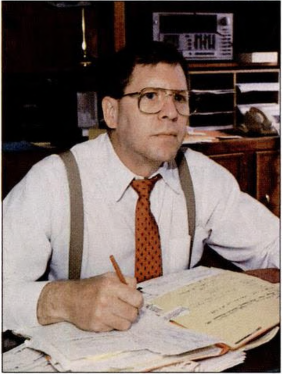
    
    <h6 class="calibre48">Richard Shapero </h6>

Shapero v. Kentucky Bar Assn.,
 486 U.S. 466 (1988) 

Summary: 
Shapero submitted wanted to send a letter advertising his legal services to people with foreclosure actions filed against them. The Kentucky Supreme Court held that Model Rule of Professional Conduct 7.3 prohibited direct mail solicitation. The 

Supreme Court reversed, holding that a direct mail solicitation was no different from an advertisement, and was protected by the 1st Amendment. The dissent argued that the court had gone too far in limiting regulation of attorney advertising and solicitation, and that advertising would harm the profession. 

JUSTICE BRENNAN announced the judgment of the Court and delivered the opinion of the Court as to Parts I and II and an opinion as to Part III in which JUSTICE MARSHALL, JUSTICE BLACKMUN, and JUSTICE KENNEDY join. 

This case presents the issue whether a State may, consistent with the First and Fourteenth Amendments, categorically prohibit lawyers from soliciting legal business for pecuniary gain by sending truthful and nondeceptive letters to potential clients known to face particular legal problems. 

I 

In 1985, petitioner, a member of Kentucky's integrated Bar Association, applied to the Kentucky Attorneys Advertising Commission for approval of a letter that he proposed to send "to potential clients who have had a foreclosure suit filed against them." The proposed letter read as follows: 

It has come to my attention that your home is being foreclosed on. If this is true, you may be about to lose your home. Federal law may allow you to keep your home by ORDERING your creditor to STOP and give you more time to pay them. 

You may call my office anytime from 8:30 a. m. to 5:00 p. m. for FREE information on how you can keep your home. 

Call NOW, don't wait. It may surprise you what I may be able to do for you. Just call and tell me that you got this letter. Remember it is FREE, there is NO charge for calling. 

The Commission did not find the letter false or misleading. Nevertheless, it declined to approve petitioner's proposal on the ground that a then-existing Kentucky Supreme Court Rule prohibited the mailing or delivery of written advertisements "precipitated by a specific event or occurrence involving or relating to the addressee or addressees as distinct from the general public." The Commission registered its view that Rule 3.135(5)(b)(i)'s ban on targeted, directmail advertising violated the First Amendment—specifically the principles enunciated in Zauderer
— and recommended that the Kentucky Supreme Court amend its Rules. Pursuing the Commission's suggestion, petitioner petitioned the Committee on Legal Ethics of the Kentucky Bar Association for an advisory opinion as to the Rule's validity. Like the Commission, the Ethics Committee, in an opinion formally adopted by the Board of Governors of the Bar Association, did not find the proposed letter false or misleading, but nonetheless upheld Rule 3.135(5)(b) (i) on the ground that it was consistent with Rule 7.3 of the American Bar Association's Model Rules of Professional Conduct. 

On review of the Ethics Committee's advisory opinion, the Kentucky Supreme Court felt "compelled by the decision in Zauderer to order Rule 3.135(5)(b)(i) deleted," and replaced it with the ABA's Rule 7.3. 

The court did not specify either the precise infirmity in Rule 3.135(5)(b)(i) or how Rule 7.3 cured it. Rule 7.3, like its predecessor, prohibits targeted, direct-mail solicitation by lawyers for pecuniary gain, without a particularized finding that the solicitation is false or misleading. We granted certiorari to resolve whether such a blanket prohibition is consistent with the First Amendment and now reverse. 

II 

Lawyer advertising is in the category of constitutionally protected commercial speech. The First Amendment principles governing state regulation of lawyer solicitations for pecuniary gain are by now familiar: "Commercial speech that is not false or deceptive and does not concern unlawful activities may be restricted only in the service of a substantial governmental interest, and only through means that directly advance that interest." Since state regulation of commercial speech "may extend only as far as the interest it serves," state rules that are designed to prevent the "potential for deception and confusion may be no broader than reasonably necessary to prevent the" perceived evil. 

Our lawyer advertising cases have never distinguished among various modes of written advertising to the general public. Thus, Ohio could no more prevent Zauderer from massmailing to a general population his offer to represent women injured by the Daikon Shield than it could prohibit his publication of the advertisement in local newspapers. Similarly, if petitioner's letter is neither false nor deceptive, Kentucky could not constitutionally prohibit him from sending at large an identical letter opening with the query, "Is your home being foreclosed on?," rather than his observation to the targeted individuals that "It has come to my attention that your home is being foreclosed on." The drafters of Rule 7.3 apparently appreciated as much, for the Rule exempts from the ban "letters addressed or advertising circulars distributed generally to persons who are so situated that they might in general find such services useful." 

The court below disapproved petitioner's proposed letter solely because it targeted only persons who were "known to need the legal services" offered in his letter, rather than the broader group of persons "so situated that they might in general find such services useful." Generally, unless the advertiser is inept, the latter group would include members of the former. The only reason to disseminate an advertisement of particular legal services among those persons who are "so situated that they might in general find such services useful" is to reach individuals who actually "need legal services of the kind provided and advertised by the lawyer." But the First Amendment does not permit a ban on certain speech merely because it is more efficient; the State may not constitutionally ban a particular letter on the theory that to mail it only to those whom it would most interest is somehow inherently objectionable. 

The court below did not rely on any such theory. Rather, it concluded that the State's blanket ban on all targeted, direct-mail solicitation was permissible because of the "serious potential for abuse inherent in direct solicitation by lawyers of potential clients known to need specific legal services." The court observed: 

Such solicitation subjects the prospective client to pressure from a trained lawyer in a direct personal way. It is entirely possible that the potential client may feel overwhelmed by the basic situation which caused the need for the specific legal services and may have seriously impaired capacity for good judgment, sound reason and a natural protective self-interest. Such a condition is full of the possibility of undue influence, overreaching and intimidation. 

Of course, a particular potential client will feel equally "overwhelmed" by his legal troubles and will have the same "impaired capacity for good judgment" regardless of whether a lawyer mails him an untargeted letter or exposes him to a newspaper advertisement—concededly constitutionally protected activities—or instead mails a targeted letter. The relevant inquiry is not whether there exist potential clients whose "condition" makes them susceptible to undue 

influence, but whether the mode of communication poses a serious danger that lawyers will exploit any such susceptibility. 

In assessing the potential for overreaching and undue influence, the mode of communication makes all the difference. Our decision in 
Ohralik
 that a State could categorically ban all inperson solicitation turned on two factors. First was our characterization of face-to-face solicitation as "a practice rife with possibilities for overreaching, invasion of privacy, the exercise of undue influence, and outright fraud." Second, "unique difficulties" would frustrate any attempt at state regulation of in-person solicitation short of an absolute ban because such solicitation is "not visible or otherwise open to public scrutiny." Targeted, direct-mail solicitation is distinguishable from the in-person solicitation in each respect. 

Like print advertising, petitioner's letter—and targeted, direct-mail solicitation generally—"poses much less risk of overreaching or undue influence" than does in-person solicitation. Neither mode of written communication involves "the coercive force of the personal presence of a trained advocate" or the "pressure on the potential client for an immediate yes-or-no answer to the offer of representation." Unlike the potential client with a badgering advocate breathing down his neck, the recipient of a letter and the "reader of an advertisement can effectively avoid further bombardment of his sensibilities simply by averting his eyes." A letter, like a printed advertisement (but unlike a lawyer), can readily be put in a drawer to be considered later, ignored, or discarded. In short, both types of written solicitation "convey information about legal services by means that are more conducive to reflection and the exercise of choice on the part of the consumer than is personal solicitation by an attorney." Nor does a targeted letter invade the recipient's privacy any more than does a substantively identical letter mailed at large. The invasion, if any, occurs when the lawyer discovers the recipient's legal affairs, not when he confronts the recipient with the discovery. 

Admittedly, a letter that is personalized (not merely targeted) to the recipient presents an increased risk of deception, intentional or inadvertent. It could, in certain circumstances, lead the recipient to overestimate the lawyer's familiarity with the case or could implicitly suggest that the recipient's legal problem is more dire than it really is. Similarly, an inaccurately targeted letter could lead the recipient to believe she has a legal problem that she does not actually have or, worse yet, could offer erroneous legal advice. 

But merely because targeted, direct-mail solicitation presents lawyers with opportunities for isolated abuses or mistakes does not justify a total ban on that mode of protected commercial speech. The State can regulate such abuses and minimize mistakes through far less restrictive and more precise means, the most obvious of which is to require the lawyer to file any solicitation letter with a state agency, giving the State ample opportunity to supervise mailings and penalize actual abuses. The "regulatory difficulties" that are "unique" to in-person lawyer solicitation—solicitation that is "not visible or otherwise open to public scrutiny" and for which it is "difficult or impossible to obtain reliable proof of what actually took place"—do not apply to written solicitations. The court below offered no basis for its "belief that submission of a blank form letter to the Advertising Commission does not provide a suitable protection to the public from overreaching, intimidation or misleading private targeted mail solicitation." Its concerns were presumably those expressed by the ABA House of Delegates in its comment to Rule 7.3: 

State lawyer discipline agencies struggle for resources to investigate specific complaints, much less for those necessary to screen lawyers' mail solicitation material. Even if they could examine such materials, agency staff members are unlikely to know anything 

about the lawyer or about the prospective client's underlying problem. Without such knowledge they cannot determine whether the lawyer's representations are misleading. 

The record before us furnishes no evidence that scrutiny of targeted solicitation letters will be appreciably more burdensome or less reliable than scrutiny of advertisements. As a general matter, evaluating a targeted advertisement does not require specific information about the recipient's identity and legal problems any more than evaluating a newspaper advertisement requires like information about all readers. If the targeted letter specifies facts that relate to particular recipients, the reviewing agency has innumerable options to minimize mistakes. It might, for example, require the lawyer to prove the truth of the fact stated; it could require the lawyer to explain briefly how he or she discovered the fact and verified its accuracy; or it could require the letter to bear a label identifying it as an advertisement, or directing the recipient how to report inaccurate or misleading letters. To be sure, a state agency or bar association that reviews solicitation letters might have more work than one that does not. But "our recent decisions involving commercial speech have been grounded in the faith that the free flow of commercial information is valuable enough to justify imposing on would-be regulators the costs of distinguishing the truthful from the false, the helpful from the misleading, and the harmless from the harmful." 

The validity of Rule 7.3 does not turn on whether petitioner's letter itself exhibited any of the evils at which Rule 7.3 was directed. Since, however, the First Amendment overbreadth doctrine does not apply to professional advertising, we address respondent's contentions that petitioner's letter is particularly overreaching, and therefore unworthy of First Amendment protection. In that regard, respondent identifies two features of the letter before us that, in its view, coalesce to convert the proposed letter into "high pressure solicitation, overbearing solicitation," which is not protected. First, respondent asserts that the letter's liberal use of underscored, uppercase letters "fairly shouts at the recipient that he should employ Shapero." Second, respondent objects that the letter contains assertions that "state no affirmative or objective fact," but constitute "pure salesman puffery, enticement for the unsophisticated, which commits Shapero to nothing." 

The pitch or style of a letter's type and its inclusion of subjective predictions of client satisfaction might catch the recipient's attention more than would a bland statement of purely objective facts in small type. But a truthful and non-deceptive letter, no matter how big its type and how much it speculates can never "shout at the recipient" or "grasp him by the lapels," as can a lawyer engaging in face-to-face solicitation. The letter simply presents no comparable risk of overreaching. And so long as the First Amendment protects the right to solicit legal business, the State may claim no substantial interest in restricting truthful and nondeceptive lawyer solicitations to those least likely to be read by the recipient. Moreover, the First Amendment limits the State's authority to dictate what information an attorney may convey in soliciting legal business. "The States may not place an absolute prohibition on certain types of potentially misleading information if the information may also be presented in a way that is not deceptive," unless the State "asserts a substantial interest" that such a restriction would directly advance. Nor may a State impose a more particularized restriction without a similar showing. Aside from the interests that we have already rejected, respondent offers none. 

To be sure, a letter may be misleading if it unduly emphasizes trivial or "relatively uninformative facts," or offers overblown assurances of client satisfaction. Respondent does not argue before us that petitioner's letter was misleading in those respects. Nor does respondent contend that 

the letter is false or misleading in any other respect. Of course, respondent is free to raise, and the Kentucky courts are free to consider, any such argument on remand. 

The judgment of the Supreme Court of Kentucky is reversed, and the case is remanded for further proceedings not inconsistent with this opinion. 

JUSTICE O'CONNOR, with whom THE CHIEF JUSTICE and JUSTICE SCALlAjoin, dissenting. 

I agree with the Court that the reasoning in 
Zauderer
 supports the conclusion reached today. That decision, however, was itself the culmination of a line of cases built on defective premises and flawed reasoning. As today's decision illustrates, the Court has been unable or unwilling to restrain the logic of the underlying analysis within reasonable bounds. The resulting interference with important and valid public policies is so destructive that I believe the analytical framework itself should now be reexamined. 

I 

Zauderer held that the First Amendment was violated by a state rule that forbade attorneys to solicit or accept employment through advertisements containing information or advice regarding a specific legal problem. I dissented from this holding because I believed that our precedents permitted, and good judgment required, that we give greater deference to the State's legitimate efforts to regulate advertising by their attorneys. Emphasizing the important differences between professional services and standardized consumer products, I concluded that unsolicited legal advice was not analogous to the free samples that are often used to promote sales in other contexts. First, the quality of legal services is typically more difficult for most laypersons to evaluate, and the consequences of a mistaken evaluation of the "free sample" may be much more serious. For that reason, the practice of offering unsolicited legal advice as a means of enticing potential clients into a professional relationship is much more likely to be misleading than superficially similar practices in the sale of ordinary consumer goods. Second, and more important, an attorney has an obligation to provide clients with complete and disinterested advice. The advice contained in unsolicited "free samples" is likely to be colored by the lawyer's own interest in drumming up business, a result that is sure to undermine the professional standards that States have a substantial interest in maintaining. 

The roots of the error in our attorney advertising cases are a defective analogy between professional services and standardized consumer products and a correspondingly inappropriate skepticism about the States' justifications for their regulations. 

Even if I agreed that this Court should take upon itself the task of deciding what forms of attorney advertising are in the public interest, I would not agree with what it has done. The best arguments in favor of rules permitting attorneys to advertise are founded in elementary economic principles. Restrictions on truthful advertising, which artificially interfere with the ability of suppliers to transmit price information to consumers, presumably reduce the efficiency of the mechanisms of supply and demand. Other factors being equal, this should cause or enable suppliers (in this case attorneys) to maintain a price/quality ratio in some of their services that is higher than would otherwise prevail. Although one could probably not test this hypothesis empirically, it is inherently plausible. Nor is it implausible to imagine that one effect of restrictions on lawyer advertising, and perhaps sometimes an intended effect, is to enable 

attorneys to charge their clients more for some services (of a given quality) than they would be able to charge absent the restrictions. 

Assuming, arguendo, that the removal of advertising restrictions should lead in the short run to increased efficiency in the provision of legal services, I would not agree that we can safely assume the same effect in the long run. The economic argument against these restrictions ignores the delicate role they may play in preserving the norms of the legal profession. While it may be difficult to defend this role with precise economic logic, I believe there is a powerful argument in favor of restricting lawyer advertising and that this argument is at the very least not easily refuted by economic analysis. 

One distinguishing feature of any profession, unlike other occupations that may be equally respectable, is that membership entails an ethical obligation to temper one's selfish pursuit of economic success by adhering to standards of conduct that could not be enforced either by legal fiat or through the discipline of the market. There are sound reasons to continue pursuing the goal that is implicit in the traditional view of professional life. Both the special privileges incident to membership in the profession and the advantages those privileges give in the necessary task of earning a living are means to a goal that transcends the accumulation of wealth. That goal is public service, which in the legal profession can take a variety of familiar forms. This view of the legal profession need not be rooted in romanticism or self-serving sanctimony, though of course it can be. Rather, special ethical standards for lawyers are properly understood as an appropriate means of restraining lawyers in the exercise of the unique power that they inevitably wield in a political system like ours. 

It is worth recalling why lawyers are regulated at all, or to a greater degree than most other occupations, and why history is littered with failed attempts to extinguish lawyers as a special class. Operating a legal system that is both reasonably efficient and tolerably fair cannot be accomplished, at least under modern social conditions, without a trained and specialized body of experts. This training is one element of what we mean when we refer to the law as a "learned profession." Such knowledge by its nature cannot be made generally available, and it therefore confers the power and the temptation to manipulate the system of justice for one's own ends. Such manipulation can occur in at least two obvious ways. One results from overly zealous representation of the client's interests; abuse of the discovery process is one example whose causes and effects (if not its cure) is apparent. The second, and for present purposes the more relevant, problem is abuse of the client for the lawyer's benefit. Precisely because lawyers must be provided with expertise that is both esoteric and extremely powerful, it would be unrealistic to demand that clients bargain for their services in the same arm's-length manner that may be appropriate when buying an automobile or choosing a dry cleaner. Like physicians, lawyers are subjected to heightened ethical demands on their conduct towards those they serve. These demands are needed because market forces, and the ordinary legal prohibitions against force and fraud, are simply insufficient to protect the consumers of their necessary services from the peculiar power of the specialized knowledge that these professionals possess. 

Imbuing the legal profession with the necessary ethical standards is a task that involves a constant struggle with the relentless natural force of economic self-interest. It cannot be accomplished directly by legal rules, and it certainly will not succeed if sermonizing is the strongest tool that may be employed. Tradition and experiment have suggested a number of formal and informal mechanisms, none of which is adequate by itself and many of which may serve to reduce competition (in the narrow economic sense) among members of the profession. A few examples include the great efforts made during this century to improve the quality and breadth of the legal education that is required for admission to the bar; the concomitant attempt 

to cultivate a subclass of genuine scholars within the profession; the development of bar associations that aspire to be more than trade groups; strict disciplinary rules about conflicts of interest and client abandonment; and promotion of the expectation that an attorney's history of voluntary public service is a relevant factor in selecting judicial candidates. 

Restrictions on advertising and solicitation by lawyers properly and significantly serve the same goal. Such restrictions act as a concrete, day-to-day reminder to the practicing attorney of why it is improper for any member of this profession to regard it as a trade or occupation like any other. There is no guarantee, of course, that the restrictions will always have the desired effect, and they are surely not a sufficient means to their proper goal. Given their inevitable anticompetitive effects, moreover, they should not be thoughtlessly retained or insulated from skeptical criticism. Appropriate modifications have been made in the light of reason and experience, and other changes may be suggested in the future. 

In my judgment, however, fairly severe constraints on attorney advertising can continue to play an important role in preserving the legal profession as a genuine profession. Whatever may be the exactly appropriate scope of these restrictions at a given time and place, this Court's recent decisions reflect a myopic belief that "consumers," and thus our Nation, will benefit from a constitutional theory that refuses to recognize either the essence of professionalism or its fragile and necessary foundations. In one way or another, time will uncover the folly of this approach. I can only hope that the Court will recognize the danger before it is too late to effect a worthwhile cure. <h8>Questions: </h8>

1. Richard D. Shapero died at his home in Louisville, Kentucky on December 31, 2006, at 63. According to his 
obituary
, 
"Richard was an attorney and Pin Ball Wizard. Richard's U.S. Supreme Court Case, Shapero vs. Kentucky Bar Association established laws regarding lawyer advertising in the United States." His colleagues also 
remembered
 
him fondly, "As we were pondering our past and setting goals for our future, Richard D. Shapero died yesterday at age 63. He will always be remembered for taking the Kentucky Bar Association to the United States Supreme Court, which resulted in a significant opinion striking down bar restrictions on lawyer advertising. A gutsy guy, lightyears ahead of his time, he enjoyed the business side of law much more than the actual practice of law. His forte was bringing in P.l. cases and then farming them out to other attorneys. His trademark, long before other lawfirms thought of tag lines or trademarks, was 'I Know The Experts.' His early TV ads made traditional lawyers cringe, but he spoke a language lay people understood and they hired him." 

2. The majority found a direct mail solicitation indistinguishable from an advertisement to the public. Do you agree? Is it reasonable to be more concerned about solicitation of potential clients who appear to need legal assistance than advertisements directed at the general public? Or perhaps we should encourage attorneys to offer legal services to potential clients who are most in need of them? 

3. The dissent argues that advertisements and solicitation are debasing the profession and its ethical standards. Have its concerns borne fruit? <h8>Further Reading: </h8>

- 
David O. Stewart & Scott Nelson, 
Hawking Legal Services
, ABA Journal, August 1, 

qfept 44 

Florida Barv. Went For It, Inc.,
 515 U.S. 618 (1995) 

Justice O'Connor delivered the opinion of the Court. 

Rules of the Florida Bar prohibit personal injury lawyers from sending targeted direct-mail solicitations to victims and their relatives for 30 days following an accident or disaster. This case asks us to consider whether such Rules violate the First and Fourteenth Amendments of the Constitution. We hold that in the circumstances presented here, they do not. 

I 

In 1989, the Florida Bar completed a 2-year study of the effects of lawyer advertising on public opinion. After conducting hearings, commissioning surveys, and reviewing extensive public commentary, the Bar determined that several changes to its advertising rules were in order. In late 1990, the Florida Supreme Court adopted the Bar's proposed amendments with some modifications. Two of these amendments are at issue in this case. Rule 4-7.4(b)(1) provides that "a lawyer shall not send, or knowingly permit to be sent, a written communication to a prospective client for the purpose of obtaining professional employment if: (A) the written communication concerns an action for personal injury or wrongful death or otherwise relates to an accident or disaster involving the person to whom the communication is addressed or a relative of that person, unless the accident or disaster occurred more than 30 days prior to the mailing of the communication." Rule 4-7.8(a) states that "a lawyer shall not accept referrals from a lawyer referral service unless the service: (1) engages in no communication with the public and in no direct contact with prospective clients in a manner that would violate the Rules of Professional Conduct if the communication or contact were made by the lawyer." Together, these Rules create a brief 30-day blackout period after an accident during which lawyers may not, directly or indirectly, single out accident victims or their relatives in order to solicit their business. 

In March 1992, G. Stewart McHenry and his wholly owned lawyer referral service, Went For It, Inc., filed this action for declaratory and injunctive relief in the United States District Court for the Middle District of Florida challenging Rules 4-7.4(b)(1) and 4-7.8(a) as violative of the First and Fourteenth Amendments to the Constitution. McHenry alleged that he routinely sent targeted solicitations to accident victims or their survivors within 30 days after accidents and that he wished to continue doing so in the future. Went For It, Inc., represented that it wished to contact accident victims or their survivors within 30 days of accidents and to refer potential clients to participating Florida lawyers. In October 1992, McHenry was disbarred for reasons unrelated to this suit. Another Florida lawyer, John T. Blakely, was substituted in his stead. 

The District Court referred the parties' competing summary judgment motions to a Magistrate Judge, who concluded that the Bar had substantial government interests, predicated on a concern for professionalism, both in protecting the personal privacy and tranquility of recent accident victims and their relatives and in ensuring that these individuals do not fall prey to undue influence or overreaching. Citing the Bar's extensive study, the Magistrate Judge found 

that the Rules directly serve those interests and sweep no further than reasonably necessary. The Magistrate recommended that the District Court grant the Bar's motion for summary judgment on the ground that the Rules pass constitutional muster. 

The District Court rejected the Magistrate Judge's report and recommendations and entered summary judgment for the plaintiffs, relying on 
Bates v. State Bar of Ariz.
 and subsequent cases. The Eleventh Circuit affirmed on similar grounds. The panel noted, in its conclusion, that it was "disturbed that 
Bates
 and its progeny require the decision" that it reached. We granted certiorari, and now reverse. 

II 

A 

Nearly two decades of cases have built upon the foundation laid by 
Bates.
 It is now well established that lawyer advertising is commercial speech and, as such, is accorded a measure of First Amendment protection. Such First Amendment protection, of course, is not absolute. We have always been careful to distinguish commercial speech from speech at the First Amendment's core. "Commercial speech enjoys a limited measure of protection, commensurate with its subordinate position in the scale of First Amendment values, and is subject to modes of regulation that might be impermissible in the realm of noncommercial expression." We have observed that "to require a parity of constitutional protection for commercial and noncommercial speech alike could invite dilution, simply by a leveling process, of the force of the Amendment's guarantee with respect to the latter kind of speech." 

Mindful of these concerns, we engage in "intermediate" scrutiny of restrictions on commercial speech, analyzing them under the framework set forth in 
Central Hudson.
 Under 
Central Hudson
, the government may freely regulate commercial speech that concerns unlawful activity or is misleading. Commercial speech that falls into neither of those categories, like the advertising at issue here, may be regulated if the government satisfies a test consisting of three related prongs: First, the government must assert a substantial interest in support of its regulation; second, the government must demonstrate that the restriction on commercial speech directly and materially advances that interest; and third, the regulation must be "narrowly drawn." 

B 

The Bar asserts that it has a substantial interest in protecting the privacy and tranquility of personal injury victims and their loved ones against intrusive, unsolicited contact by lawyers. 

This interest obviously factors into the Bar's paramount (and repeatedly professed) objective of curbing activities that "negatively affect the administration of justice." Because direct-mail solicitations in the wake of accidents are perceived by the public as intrusive, the Bar argues, the reputation of the legal profession in the eyes of Floridians has suffered commensurately. 

The regulation, then, is an effort to protect the flagging reputations of Florida lawyers by preventing them from engaging in conduct that, the Bar maintains, "is universally regarded as 

deplorable and beneath common decency because of its intrusion upon the special vulnerability and private grief of victims or their families." 

We have little trouble crediting the Bar's interest as substantial. On various occasions we have accepted the proposition that "States have a compelling interest in the practice of professions within their boundaries, and as part of their power to protect the public health, safety, and other valid interests they have broad power to establish standards for licensing practitioners and regulating the practice of professions." Our precedents also leave no room for doubt that "the protection of potential clients' privacy is a substantial state interest." In other contexts, we have consistently recognized that "the State's interest in protecting the well-being, tranquility, and privacy of the home is certainly of the highest order in a free and civilized society." Indeed, we have noted that "a special benefit of the privacy all citizens enjoy within their own walls, which the State may legislate to protect, is an ability to avoid intrusions." 

Under 
Central Hudson's
 second prong, the State must demonstrate that the challenged regulation "advances the Government's interest in a direct and material way." That burden, we have explained, "is not satisfied by mere speculation or conjecture; rather, a governmental body seeking to sustain a restriction on commercial speech must demonstrate that the harms it recites are real and that its restriction will in fact alleviate them to a material degree." 

The Bar submitted a 106-page summary of its 2-year study of lawyer advertising and solicitation to the District Court. That summary contains data—both statistical and anecdotal—supporting the Bar's contentions that the Florida public views direct-mail solicitations in the immediate wake of accidents as an intrusion on privacy that reflects poorly upon the profession. As of June 1989, lawyers mailed 700,000 direct solicitations in Florida annually, 40% of which were aimed at accident victims or their survivors. A survey of Florida adults commissioned by the Bar indicated that Floridians "have negative feelings about those attorneys who use direct mail advertising." Fifty-four percent of the general population surveyed said that contacting persons concerning accidents or similar events is a violation of privacy. A random sampling of persons who received direct-mail advertising from lawyers in 1987 revealed that 45% believed that directmail solicitation is "designed to take advantage of gullible or unstable people"; 34% found such tactics "annoying or irritating"; 26% found it "an invasion of your privacy"; and 24% reported that it "made you angry." Significantly, 27% of direct-mail recipients reported that their regard for the legal profession and for the judicial process as a whole was "lower" as a result of receiving the direct mail. 

The anecdotal record mustered by the Bar is noteworthy for its breadth and detail. With titles like "Scavenger Lawyers" and "Solicitors Out of Bounds," newspaper editorial pages in Florida have burgeoned with criticism of Florida lawyers who send targeted direct mail to victims shortly after accidents. The study summary also includes page upon page of excerpts from complaints of direct-mail recipients. For example, a Florida citizen described how he was "appalled and angered by the brazen attempt" of a law firm to solicit him by letter shortly after he was injured and his fiancee was killed in an auto accident. Another found it "despicable and inexcusable" that a Pensacola lawyer wrote to his mother three days after his father's funeral. Another 

described how she was "astounded" and then "very angry" when she received a solicitation following a minor accident. Still another described as "beyond comprehension" a letter his nephew's family received the day of the nephew's funeral. One citizen wrote, "I consider the unsolicited contact from you after my child's accident to be of the rankest form of ambulance chasing and in incredibly poor taste. I cannot begin to express with my limited vocabulary the utter contempt in which I hold you and your kind." 

In light of this showing—which respondents at no time refuted, save by the conclusory assertion that the Rule lacked "any factual basis"—we conclude that the Bar has satisfied the second prong of the 
Central Hudson
 test. In dissent, Justice Kennedy complains that we have before us few indications of the sample size or selection procedures employed by Magid Associates (a nationally renowned consulting firm) and no copies of the actual surveys employed. As stated, we believe the evidence adduced by the Bar is sufficient. In any event, we do not read our case law to require that empirical data come to us accompanied by a surfeit of background information. Indeed, in other First Amendment contexts, we have permitted litigants to justify speech restrictions by reference to studies and anecdotes pertaining to different locales altogether, or even, in a case applying strict scrutiny, to justify restrictions based solely on history, consensus, and "simple common sense." After scouring the record, we are satisfied that the ban on directmail solicitation in the immediate aftermath of accidents targets a concrete, nonspeculative harm. 

In reaching a contrary conclusion, the Court of Appeals determined that this case was governed squarely by 
Shapero.
 Making no mention of the Bar's study, the court concluded that "a targeted letter does not invade the recipient's privacy any more than does a substantively identical letter mailed at large. The invasion, if any, occurs when the lawyer discovers the recipient's legal affairs, not when he confronts the recipient with the discovery." In many cases, the Court of Appeals explained, "this invasion of privacy will involve no more than reading the newspaper." 

While some of 
Shapero's
 language might be read to support the Court of Appeals' interpretation, 
Shapero
 differs in several fundamental respects from the case before us. First and foremost, 
Shapero's
 treatment of privacy was casual. Contrary to the dissent's suggestions, the State in 
Shapero
 did not seek to justify its regulation as a measure undertaken to prevent lawyers' invasions of privacy interests. Rather, the State focused exclusively on the special dangers of overreaching inhering in targeted solicitations. Second, in contrast to this case, Shapero
 dealt with a broad ban on all direct-mail solicitations, whatever the time frame and whoever the recipient. Finally, the State in 
Shapero
 assembled no evidence attempting to demonstrate any actual harm caused by targeted direct mail. The Court rejected the State's effort to justify a prophylactic ban on the basis of blanket, untested assertions of undue influence and overreaching. Because the State did not make a privacy-based argument at all, its empirical showing on that issue was similarly infirm. 

We find the Court's perfunctory treatment of privacy in 
Shapero
 to be of little utility in assessing this ban on targeted solicitation of victims in the immediate aftermath of accidents. While it is undoubtedly true that many people find the image of lawyers sifting through accident and police 

reports in pursuit of prospective clients unpalatable and invasive, this case targets a different kind of intrusion. The Bar has argued, and the record reflects, that a principal purpose of the ban is "protecting the personal privacy and tranquility of Florida's citizens from crass commercial intrusion by attorneys upon their personal grief in times of trauma." The intrusion targeted by the Bar's regulation stems not from the fact that a lawyer has learned about an accident or disaster, but from the lawyer's confrontation of victims or relatives with such information, while wounds are still open, in order to solicit their business. In this respect, an untargeted letter mailed to society at large is different in kind from a targeted solicitation; the untargeted letter involves no willful or knowing affront to or invasion of the tranquility of bereaved or injured individuals and simply does not cause the same kind of reputational harm to the profession unearthed by the Bar's study. 

The purpose of the 30-day targeted direct-mail ban is to forestall the outrage and irritation with the state-licensed legal profession that the practice of direct solicitation only days after accidents has engendered. The Bar is concerned not with citizens' "offense" in the abstract, but with the demonstrable detrimental effects that such "offense" has on the profession it regulates. Moreover, the harm posited by the Bar is as much a function of simple receipt of targeted solicitations within days of accidents as it is a function of the letters' contents. Throwing the letter away shortly after opening it may minimize the latter intrusion, but it does little to combat the former. 

Passing to 
Central Hudson's
 third prong, we examine the relationship between the Bar's interests and the means chosen to serve them. With respect to this prong, the differences between commercial speech and noncommercial speech are manifest. The "least restrictive means" test has no role in the commercial speech context. "What our decisions require," instead, "is a fit between the legislature's ends and the means chosen to accomplish those ends, a fit that is not necessarily perfect, but reasonable; that represents not necessarily the single best disposition but one whose scope is in proportion to the interest served, that employs not necessarily the least restrictive means, but a means narrowly tailored to achieve the desired objective." Of course, we do not equate this test with the less rigorous obstacles of rational basis review; in 
Cincinnati v. Discovery
, for example, we observed that the existence of "numerous and obvious less-burdensome alternatives to the restriction on commercial speech is certainly a relevant consideration in determining whether the fit between ends and means is reasonable." 

Respondents levy a great deal of criticism, at the scope of the Bar's restriction on targeted mail. "By prohibiting written communications to all people, whatever their state of mind," respondents charge, the Rule "keeps useful information from those accident victims who are ready, willing and able to utilize a lawyer's advice." This criticism may be parsed into two components. First, the Rule does not distinguish between victims in terms of the severity of their injuries. According to respondents, the Rule is unconstitutionally overinclusive insofar as it bans targeted mailings even to citizens whose injuries or grief are relatively minor. Second, the Rule may prevent citizens from learning about their legal options, particularly at a time when other actors— opposing counsel and insurance adjusters—may be clamoring for victims' attentions. Any 

benefit arising from the Bar's regulation, respondents implicitly contend, is outweighed by these costs. 

We are not persuaded by respondents' allegations of constitutional infirmity. We find little deficiency in the ban's failure to distinguish among injured Floridians by the severity of their pain or the intensity of their grief. Indeed, it is hard to imagine the contours of a regulation that might satisfy respondents on this score. Rather than drawing difficult lines on the basis that some injuries are "severe" and some situations appropriate (and others, presumably, inappropriate) for grief, anger, or emotion, the Bar has crafted a ban applicable to all postaccident or disaster solicitations for a brief 30-day period. Unlike respondents, we do not see "numerous and obvious less-burdensome alternatives" to Florida's short temporal ban. The Bar's rule is reasonably well tailored to its stated objective of eliminating targeted mailings whose type and timing are a source of distress to Floridians, distress that has caused many of them to lose respect for the legal profession. 

Respondents' second point would have force if the Bar's Rule were not limited to a brief period and if there were not many other ways for injured Floridians to learn about the availability of legal representation during that time. Our lawyer advertising cases have afforded lawyers a great deal of leeway to devise innovative ways to attract new business. Florida permits lawyers to advertise on prime-time television and radio as well as in newspapers and other media. They may rent space on billboards. They may send untargeted letters to the general population, or to discrete segments thereof. There are, of course, pages upon pages devoted to lawyers in the Yellow Pages of Florida telephone directories. These listings are organized alphabetically and by area of specialty. These ample alternative channels for receipt of information about the availability of legal representation during the 30-day period following accidents may explain why, despite the ample evidence, testimony, and commentary submitted by those favoring (as well as opposing) unrestricted direct-mail solicitation, respondents have not pointed to—and we have not independently found—a single example of an individual case in which immediate solicitation helped to avoid, or failure to solicit within 30 days brought about, the harms that concern the dissent. In fact, the record contains considerable empirical survey information suggesting that Floridians have little difficulty finding a lawyer when they need one. Finding no basis to question the commonsense conclusion that the many alternative channels for communicating necessary information about attorneys are sufficient, we see no defect in Florida's regulation. 

Speech by professionals obviously has many dimensions. There are circumstances in which we will accord speech by attorneys on public issues and matters of legal representation the strongest protection our Constitution has to offer. This case, however, concerns pure commercial advertising, for which we have always reserved a lesser degree of protection under the First Amendment. Particularly because the standards and conduct of state-licensed lawyers have traditionally been subject to extensive regulation by the States, it is all the more appropriate that we limit our scrutiny of state regulations to a level commensurate with the "subordinate position" of commercial speech in the scale of First Amendment values. 

We believe that the Bar's 30-day restriction on targeted direct-mail solicitation of accident victims and their relatives withstands scrutiny under the three-pronged Central Hudson test that we have devised for this context. The Bar has substantial interest both in protecting injured Floridians from invasive conduct by lawyers and in preventing the erosion of confidence in the profession that such repeated invasions have engendered. The Bar's proffered study, unrebutted by respondents below, provides evidence indicating that the harms it targets are far from illusory. The palliative devised by the Bar to address these harms is narrow both in scope and in duration. The Constitution, in our view, requires nothing more. 

Justice Kennedy, with whom Justice Stevens, Justice Souter, and Justice Ginsburg join, dissenting. 

Attorneys who communicate their willingness to assist potential clients are engaged in speech protected by the First and Fourteenth Amendments. The Court today undercuts this guarantee in an important class of cases and unsettles leading First Amendment precedents, at the expense of those victims most in need of legal assistance. With all respect for the Court, in my view its solicitude for the privacy of victims and its concern for our profession are misplaced and self-defeating, even upon the Court's own premises. 

I take it to be uncontroverted that when an accident results in death or injury, it is often urgent at once to investigate the occurrence, identify witnesses, and preserve evidence. Vital interests in speech and expression are, therefore, at stake when by law an attorney cannot direct a letter to the victim or the family explaining this simple fact and offering competent legal assistance. Meanwhile, represented and better informed parties, or parties who have been solicited in ways more sophisticated and indirect, may be at work. Indeed, these parties, either themselves or by their attorneys, investigators, and adjusters, are free to contact the unrepresented persons to gather evidence or offer settlement. This scheme makes little sense. As is often true when the law makes little sense, it is not first principles but their interpretation and application that have gone awry. 

Although I agree with the Court that the case can be resolved by following the three-part inquiry we have identified to assess restrictions on commercial speech, a preliminary observation is in order. Speech has the capacity to convey complex substance, yielding various insights and interpretations depending upon the identity of the listener or the reader and the context of its transmission. It would oversimplify to say that what we consider here is commercial speech and nothing more, for in many instances the banned communications may be vital to the recipients' right to petition the courts for redress of grievances. The complex nature of expression is one reason why even so-called commercial speech has become an essential part of the public discourse the First Amendment secures. If our commercial speech rules are to control this case, then, it is imperative to apply them with exacting care and fidelity to our precedents, for what is at stake is the suppression of information and knowledge that transcends the financial selfinterests of the speaker. 

I 

As the Court notes, the first of the 
Central Hudson
 factors to be considered is whether the interest the State pursues in enacting the speech restriction is a substantial one. The State says two different interests meet this standard. The first is the interest "in protecting the personal privacy and tranquility" of the victim and his or her family. As the Court notes, that interest has recognition in our decisions as a general matter; but it does not follow that the privacy interest in the cases the majority cites is applicable here. The problem the Court confronts, and cannot overcome, is our recent decision in 
Shapero.
 In assessing the importance of the interest in that solicitation case, we made an explicit distinction between direct, in-person solicitations and direct-mail solicitations. 
Shapero
, like this case, involved a direct-mail solicitation, and there the State recited its fears of "overreaching and undue influence." We found, however, no such dangers presented by direct-mail advertising. We reasoned that "a letter, like a printed advertisement (but unlike a lawyer), can readily be put in a drawer to be considered later, ignored, or discarded. We pointed out that "the relevant inquiry is not whether there exist potential clients whose 'condition' makes them susceptible to undue influence, but whether the mode of communication poses a serious danger that lawyers will exploit any such susceptibility." In assessing the substantiality of the evils to be prevented, we concluded that "the mode of communication makes all the difference." The direct mail in 
Shapero
 did not present the justification for regulation of speech presented in 
Ohralik. 

To avoid the controlling effect of 
Shapero
 in the case before us, the Court seeks to declare that a different privacy interest is implicated. As it sees the matter, the substantial concern is that victims or their families will be offended by receiving a solicitation during their grief and trauma. But we do not allow restrictions on speech to be justified on the ground that the expression might offend the listener. On the contrary, we have said that these "are classically not justifications validating the suppression of expression protected by the First Amendment." And in 
Zauderer
, where we struck down a ban on attorney advertising, we held that "the mere possibility that some members of the population might find advertising offensive cannot justify suppressing it. The same must hold true for advertising that some members of the bar might find beneath their dignity." 

We have applied this principle to direct-mail cases as well as with respect to general advertising, noting that the right to use the mails is protected by the First Amendment. In Bo/ger, we held that a statute designed to "shield recipients of mail from materials that they are likely to find offensive" furthered an interest of "little weight," noting that "we have consistently held that the fact that protected speech may be offensive to some does not justify its suppression." It is only where an audience is captive that we will assure its protection from some offensive speech. Outside that context, "we have never held that the Government itself can shut off the flow of mailings to protect those recipients who might potentially be offended." The occupants of a household receiving mailings are not a captive audience, and the asserted interest in preventing their offense should be no more controlling here than in our prior cases. All the recipient of objectionable mailings need do is to take "the short, though regular, journey from mail box to trash can." As we have observed, this is "an acceptable burden, at least so far as the 

Constitution is concerned." If these cases forbidding restrictions on speech that might be offensive are to be overruled, the Court should say so. 

In the face of these difficulties of logic and precedent, the State and the opinion of the Court turn to a second interest: protecting the reputation and dignity of the legal profession. The argument is, it seems fair to say, that all are demeaned by the crass behavior of a few. The argument takes a further step in the amicus brief filed by the Association of Trial Lawyers of America. There it is said that disrespect for the profession from this sort of solicitation (but presumably from no other sort of solicitation) results in lower jury verdicts. In a sense, of course, these arguments are circular. While disrespect will arise from an unethical or improper practice, the majority begs a most critical question by assuming that direct-mail solicitations constitute such a practice. The fact is, however, that direct solicitation may serve vital purposes and promote the administration of justice, and to the extent the bar seeks to protect lawyers' reputations by preventing them from engaging in speech some deem offensive, the State is doing nothing more (as amicus the Association of Trial Lawyers of America is at least candid enough to admit) than manipulating the public's opinion by suppressing speech that informs us how the legal system works. The disrespect argument thus proceeds from the very assumption it tries to prove, which is to say that solicitations within 30 days serve no legitimate purpose. This, of course, is censorship pure and simple; and censorship is antithetical to the first principles of free expression. 

Even were the interests asserted substantial, the regulation here fails the second part of the Central Hudson
 test, which requires that the dangers the State seeks to eliminate be real and that a speech restriction or ban advance that asserted state interest in a direct and material way. The burden of demonstrating the reality of the asserted harm rests on the State. Slight evidence in this regard does not mean there is sufficient evidence to support the claims. Here, what the State has offered falls well short of demonstrating that the harms it is trying to redress are real, let alone that the regulation directly and materially advances the State's interests. The parties and the Court have used the term "Summary of Record" to describe a document prepared by the Florida Bar (Bar), one of the adverse parties, and submitted to the District Court in this case. This document includes no actual surveys, few indications of sample size or selection procedures, no explanations of methodology, and no discussion of excluded results. There is no description of the statistical universe or scientific framework that permits any productive use of the information the so-called Summary of Record contains. The majority describes this anecdotal matter as "noteworthy for its breadth and detail," but when examined, it is noteworthy for its incompetence. The selective synopses of unvalidated studies deal, for the most part, with television advertising and phone book listings, and not direct-mail solicitations. Although there may be issues common to various kinds of attorney advertising and solicitation, it is not clear what would follow from that limited premise, unless the Court means by its decision to call into question all forms of attorney advertising. The most generous reading of this document permits identification of 34 pages on which direct-mail solicitation is arguably discussed. Of these, only two are even a synopsis of a study of the attitudes of Floridians 

towards such solicitations. The bulk of the remaining pages include comments by lawyers about direct mail (some of them favorable), excerpts from citizen complaints about such solicitation, and a few excerpts from newspaper articles on the topic. Our cases require something more than a few pages of self-serving and unsupported statements by the State to demonstrate that a regulation directly and materially advances the elimination of a real harm when the State seeks to suppress truthful and nondeceptive speech. 

It is telling that the essential thrust of all the material adduced to justify the State's interest is devoted to the reputational concerns of the Bar. It is not at all clear that this regulation advances the interest of protecting persons who are suffering trauma and grief, and we are cited to no material in the record for that claim. Indeed, when asked at oral argument what a "typical injured plaintiff gets in the mail," the Bar's lawyer replied: "That's not in the record, and I don't know the answer to that question." Having declared that the privacy interest is one both substantial and served by the regulation, the Court ought not to be excused from justifying its conclusion. 

The insufficiency of the regulation to advance the State's interest is reinforced by the third inquiry necessary in this analysis. Were it appropriate to reach the third part of the 
Central Hudson
 test, it would be clear that the relationship between the Bar's interests and the means chosen to serve them is not a reasonable fit. The Bar's rule creates a flat ban that prohibits far more speech than necessary to serve the purported state interest. Even assuming that interest were legitimate, there is a wild disproportion between the harm supposed and the speech ban enforced. It is a disproportion the Court does not bother to discuss, but our speech jurisprudence requires that it do so. 

To begin with, the ban applies with respect to all accidental injuries, whatever their gravity. The Court's purported justification for the excess of regulation in this respect is the difficulty of drawing lines between severe and less serious injuries, but making such distinctions is not important in this analysis. Even were it significant, the Court's assertion is unconvincing. After all, the criminal law routinely distinguishes degrees of bodily harm, and if that delineation is permissible and workable in the criminal context, it should not be "hard to imagine the contours of a regulation" that satisfies the reasonable fit requirement. 

There is, moreover, simply no justification for assuming that in all or most cases an attorney's advice would be unwelcome or unnecessary when the survivors or the victim must at once begin assessing their legal and financial position in a rational manner. With regard to lesser injuries, there is little chance that for any period, much less 30 days, the victims will become distraught upon hearing from an attorney. It is, in fact, more likely a real risk that some victims might think no attorney will be interested enough to help them. It is at this precise time that sound legal advice may be necessary and most urgent. 

Even as to more serious injuries, the State's argument fails, since it must be conceded that prompt legal representation is essential where death or injury results from accidents. The only 

seeming justification for the State's restriction is the one the Court itself offers, which is that attorneys can and do resort to other ways of communicating important legal information to potential clients. Quite aside from the latent protectionism for the established bar that the argument discloses, it fails for the more fundamental reason that it concedes the necessity for the very representation the attorneys solicit and the State seeks to ban. The accident victims who are prejudiced to vindicate the State's purported desire for more dignity in the legal profession will be the very persons who most need legal advice, for they are the victims who, because they lack education, linguistic ability, or familiarity with the legal system, are unable to seek out legal services. 

The reasonableness of the State's chosen methods for redressing perceived evils can be evaluated, in part, by a commonsense consideration of other possible means of regulation that have not been tried. Here, the Court neglects the fact that this problem is largely self-policing: Potential clients will not hire lawyers who offend them. And even if a person enters into a contract with an attorney and later regrets it, Florida, like some other States, allows clients to rescind certain contracts with attorneys within a stated time after they are executed. The State's restriction deprives accident victims of information which may be critical to their right to make a claim for compensation for injuries. The telephone book and general advertisements may serve this purpose in part; but the direct solicitation ban will fall on those who most need legal representation: for those with minor injuries, the victims too ill informed to know an attorney may be interested in their cases; for those with serious injuries, the victims too ill informed to know that time is of the essence if counsel is to assemble evidence and warn them not to enter into settlement negotiations or evidentiary discussions with investigators for opposing parties. One survey reports that over a recent 5-year period, 68% of the American population consulted a lawyer. The use of modern communication methods in a timely way is essential if clients who make up this vast demand are to be advised and informed of all of their choices and rights in selecting an attorney. The very fact that some 280,000 direct-mail solicitations are sent to accident victims and their survivors in Florida each year is some indication of the efficacy of this device. Nothing in the Court's opinion demonstrates that these efforts do not serve some beneficial role. A solicitation letter is not a contract. Nothing in the record shows that these communications do not at the least serve the purpose of informing the prospective client that he or she has a number of different attorneys from whom to choose, so that the decision to select counsel, after an interview with one or more interested attorneys, can be deliberate and informed. And if these communications reveal the social costs of the tort system as a whole, then efforts can be directed to reforming the operation of that system, not to suppressing information about how the system works. The Court's approach, however, does not seem to be the proper way to begin elevating the honor of the profession. 

IV 

It is most ironic that, for the first time since 
Bates v. State Bar of Arizona,
 the Court now orders a major retreat from the constitutional guarantees for commercial speech in order to shield its own profession from public criticism. Obscuring the financial aspect of the legal profession from public discussion through direct-mail solicitation, at the expense of the least sophisticated 

members of society, is not a laudable constitutional goal. There is no authority for the proposition that the Constitution permits the State to promote the public image of the legal profession by suppressing information about the profession's business aspects. If public respect for the profession erodes because solicitation distorts the idea of the law as most lawyers see it, it must be remembered that real progress begins with more rational speech, not less. I agree that if this amounts to mere "sermonizing," the attempt may be futile. The guiding principle, however, is that full and rational discussion furthers sound regulation and necessary reform. 

The image of the profession cannot be enhanced without improving the substance of its practice. The objective of the profession is to ensure that "the ethical standards of lawyers are linked to the service and protection of clients." 

Today's opinion is a serious departure, not only from our prior decisions involving attorney advertising, but also from the principles that govern the transmission of commercial speech. The Court's opinion reflects a new-found and illegitimate confidence that it, along with the Supreme Court of Florida, knows what is best for the Bar and its clients. Self-assurance has always been the hallmark of a censor. That is why under the First Amendment the public, not the State, has the right and the power to decide what ideas and information are deserving of their adherence. "The general rule is that the speaker and the audience, not the government, assess the value of the information presented." By validating Florida's rule, today's majority is complicit in the Bar's censorship. For these reasons, I dissent from the opinion of the Court and from its judgment. 
    

    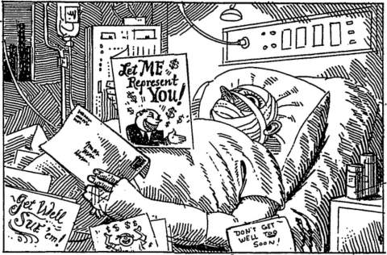
    
  

Illustrations by Elliott Banfleld 
    

    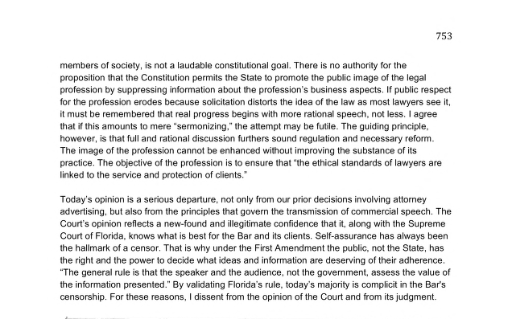
    
    
    

    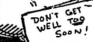
    
  

Illustration for 
Linda Greenhouse, 
In the longtime war over lawyer advertising, the latest shot leaves as many wounds as ever,
 New York Times, June 23, 1995, at A23 

Questions: 

1. G. Stewart McHenry was disbarred in 1992 for masturbating in front of one female client and fondling another. He was also disciplined by the bar in 1985 and 1988, for brandishing a gun in his office, hitting a paralegal with a file and refusing to pay her when she quit, improperly withdrawing funds from his client trust account, and drunk driving, among other things. 

2. Opponents of bar association rules limiting attorney advertisements and solicitation argue that the rules are motivated by the fear of increased competition and intended to protect the interests of established attorneys. Supporters of those rules argue that they reflect philosophical principles, including an aversion to "ambulance chasing." Which argument do you find more compelling? Can both be true? 

3. Justice O'Connor's majority opinion relied on empirical evidence submitted by the bar showing that attorney solicitations sent to people after they or a family member suffered an injury caused harm and were unwanted. Justice Kennedy's dissent questioned the credibility of the empirical evidence and argued that attorney solicitations could help consumers, who didn't realize they had a potential claim or didn't know who to contact. Did you find O'Connor's empirical claims convincing? Do you think they provided adequate evidence of harm to overcome Justice Kennedy's 1st Amendment objections? 

# Lawyers' soliciting tactics draw scorn at Bar hearing 

By MARY DOLAN 

Tlm»« Man WlUK 

TAMPA Kenneth Addison wan barely a year old when he received his first letter from a lawyer Kenneth and his mother, Cecelia Addison, had been in a minor automobile a&lt; &lt; ident, and the lawyer had gotten hold of the accident report 

The lawyer. G. Stewart M&lt; Henry, is one of eight lawyers who each week slop by tin- Tampa Police Department or Hillsborough County Sheriffs Office to pick up copies of hundreds of accident reports. 

Their practice concerns the Florida Rar Assoc iation, which is examining the methods lawyers use to advertise their services The liar relaxed its rules Jan 1 to permit solicitation by mail after the U.S Supreme Court ruled that such mailings are a form of advertisement. Some area lawyers say the practice gives their profession a sleazy image and they want the rules tightened 

"It's not a profession anymore It's like a bunch of sharks in the water." said Michael C. Addison, a Tampa lawyer and Kenneth's father 

Michael Addison spoke against the practice of mailing letters to accident victims Tuesday at a meeting of a Florida Har committee studying lawyer solicitation Stephen N. Zack. chairman of the committee, said the group will recommend to the Har whether certain advertising prat tires by lawyers should be curtailed or forbidden 

Most of the lawyers who spoke at the hearing were opposed to direct mail soliritaliori. 

Oddly, one of them routinely picks up hundreds of accident reports at the poise department 

"I am violently opposed to any type of direct mail solicitation," said Kdward C. Rood. 

Asked afterward why he orders copies of arcidmt reports from Tampa police. Rood said he sends the acc ident victims letters warning them that they will receive letters from other attorneys and to check their backgrounds. Nowhere in the letters does he suggest that the accident victim call his office, although his telephone number and address are printed on each letter, he said. 

Rood also said he did not consider the letters solicitation. 

Asked if he considered such letters solicitation, 

Zack. the committee chairman, said: "I'd consider that any time a lawyer is putting his or her name in front of a person that it could be solicitation." 

Another lawyer who routinely gets accident reports. Harry Caskey, said he does not solicit clients by null, hut gives the reports to other lawyers, with whom he has a "referral arrangement." He would not name the lawyers. 

lawyers are charged from 5 cents to 50 cents a page for the copies. Their bills for police copies last month ranged from $MI3 to 11,626. <h2 class="calibre2">"It 's like a bunch of sharks in the water." </h2>

MichaelC Addison. 

Tampa 
lawyer 

Spokesmen for the Police Department and Sheriff's Office said lawyers have been requesting copies of all serious traffic accident reports for the past few months. 

Other lawyers receiving copies of accident reports are Lillian Joyce. Clay H. Rood, Michael H. Otis and I) Russell Stahl. Hob Joyce and a company called Investigative Knterpnses. 

All are members of the Fkinda Har, said Janice Rowland, administrative secretary to staff counsel. 

Only McHenry has a record of violations with the Har In 1965. the Florida Supreme Court issued a public reprimand against him for violating disciplinary rules of the Har. she said. 

Rowland said McHenry violated rules that govern the conduct of attorneys, including knowingly engaging in illegal conduct She could not provide details of the incident. 

Rood, the son of Tampa lawyer Kdward R. Rood, was found innocent last December of charges that he advised several of his clients to lie under oath. 

Spokesmen fur the Pinellas County Sheriff s Office and the St. Petersburg Police Department said they knew of of no lawyers coming in to look at accident reports hut that it could be happening without them knowing about it. 

— Slaft writers Kenfeerty 0 Aleman and WSham Foi ux
Wtul
i
d lo Vat report <h3 class="calibre28">Tampa Bay Times (St. Petersburg, Florida), Wed., Oct. 7, 1987, at 24 </h3>
    

    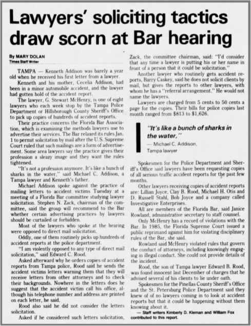
    
  <h2 class="calibre2">The Powerful Self-Marketing Of Personal Injury Lawyers </h2>

Children who never come when called wiO grow up to be doctors. 

Children who come before they're called will grow up to be lawyers. 

— From the Nolo News, ■ quarterly newspaper In California devoted to lawyerly affairs, quoted by Lakeland Ledger columnist Lonnie Brown. 

O
n Sept 24, the day the Bucs beat the Saints, Emmett C. Lee. Jr., was Involved In a collision. As Lee drove from Tampa Stadium, a driver ran a Mop sign. Occupants were shaken but OK. 

Within 48 hours. Lee. who Is Tampa's port director, was Inundated with stimulating mall. 

"1 was sorTy to learn of your recent accident" wrote Sherman M. Brod "The Public Records of Hillsborough County, Florida. Indicate that you were Involved in an accident through no fault of your own on the above referenced dale." wrote G. Stewart McHenry 

"It ts with great remorse and sympathy that I am writing lo you and your family after the trauma of having been Involved in an automobile accident on the above dale through no fault of your own," wrote Anthony P. Prieto. 

These are the opening pitches of hungry lawyers As you may have deduced. barristers who would never dream of joining an ambulance chase apparently think nothing of engaging in a paper chase 

But keep reading There's more to (his story than just lawyers hotel with their own petard. Constitutional rights are at stake. And a lawyers' reform effort. To top it off. a question of clime and punishment. 

But first, let us take a last look at (he missives aimed at Lee. 

Robert T. Joyce of Joyce A Reyes strikes a coosumensl tone: "As a victim of an accident you should be aware that there are numerous benefits you may be entitled to." 

Sherman M Brod is helpful "Please call me for a free consultation with no obligation lo you. No appointment Is necessary. If you are confined to a bed or have difficulty getting around, someone may come lo your home " 

Anthony P. Prieto goes for the scare "Our experienced staff is ready to protect your rights' Do not expect the Insurance Company of the negligent driver to offer you a fair settle ment. because they will not" 

G. Stewart McHenry strives to make one point crystal clear 

"IF I DO NOT WIN. VOU DO NOT PAY ANYTHING!" 

There are photos, loo Presumably so prospective clients can get a look at them, partners Earle Mofntl and Bob Vessel include in their brochure snapshots of themselves, dedicated 

and Industrious. Caption: "We know what it takes to get you the money you deserve—quickly." 

What do these letters tell us? According to the Florida Bar's Board of Governors, hard-sell, self-promotional solicitation is conduct unbefitting a lawyer Earlier this year, the board proposed lo restrict distasteful ads. Testimonials from celebrities and former clients banned. Dramatization of accidents banned. Background music: banned. Direct-mall advertising targeted to accident victims banned 

To fight back, a group of dissident lawyers formed an organization. Citizens Against Censorship. The American Civil Liberties Union joined the slugging match. So did a Ralph Nadera(filialed watchdog. Public Citizen Litigation Group. 

This past summer, the Board of Governors approved the reform package anyway, and the matter would seem to be, If not closed, at least of interest only to lawyers working In the field of personal injury. 

But part of the reform package found its way Into state law. As of Oct 1, lawyers may no longer do what the lawyers did who wrote to Emmett Lee. They may not pick up the names of accident victims from police blotters and use them as leads. 

Let us Ignore, for the moment, the constitutional quandary created when government can publish a public document. but prevent a citizen from writing to a person named In that document Let us concern ourselves with the letter of the law. (This is crucial because: 
What do you get when you cross an attorney with the Godfather Answer: An offer you can't understand.) 

The mail-solicitation ban was accomplished via an amendment to Chapter lit of the Florida Statutes Language has been Inserted "Accident reports shall nol be used for solicitation purposes." 

What happens lo Hie lawyer who does solicit from accident reports? Statute 318.855 states: "A violation of any of the provisions of this chapter ... shall be deemed an Infraction, as defined In Section 318.13(3)" 

On to 318.13(31. There, we find that aa Infraction means a "noncriminal violation which is not punishable by Incarceration and for which (here is no rt8ht to a trial by jury or a right to court-appointed counsel." Which bnnp us to .14. which spells out penalties for noncrimmal traffic infractions Traffic infractions? So the lawyer who writes letters of solicitation gets a traffic ticket? Points on his record? 

Does the mail-solicitation ban suggest it Is possible to have a crime without a punishment? Is the new law unconstitutional'' Unenforceable? Silly? Only a lawyer knows for sure. So ask one. Quick—
before
 he asks you. <h4 class="calibre41">The Tampa Tribune (Tampa, Florida), Tues., Oct 31, 1989, at 8 </h4>
    

    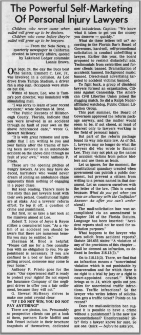
    
  

7.4: Prosecutorial Misconduct 

Is a dream a lie if it don't come true, or is it something
 worse?
111 

Prosecutors are responsible for enforcing criminal law. Indeed, for better or worse, prosecutors probably have the most important role in our modern criminal justice system. Among many other things, prosecutors decide who to charge with crimes, which crimes to charge, and whether to offer a plea bargain. And they exercise immense discretion in all of those areas. 

In practice, prosecutors play a much more important role in the administration of criminal justice than judges, because only about 3% of criminal prosecutions go to trial. The overwhelming majority of criminal defendants plead guilty, and the prosecutors determine what sentence the defendant will receive, with limited oversight from the judge. And prosecutors strongly encourage defendants to plead guilty, rather than go to trial. If a defendant refuses to plead guilty, prosecutors typically charge aggressively and request the longest possible sentence. 

At least in theory, the paramount duty of the prosecutor is to seek justice, not a conviction. As Justice Sutherland observed in 
Berger v. United States,
 295 U.S. 78 (1935)
, 
a prosecutor 

is the representative not of an ordinary party to a controversy, but of a sovereignty whose obligation to govern impartially is as compelling as its obligation to govern at all; and whose interest, therefore, in a criminal prosecution is not that it shall win a case, but that justice shall be done. As such, he is in a peculiar and very definite sense the servant of the law, the twofold aim of which is that guilt shall not escape or innocence suffer. He may prosecute with earnestness and vigor—indeed, he should do so. But, while he may strike hard blows, he is not at liberty to strike foul ones. It is as much his duty to refrain from improper methods calculated to produce a wrongful conviction as it is to use every legitimate means to bring about a just one. 

Accordingly, prosecutors should never employ improper means, even to achieve results they believe to be just. They should always be candid with the court and the defense, and should never suppress exculpatory evidence or make improper statements. As Justice Jackson observed: 

The qualities of a good prosecutor are as elusive and as impossible to define as those which make a gentleman. And those who need to be told would not understand it anyway. A sensitiveness to fair play and sportsmanship is perhaps the best protection against the abuse of power, and the citizens safety lies in the prosecutor who tempers zeal with human kindness, who seeks truth and not victims, who serves the law and not factional purposes, and who approaches his task with humility. 

in 

Bruce Springsteen, 
The River,
 The River (1980). 

The American Bar Association has described the duties of a prosecutor in Model Rule of Professional Responsibility 3.8 and in a separate set of model rules governing the prosecution function. Most jurisdiction have adopted some version of these rules. But their effectiveness is limited by the discretion and immunity of prosecutors. For one thing, it is often difficult or impossible to know when prosecutors have violated their professional duties. Even if they have, they are usually protected by absolute immunity. And historically, courts have been reluctant to impose meaningful sanctions on prosecutors, even for egregious misconduct. <h4 class="calibre41">Prosecution Function Standard 3-1.2: The Function of the Prosecutor </h4>

a. The office of prosecutor is charged with responsibility for prosecutions in its jurisdiction. 

b. The prosecutor is an administrator of justice, an advocate, and an officer of the court; the prosecutor must exercise sound discretion in the performance of his or her functions. 

c. The duty of the prosecutor is to seek justice, not merely to convict. 

d. It is an important function of the prosecutor to seek to reform and improve the administration of criminal justice. When inadequacies or injustices in the substantive or procedural law come to the prosecutor's attention, he or she should stimulate efforts for remedial action. 

e. It is the duty of the prosecutor to know and be guided by the standards of professional conduct as defined by applicable professional traditions, ethical codes, and law in the prosecutor's jurisdiction. The prosecutor should make use of the guidance afforded by an advisory council. <h4 class="calibre41">Model Rule 3.8: Special Responsibilities of a Prosecutor </h4>

The prosecutor in a criminal case shall: 

a. refrain from prosecuting a charge that the prosecutor knows is not supported by probable cause; 

b. make reasonable efforts to assure that the accused has been advised of the right to, and the procedure for obtaining, counsel and has been given reasonable opportunity to obtain counsel; 

c. not seek to obtain from an unrepresented accused a waiver of important pretrial rights, such as the right to a preliminary hearing; 

d. make timely disclosure to the defense of all evidence or information known to the prosecutor that tends to negate the guilt of the accused or mitigates the offense, and, in connection with sentencing, disclose to the defense and to the tribunal all unprivileged mitigating information known to the prosecutor, except when the prosecutor is relieved of this responsibility by a protective order of the tribunal; 

e. not subpoena a lawyer in a grand jury or other criminal proceeding to present evidence about a past or present client unless the prosecutor reasonably believes: 

1. the information sought is not protected from disclosure by any applicable privilege; 

2. the evidence sought is essential to the successful completion of an ongoing investigation or prosecution; and 

3. there is no other feasible alternative to obtain the information; 

f. except for statements that are necessary to inform the public of the nature and extent of the prosecutor's action and that serve a legitimate law enforcement purpose, refrain from making extrajudicial comments that have a substantial likelihood of heightening public condemnation of the accused and exercise reasonable care to prevent investigators, law enforcement personnel, employees or other persons assisting or associated with the prosecutor in a criminal case from making an extrajudicial statement that the prosecutor would be prohibited from making under Rule 3.6 or this Rule. 

g. When a prosecutor knows of new, credible and material evidence creating a reasonable likelihood that a convicted defendant did not commit an offense of which the defendant was convicted, the prosecutor shall: 

1. promptly disclose that evidence to an appropriate court or authority, and 

2. if the conviction was obtained in the prosecutor's jurisdiction, 

i. promptly disclose that evidence to the defendant unless a court authorizes delay, and 

ii. undertake further investigation, or make reasonable efforts to cause an investigation, to determine whether the defendant was convicted of an offense that the defendant did not commit. 

h. When a prosecutor knows of clear and convincing evidence establishing that a defendant in the prosecutor's jurisdiction was convicted of an offense that the defendant did not commit, the prosecutor shall seek to remedy the conviction. <h3 class="calibre28">Model Rule 3.8: Comments </h3>

1. A prosecutor has the responsibility of a minister of justice and not simply that of an advocate. This responsibility carries with it specific obligations to see that the defendant is accorded procedural justice, that guilt is decided upon the basis of sufficient evidence, and that special precautions are taken to prevent and to rectify the conviction of innocent persons. The extent of mandated remedial action is a matter of debate and varies in different jurisdictions. Many jurisdictions have adopted the ABA Standards of Criminal Justice Relating to the Prosecution Function, which are the product of prolonged and careful deliberation by lawyers experienced in both criminal prosecution and defense. Competent representation of the sovereignty may require a prosecutor to undertake some procedural and remedial measures as a matter of obligation. Applicable law may require other measures by the prosecutor and knowing disregard of those obligations or a systematic abuse of prosecutorial discretion could constitute a violation of Rule 8.4. 

7. When a prosecutor knows of new, credible and material evidence creating a reasonable likelihood that a person outside the prosecutor's jurisdiction was convicted of a crime that the person did not commit, paragraph (g) requires prompt disclosure to the court or other appropriate authority, such as the chief prosecutor of the jurisdiction where the conviction occurred. If the conviction was obtained in the prosecutor's jurisdiction, paragraph (g) requires the prosecutor to examine the evidence and undertake further 

investigation to determine whether the defendant is in fact innocent or make reasonable efforts to cause another appropriate authority to undertake the necessary investigation, and to promptly disclose the evidence to the court and, absent court-authorized delay, to the defendant. Consistent with the objectives of Rules 4.2 and 4.3, disclosure to a represented defendant must be made through the defendant's counsel, and, in the case of an unrepresented defendant, would ordinarily be accompanied by a request to a court for the appointment of counsel to assist the defendant in taking such legal measures as may be appropriate. 

8. Under paragraph (h), once the prosecutor knows of clear and convincing evidence that the defendant was convicted of an offense that the defendant did not commit, the prosecutor must seek to remedy the conviction. Necessary steps may include disclosure of the evidence to the defendant, requesting that the court appoint counsel for an unrepresented indigent defendant and, where appropriate, notifying the court that the prosecutor has knowledge that the defendant did not commit the offense of which the defendant was convicted. 

9. A prosecutor's independent judgment, made in good faith, that the new evidence is not of such nature as to trigger the obligations of sections (g) and (h), though subsequently determined to have been erroneous, does not constitute a violation of this Rule. 
    

    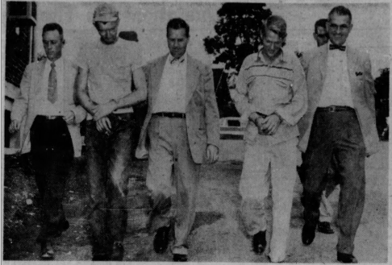
    
  

ACCUSED 
OF Ml 
RDEK—Charles D. Boblit, 2-1, and John 
I.. 
Brady, 25, 
charged 
by Anne Arundel county police with the murder of William Brooks on June 27, leave the Fermiale Police Station today after further questioning. Left to right arc CpI. Richard S. Disney, Boblit. CpI. Bernard Kiessling, Brady, Sgt. Maxwell Frye (partially obscure) and Sgt. Edward Praley. Brady allegedly confessed to the bludgeon-murder in Cuba last week and told police there where he and a companion, allegedly Boblit, had tossed Brooks's body out of a car on a lonely county r
oad. Both men are being held in the jail at Annapolis. 

The Evening Sun (Baltimore, Maryland), July 10, 1958, at 28 

Brady v. Maryland
, 373 U.S. 83 (1963) 

Summary: 
John Leo Brady and Charles Donald Boblit were charged with the murder of William Brooks and tried separately. Brady confessed to participating in the murder, but claimed that Boblit actually killed Brooks. The prosecutor suppressed a confession in which Boblit admitted killing Brooks, and Brady was sentenced to death. The Supreme Court reversed Brady's sentence, holding that the Due Process Clause of the 14th Amendment requires prosecutors to disclose all exculpatory evidence. 

Opinion of the Court by MR. JUSTICE DOUGLAS, announced by MR. JUSTICE BRENNAN. 

Petitioner and a companion, Boblit, were found guilty of murder in the first degree and were sentenced to death, their convictions being affirmed by the Court of Appeals of Maryland. Their trials were separate, petitioner being tried first. At his trial Brady took the stand and admitted his 
    

    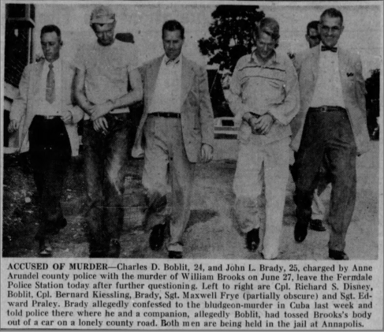
    
  

participation in the crime, but he claimed that Boblit did the actual killing. And, in his summation to the jury, Brady's counsel conceded that Brady was guilty of murder in the first degree, asking only that the jury return that verdict "without capital punishment." Prior to the trial petitioner's counsel had requested the prosecution to allow him to examine Boblit's extrajudicial statements. Several of those statements were shown to him; but one dated July 9, 1958, in which Boblit admitted the actual homicide, was withheld by the prosecution and did not come to petitioner's notice until after he had been tried, convicted, and sentenced, and after his conviction had been affirmed. 

Petitioner moved the trial court for a new trial based on the newly discovered evidence that had been suppressed by the prosecution. Petitioner's appeal from a denial of that motion was dismissed by the Court of Appeals without prejudice to relief under the Maryland Post Conviction Procedure Act. The petition for post-conviction relief was dismissed by the trial court; and on appeal the Court of Appeals held that suppression of the evidence by the prosecution denied petitioner due process of law and remanded the case for a retrial of the question of punishment, not the question of guilt. The case is here on certiorari. 

The crime in question was murder committed in the perpetration of a robbery. Punishment for that crime in Maryland is life imprisonment or death, the jury being empowered to restrict the punishment to life by addition of the words "without capital punishment." In Maryland, by reason of the state constitution, the jury in a criminal case are "the Judges of Law, as well as of fact." The question presented is whether petitioner was denied a federal right when the Court of Appeals restricted the new trial to the question of punishment. 

We agree with the Court of Appeals that suppression of this confession was a violation of the Due Process Clause of the Fourteenth Amendment. 

This ruling is an extension of 
Mooney v. Holohan,
 where the Court ruled on what nondisclosure by a prosecutor violates due process: 

It is a requirement that cannot be deemed to be satisfied by mere notice and hearing if a State has contrived a conviction through the pretense of a trial which in truth is but used as a means of depriving a defendant of liberty through a deliberate deception of court and jury by the presentation of testimony known to be perjured. Such a contrivance by a State to procure the conviction and imprisonment of a defendant is as inconsistent with the rudimentary demands of justice as is the obtaining of a like result by intimidation. 

In 
Pyle v. Kansas,
 we phrased the rule in broader terms: 

Petitioner's papers are inexpertly drawn, but they do set forth allegations that his imprisonment resulted from perjured testimony, knowingly used by the State authorities to obtain his conviction, and from the deliberate suppression by those same authorities of evidence favorable to him. These allegations sufficiently charge a deprivation of rights 

guaranteed by the Federal Constitution, and, if proven, would entitle petitioner to release from his present custody. 

The Third Circuit in the 
Baldi
 case construed that statement in 
Pyle v. Kansas
 to mean that the "suppression of evidence favorable" to the accused was itself sufficient to amount to a denial of due process. In 
Napue v. Illinois,
 we extended the test formulated in 
Mooney v. Holohan
 when we said: "The same result obtains when the State, although not soliciting false evidence, allows it to go uncorrected when it appears." 

We now hold that the suppression by the prosecution of evidence favorable to an accused upon request violates due process where the evidence is material either to guilt or to punishment, irrespective of the good faith or bad faith of the prosecution. 

The principle of 
Mooney v. Holohan
 is not punishment of society for misdeeds of a prosecutor but avoidance of an unfair trial to the accused. Society wins not only when the guilty are convicted but when criminal trials are fair; our system of the administration of justice suffers when any accused is treated unfairly. An inscription on the walls of the Department of Justice states the proposition candidly for the federal domain: "The United States wins its point whenever justice is done its citizens in the courts."
112
 A prosecution that withholds evidence on demand of an accused which, if made available, would tend to exculpate him or reduce the penalty helps shape a trial that bears heavily on the defendant. That casts the prosecutor in the role of an architect of a proceeding that does not comport with standards of justice, even though, as in the present case, his action is not "the result of guile." <h3 class="calibre28">Questions: </h3>

1. The story behind 
Brady v. Maryland
 is peculiar and sad. A thorough narrative account is available 
here
. 
Essentially, in 1958, John Leo Brady and his friend Charles Donald Boblit decided to rob a bank, because Brady was in love with Boblit's married sister Nancy, and had promised her $35,000. They needed a getaway car, so they tried to steal one from Brady's friend William Brooks, a disabled factory worker. The plan was to kidnap Brooks and release him after the bank robbery, but in the heat of the moment, Boblit strangled him. They split the $255.30 in Brooks wallet, and Brady fled to Cuba. In the meantime, the police soon found Brooks's body and went looking for Brady and Boblit. They arrested Boblit, who took them to the body, and accused Brady of the murder. Brady turned himself in at the United States Embassy and was extradited back to 

112
 Judge Simon E. Sobeloff when Solicitor General put the idea as follows in an address before the Judicial Conference of the Fourth Circuit on June 29, 1954: 

The Solicitor General is not a neutral, he is an advocate; but an advocate for a client whose business is not merely to prevail in the instant case. My client's chief business is not to achieve victory but to establish justice. We are constantly reminded of the now classic words penned by one of my illustrious predecessors, Frederick William Lehmann, that the Government wins its point when justice is done in its courts. 

Maryland. Both Brady and Boblit confessed and were charged with first-degree murder. The only question was who actually killed Brooks. Boblit gave five confessions. In the first four, he accused Brady of the murder. But in the fifth, he admitted that he was the murderer. Brady and Boblit were tried separately, and the prosecutor in Brady's case suppressed Boblit's fifth confession. Brady was sentenced to death, but 
Brady v. Maryland
 overturned the sentence, on the basis of the suppressed fifth confession. Afterward, Maryland had to resentence Brady, but never did. In 1974, the Governor of Maryland granted Brady clemency and he was paroled. He lived a quiet life, and died in 2009. 

2. Brady's attorney, 
E. Clinton Bamberger, 
Jr.
, 
was a Baltimore corporate lawyer who represented criminal defendants pro bono. In 1965, he quit his firm and became the first director of the the Office of Economic Opportunity Legal Services Program, which became the Legal Services Corporation. You can read Bamberger's account 
here
 
and find a history of the Legal Services Corporation 
here
. 
    

    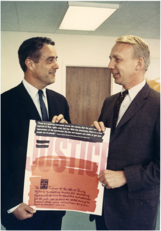
    
  

Sargent Shriver & Clint Bamberger (1966) 

Taylor v. Kavanagh
, 640 F. 2d 450 (2d Cir. 1981) 
    

    
    
  

Summary: 
In 1974, Rodney Taylor was arrested and indicted for burglary, and in 1975 he was arrested again for burglary. Assistant District Attorney Michael Kavanagh told Taylor the grand jury had returned an indictment on the 1975 charge, so Taylor pleaded guilty to both charges, in exchange for Kavanagh's promise not to recommend a sentence. But Taylor later tried to withdraw his plea, because he was never indicted on the 1975 charge and Kavanagh withdrew his promise. The trial court denied Taylor's motion, Kavanagh recommended the maximum sentence, and the court imposed a 6 year sentence. The appellate court reversed and remanded for resentencing because Kavanagh failed to honor his promise, but Taylor received the same sentence. Accordingly, Taylor filed a § 1983 action against Kavanagh. The district court granted Kavanagh's motion for judgment on the pleadings and the circuit court affirmed, holding that he was protected by absolute immunity. 

IRVING R. KAUFMAN, Circuit Judge: 

Plaintiff Rodney Taylor, 
pro
 se, instituted this action against Michael Kavanagh, an Assistant District Attorney for Ulster County, New York. Claiming that Kavanagh lied to him during plea negotiations and violated the terms of the negotiated plea agreement, Taylor seeks to set aside a criminal conviction resulting from his guilty plea. He also requests compensatory and punitive damages amounting to $5.5 million. 

I. 

Taylor was arrested in Kingston, New York, in October 1974, and on December 20, 1974, he was indicted and charged with third degree burglary and attempted grand larceny. He was taken into custody again on August 14, 1975, and charged with third degree burglary and criminal possession of a controlled substance in the seventh degree. 

On June 9, 1976, Taylor, represented by counsel, pleaded guilty in the Ulster County Court to the third degree burglary charge contained in the December 1974 indictment. This plea was in full satisfaction of the charges resulting from both the October 1974 and the August 1975 arrests, although no indictment concerning the events of August 1975 had ever been returned. The court was advised that Taylor and Assistant District Attorney Kavanagh had agreed that no recommendation or statement would be made relating to the sentence to be imposed. 

On June 7, 1977, Taylor moved in the state court to vacate his guilty plea, claiming that 1) during plea negotiations and at the time he entered his plea, the Assistant District Attorney had misrepresented to him and the court that a grand jury had returned an indictment on the charges relating to the August 1975 arrest; and 2) Kavanagh had indicated he would not abide by his promise not to recommend any sentence. This motion was denied. 

At the sentencing proceeding in February 1978, Kavanagh made a lengthy and detailed statement concerning Taylor's prior criminal record and recommended that he receive the maximum punishment. The court then sentenced Taylor to an indeterminate term of six years, 

with a minimum term of two years. Taylor appealed the judgment of conviction, but the Appellate Division affirmed, ordering, however, that Taylor be resentenced. The court stated that although the misrepresentation by the prosecutor concerning the existence of the second indictment was harmless error, resentencing was necessary because the prosecutor failed to honor his promise. Taylor eventually was resentenced to the same term he had previously received. 

Taylor filed the instant action in October 1978, claiming he was induced to plead guilty by the Assistant District Attorney's misrepresentations concerning the alleged second indictment. He also asserted that he should be awarded damages for Kavanagh's breach of the plea bargain. 

The defendant moved for judgment on the pleadings, which Judge Griesa granted in July 1980. He reasoned that because a prosecutor does not have custody over a convicted prisoner, Kavanagh was not a proper defendant in the suit to set aside Taylor's conviction. Extending the doctrine of absolute immunity to a prosecutor's plea bargaining activities. Judge Griesa also held that Kavanagh was immune from liability, and dismissed the action. We affirm. 

We note at the outset that when a prisoner is challenging his imprisonment in state facilities, his sole federal remedy is a writ of habeas corpus. Taylor followed this approach in September 1979, seeking a writ in the United States District Court for the Northern District of New York. Judge Port dismissed the petition and denied a certificate of probable cause. Taylor did not appeal this order. Accordingly, we hold that he cannot raise this request to be set free in the instant civil rights action. 

Taylor's damages claim also fails because the Assistant District Attorney's conduct in the plea bargaining negotiations and the sentencing proceeding in state court is protected by the doctrine of absolute prosecutorial immunity. 
Imblerv. Pachtman
, 424 U.S. 409 (1976)
. 
Imbler provided the basis for the development of a functional approach to the immunity question. The Court held that absolute immunity from § 1983 liability exists for those prosecutorial activities "intimately associated with the judicial phase of the criminal process." These protected "quasijudicial" activities include the initiation of a prosecution and the presentation of the Government's case. 

Absolute protection does not extend, however, to a prosecutor's investigative or administrative acts. Accordingly, we have recognized that where prosecutors act in this capacity, only the qualified "good faith" immunity that protects, for example, police officers, is available. 

The task of determining whether a particular activity is better characterized as "quasi-judicial" and subject to absolute immunity, or "investigative" and subject to only qualified "good faith" immunity requires more than the mechanical application of labels. An examination of the functional nature of prosecutorial behavior, rather than the status of the person performing the act, is determinative. Thus, a prosecutor is insulated from liability where his actions directly 

concern the pre-trial or trial phases of a case. For example, the swearing of warrants to insure a witness's attendance at trial, the falsification of evidence and the coercion of witnesses, or the failure to drop charges until immediately before trial, have been held to be prosecutorial activities for which absolute immunity applies. Similarly, because a prosecutor is acting as an advocate in a judicial proceeding, the solicitation and subornation of perjured testimony, the withholding of evidence, or the introduction of illegally-seized evidence at trial does not create liability in damages. The rationale for this approach is sound, for these protected activities, while deplorable, involve decisions of judgment affecting the course of a prosecution. The efficient, and just, performance of the prosecutorial function would be chilled if Government attorneys were forced to worry that their choice of trial strategy and tactics could subject them to monetary liability, or at best, the inconvenience of proving a "good faith" defense to a § 1983 action. 

In contrast, activities in which a prosecutor engages that are independent of prosecution are not protected by the doctrine of absolute immunity. For example, only a "good faith" immunity is available where a prosecutor testifies falsely as a witness, distributes extraneous statements to the press designed to harm a suspect's reputation, or participates in an illegal search that violates a suspect's Fourth Amendment rights. 

Decisions to engage in conduct of this character are not directly related to the delicate judgments prosecutors must make concerning the development of the Government's case. The "investigatory" and "administrative" work involved in testifying before a grand jury, accumulating evidence, and disseminating information to the press is analogous to the tasks performed by the police, and therefore only the same qualified "good faith" immunity is available. 

This functional approach requires us to evaluate plea bargaining in light of the general purpose of the absolute immunity doctrine. Judge Griesa properly recognized that the purpose of the doctrine "is to insure that a prosecutor will perform his difficult function with complete vigor and independence, undeterred by the spectre of liability for damages with respect to his activities." Learned Hand has told us that the doctrine we apply today supports the just administration of the criminal law, for we all would suffer if prosecutors "who try to do their duty were subject to the constant dread of retaliation." The threat of § 1983 liability would inhibit prosecutors from exercising independent judgment and would divert their attention from the immediate matters at hand. 

We are satisfied that a prosecutor's activities in the plea bargaining context merit the protection of absolute immunity. The plea negotiation is an "essential component" of our system of criminal justice. It is at this stage that the prosecutor evaluates the evidence before him, determines the strength of the Government's case, and considers the societal interest in disposing of the case by a negotiated guilty plea. The effective negotiation of guilty pleas would be severely chilled if a prosecutor were constantly concerned with the possibility of ruinous personal liability for judgments and decisions made at this critical stage of the criminal process. 

Moreover, reference to the type of harm suffered from the alleged misconduct during a plea negotiation demonstrates that defendant Kavanagh should be afforded absolute immunity in this case. We recently noted that there can be no monetary liability for injuries related solely to the prosecution itself. Thus, if as a result of prosecutorial misconduct, a defendant is compelled to face prosecution, or to suffer imprisonment or pretrial detention, the harm cannot be redressed via a § 1983 civil rights suit. But, where the alleged harm is inflicted independently from the prosecution—for example, the damage to reputation caused by a prosecutor's dissemination of false information to the press or the violation of Fourth Amendment privacy rights resulting from a prosecutor's authorization of an illegal search—the prosecutor cannot rely on the blanket protection of absolute immunity. In this case, the only harm caused by Kavanagh's purported misrepresentations and his failure to abide by a promise was imprisonment, an injury for which the 
Imbler
 doctrine of immunity protects the prosecutor. 

Finally, we note that by extending the doctrine of absolute immunity to a prosecutor's plea bargaining activities, we do not condone Kavanagh's alleged misconduct. Prosecutorial abuses can and should be remedied at the trial and appellate levels, as well as by state and federal post-conviction collateral procedures. Relief for misconduct committed during a plea negotiation includes the setting aside of the plea or ordering specific performance of the agreement.
113
 In this case, Taylor raised vigorous objections to Kavanagh's conduct in state court. He also employed the federal habeas corpus procedure, without success. His failure to prevail in both the state and federal forums cannot justify the creation of another remedy, one which would impose a tremendous burden on society by severely undercutting prosecutorial independence and morale. <h3 class="calibre28">Questions: </h3>

1. The New York Times reported on 
Taylor v. Kavanagh
 
here
. 

2. In 
Imbler v. Pachtman,
 the Supreme Court held that prosecutors are protected by absolute immunity from tort liability under § 1983 for the exercise of their prosecutorial powers. Accordingly, even manifest abuse of those powers cannot create tort liability for the prosecutor or the government, although it can be the basis for discipline. The Supreme Court held that absolute immunity is necessary in order to protect prosecutorial independence. Do you agree? 

113 

Prosecutors are also subject to professional discipline for their misconduct. 
    

    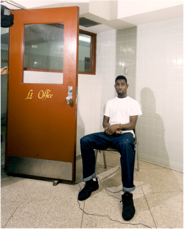
    
  

Shareef Cousin (-1999) 

In re Jordan
, 913 So. 2d 775 (La. 2005) 

Summary: 
Shareef Cousin was convicted of the murder of Michael Gerardi and sentenced to death, based on the eyewitness testimony of Connie Babin. However, prosecutor Roger Jordan suppressed Babin's testimony that she was not wearing contact lenses during the murder. Cousin was exonerated and the Office of Disciplinary Counsel pursued charges against Jordan. The Louisiana Supreme Court eventually concluded that Jordan had violated Rule 3.8(d) and imposed a three-month suspension, deferred. 

TRAYLOR, J. 

This attorney disciplinary matter arises from formal charges filed by the Office of Disciplinary Counsel against respondent, Roger W. Jordan, Jr., a former Orleans Parish prosecutor. 

UNDERLYING FACTS AND PROCEDURAL HISTORY 
    

    
    
    
    

    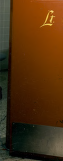
    
  

On April 22, 2003, the ODC filed one count of formal charges against respondent, alleging that he violated Rules 3.8(d)
114
 and 8.4(a)
115
 of the Rules of Professional Conduct by failing to timely disclose to the defense evidence tending to negate the guilt of the accused or mitigate the offense. The formal charges against respondent arise from the capital prosecution of Shareef Cousin and respondent's undisputed failure to turn over an eyewitness's statement to the defense. 

FACTS AND PROCEDURAL HISTORY OF 
STATE V. COUSIN
: 

Before addressing the merits of the case, it is necessary to discuss, in some detail, the underlying facts and procedural history of Shareef Cousin's criminal case. 

On March 2, 1995, Michael Gerardi was shot at point-blank range during an armed robbery attempt outside the Port of Call restaurant in New Orleans. Connie Ann Babin, Mr. Gerardi's date that evening and the only eyewitness to the murder, gave three separate statements to the New Orleans Police Department during the homicide investigation. When questioned on the night of the murder, a "visibly shaken" Ms. Babin told the police that she "did not get a good look at the perpetrators and probably could not identify them." In the second statement, which was tape recorded by police at Ms. Babin's home on March 5, 1995, three days after the murder, 

Ms. Babin was asked by a New Orleans Police Department detective whether she could "describe the person who did the shooting, his clothing?" In response, Ms. Babin said that she remembered the shooter was wearing an oversized denim jacket. She continued: 

I don't know, it was dark and I did not have my contacts nor my glasses so I'm coming at this at a disadvantage. I ... you know you could see outlines and shapes and things that stick out, but 
er...
 the socks, I remember the colorful socks, because he kept drawing my attention to it when he kept fidgeting at his ankle area. 

Ms. Babin went on to describe the shooter's hair and to say that the shooter was in his late teens and five feet seven or eight inches tall. After providing this description, Ms. Babin stated: 

As he looked to me ... I keep getting this vision of a young man with, with an older man's face ... er I don't know that if this is coming ... er somewhere, or if I really did see this person ... if this is just coming from my imagination or what, but I ... every time I go over 

Rule 3.8 of the Rules of Professional Conduct provides in pertinent part as follows: 

The prosecutor in a criminal case shall: 

(d) Make timely disclosure to the defense of all evidence or information known to the prosecutor that tends to negate the guilt of the accused or mitigates the offense, except when the prosecutor is relieved of this responsibility by a protective order of the tribunal. 

Rule 8.4 of the Rules of Professional Conduct provides, in pertinent part: 

It is professional misconduct for a lawyer to: 

(a) Violate or attempt to violate the Rules of Professional Conduct, knowingly assist or induce another to do so, or do so through the acts of another. 

it and close my eyes 
er...
 I remember thinking that he had an older man's face or a young body, on a young person ... how I visualize that, I don't know. 

On March 25, 1995, three weeks after the murder, Ms. Babin viewed a photographic lineup presented by the police and positively identified sixteen-year old Shareef Cousin as the shooter. Mr. Cousin was arrested a short time later and indicted for the first degree murder of Mr. 

Gerardi. 

In the summer of 1995, the criminal case was assigned to respondent, then an assistant district attorney in Orleans Parish. When respondent was first assigned the case, he recalls that there were three identification witnesses. However, Ms. Babin was the only witness to positively identify Mr. Cousin. 

In preparing for trial, respondent interviewed Ms. Babin. She informed him that she is nearsighted and only needs her contacts or glasses for nighttime driving, but not to see at close distances. Considering this information, respondent unilaterally determined that the absence of contacts or glasses on the night of the murder did not affect Ms. Babin's identification of Mr. Cousin as the shooter. 

Respondent testified at his disciplinary hearing that he believed Ms. Babin's second statement provided significant additional details that tended to corroborate her identification of Mr. Cousin, especially the observation of the killer as having "an old man's face" on "a young person's body." Respondent therefore concluded that, in his judgment, Ms. Babin's second statement was not material exculpatory evidence to which the defense would be entitled under 
Brady v. Maryland.
 Accordingly, he did not produce that statement to Mr. Cousin's attorneys in response to their motion for the production of exculpatory evidence. Respondent has never maintained that he was unaware of his obligation as a prosecutor to disclose exculpatory evidence pursuant to 
Brady. 

Prior to the trial, Mr. Cousin's defense team filed a motion to suppress Ms. Babin's identification of Mr. Cousin. Ms. Babin testified at the suppression hearing, and, in response to questions by respondent, explained the manner by which she came to identify Mr. Cousin in the photographic lineup conducted by the NOPD. On cross-examination, Mr. Cousin's attorney questioned Ms. Babin as to whether she had given a description of the perpetrator to the police "when they questioned you about this case." Ms. Babin testified she described the perpetrator as youthful, slim, slightly shorter than Mr. Gerardi, with short cropped hair and a very distinctive "unusual" or "evil-looking" face. Mr. Cousin's attorney also asked whether Ms. Babin told the police "about any characteristics that you felt were outstanding." Ms. Babin said that she could only recall stating "that he had an older-looking face on a younger body." While Mr. Cousin's attorney attempted to discover whether or not Ms. Babin had given any additional descriptions to anyone else prior to the photographic lineup, respondent objected, and the question was rephrased. Eventually, Mr. Cousin's attorney questioned Ms. Babin as to whether she had provided any additional statements to the police other than the night of the murder and the photographic lineup. Ms. Babin testified that her description had been consistent throughout. Thus, the only 

Ill 

way that the defense could have known about Statement 2 would have been disclosure by respondent. 

Ms. Babin testified at trial and repeated her positive identification of Mr. Cousin. Mr. Cousin was convicted of first degree murder. The same jury subsequently sentenced him to death in a bifurcated penalty phase. 

Several days after the completion of the guilt phase of the trial but before the penalty phase, a copy of Statement 2 was delivered anonymously to defense counsel. On appeal, the defense raised as error respondent's failure to produce Statement 2 prior to trial. This Court did not reach that issue. Instead, a unanimous Court reversed Mr. Cousin's conviction and death sentence based on the erroneous admission of a witness' testimony as impeachment evidence and respondent's improper use of that evidence in closing argument. Nevertheless, the Court commented in footnotes that Ms. Babin's second statement was "obviously" exculpatory, material to the issue of guilt, and "clearly" should have been produced to the defense under Brady
 and 
Kyles v. Whitley. 

Following this court's decision in 
Cousin
, the Orleans Parish District Attorney's Office elected not to retry Mr. Cousin for the murder of Michael Gerardi. 

DISCIPLINARY PROCEEDINGS 

DISCIPLINARY COMPLAINT 

In May 1998, Mr. Cousin and his sister, Tonya Cropper, filed a complaint against respondent with the ODC, alleging, among other things, that respondent wrongfully suppressed 
Brady evidence by failing to disclose Ms. Babin's second statement. In his July 1998 response to the complaint, respondent asserted his belief that the witness's statement at issue was more inculpatory than exculpatory, and his determination that disclosure of the statement was not required by 
Brady.
 Respondent reiterated this assertion in his sworn statement taken by the ODC on June 16, 1999. 

Following its investigation, the ODC dismissed the complaint against respondent. Ms. Cropper appealed the dismissal, but the hearing committee found that the ODC did not abuse its discretion in dismissing the complaint. Subsequently, the disciplinary board remanded the matter to the ODC with instructions to file formal charges against respondent. 

FORMAL HEARING 

The hearing committee conducted a formal hearing on the charges. ODC called several witnesses in its case in chief, including respondent, Shareef Cousin's defense attorney, and the complainant, Tonya Cropper. Respondent presented character testimony from several members of the bench and bar. 

Hearing Committee Recommendation 

In a split decision, the chair and the public member of the committee found that the ODC did not prove a violation of Rules 3.8(d) and 8.4(a) as charged, and recommended that the formal charges against respondent be dismissed. In a nineteen page report, the majority found respondent's testimony credible regarding the nature of the 
Brady
 material. The committee acknowledged that respondent was in possession of the statement yet failed to disclose the second statement to the defense. However, the committee found no violation of Rule 3.8, as the committee determined that respondent reasonably believed that Ms. Babin's statement was inculpatory rather than exculpatory. The committee concluded that the defense was aware of the second statement and that it did not believe that the prosecution had an obligation "to help out the defense" by providing the statement. Based on these factual determinations, the majority of the committee concluded that respondent did not violate the Rules of Professional Conduct. 

The lawyer member of the committee dissented, noting her objection to the majority's interpretation of a prosecutor's duty under 
Brady.
 She commented that she did not believe that the prosecutor has the discretion to determine whether to disclose exculpatory evidence to the defense. Rather, she interpreted 
Brady
 as imposing an affirmative duty on the prosecutor to disclose material exculpatory evidence, irrespective of whether a request was made by the defense. 

The ODC filed an objection to the hearing committee's report and recommendation. 

Ruling of the Disciplinary Board 

The disciplinary board determined that respondent technically violated the Rules of Professional Conduct, but found that no discipline was appropriate and dismissed the formal charges against respondent. While the board adopted the hearing committee's factual findings, it rejected the committee's legal conclusions and application of the Rules of Professional Conduct. The board determined that the committee erred in its finding that respondent did not violate either 
Brady
 or Rule 3.8(d) when he failed to produce Ms. Babin's second statement. The board concluded that respondent was ethically bound to voluntarily disclose Statement 2, which tended to negate the guilt of the accused by calling into question Ms. Babin's positive identification of Cousin as the perpetrator of the crime. By failing to do so, respondent violated Rule 3.8(d). 

The board found no aggravating factors present in this case, but found "numerous and weighty" mitigating factors, including the absence of a prior disciplinary record, absence of a dishonest or selfish motive, full and free disclosure to the disciplinary board and a cooperative attitude toward the proceedings, character and reputation, and remorse. The board concluded: 

While the board finds that respondent's actions constitute a technical violation of the Rules of Professional Conduct, considering all of the factors, particularly respondent's good faith and lack of intent, the lack of any actual injury, respondent's excellent reputation among judges and colleagues and his unblemished disciplinary record, and 

considering the purpose of lawyer discipline, the board finds that no formal discipline is warranted. 

Based on this reasoning, the formal charges against respondent were dismissed. 

The ODC sought review of the board's ruling in this Court. We ordered the parties to submit briefs addressing the issue of whether the record supports the disciplinary board's report. After reviewing the briefs filed by both parties, we docketed the matter for oral argument. 

DISCUSSION 

In our system of justice, we entrust vast discretion to a prosecutor. Because a prosecutor is given such great power and discretion, he is also charged with a high ethical standard. A prosecutor stands as the representative of the people of the State of Louisiana. He is entrusted with upholding the integrity of the criminal justice system by ensuring that justice is served for both the victims of crimes and the accused. "Society wins not only when the guilty are convicted but when criminal trials are fair; our system of the administration of justice suffers when any accused is treated unfairly." The actions, or inactions in this case, of the prosecutor are paramount to a fair administration of justice; and the people of this state must have confidence in a prosecutor's integrity in performing his duty to disclose exculpatory evidence in order for the system to be just. Any intentional deviation from the principle of the fair administration of justice will be dealt with harshly by this Court. 

This is a case of first impression in the State of Louisiana. Never before have we been confronted with the issue of disciplining a prosecutor for failing to disclose "evidence or information known to the prosecutor that tends to negate the guilt of the accused or mitigates the offense, and, in connection with sentencing, disclose to the defense and to the tribunal all unprivileged mitigating information known to the prosecutor." The language of Rule 3.8(d) is recognizably similar to the prosecutor's duty set forth in 
Brady
 and its progeny. Moreover, the Louisiana Code of Criminal Procedure likewise imposes a corresponding statutory duty on a prosecutor to disclose exculpatory evidence to the defendant. 

The duty of a prosecutor to disclose exculpatory evidence is embedded in the principle that a criminal defendant is deprived of a fair trial when the state withholds exculpatory evidence that is material to guilt or punishment. The state's failure to disclose material evidence favorable to a criminal defendant implicates more than the defendant's discovery rights; the prosecutor has an affirmative duty to disclose such evidence under the Fourteenth Amendment's Due Process Clause. Failure to reveal this evidence implicates the defendant's right to a fair trial. 

Whether the questioned evidence is material under 
Brady
 has been explained by this Court in Marshall: 

The issue is whether the exculpatory evidence is material under the 
Brady-Bagley-Kyles line of cases. Evidence is material only if it is reasonably probable that the result of the 

proceeding would have been different had the evidence been disclosed to the defense. A reasonable probability is one which is sufficient to undermine confidence in the outcome. This Court must provide a cumulative evaluation of the suppressed evidence, keeping in mind that Marshall does not have to show that, with the addition of the suppressed evidence, his trial would have resulted in acquittal or that there would be an insufficiency of the evidence to support a conviction. Marshall need only show that "disclosure of the suppressed evidence to competent counsel would have made a different result reasonably probable." 

During his testimony before the hearing committee, respondent testified that he did not believe Ms. Babin's second statement was material and did not qualify as the type of evidence to be disclosed under 
Brady.
 Specifically, respondent stated that he thought the evidence was inculpatory rather than exculpatory as Ms. Babin recounted specific details regarding the defendant's clothing and colorful socks. While the definition of materiality set forth in 
Kyles
 and its progeny may be seen as leaving a prosecutor with a degree of discretion, it does not. 

Exculpatory evidence includes evidence which impeaches the testimony of a witness whose credibility or reliability may determine guilt or innocence. Additionally, 
United States v. Bagley reiterates the principle that there is no distinction between exculpatory evidence and impeachment evidence under 
Brady.
 Clearly, Ms. Babin's second statement negates her ability to positively identify the defendant in a lineup. The statement should have been disclosed to the defense. As we noted in our decision overruling Mr. Cousin's conviction, citing Justice Souter's eloquent statement in 
Kyles
, a prosecutor anxious about "tacking too close to the wind will disclose a favorable piece of evidence" and "will resolve doubtful questions in favor of disclosure." Respondent failed to produce evidence which was clearly exculpatory and should have resolved this issue in favor of disclosure. 

Accordingly, we agree with the factual findings of the disciplinary board that respondent violated Rule 3.8(d) by failing to disclose the second statement of Ms. Babin to the defendant. 

SANCTIONS 

In considering the issue of sanctions, we are mindful that disciplinary proceedings are designed to maintain high standards of conduct, protect the public, preserve the integrity of the profession, and deter future misconduct. The discipline to be imposed depends upon the facts of each case and the seriousness of the offenses involved, considered in light of any aggravating and mitigating circumstances. Thus, we must consider the facts as they are presented herein in deciding the type of discipline to impose on respondent. 

The violation of Rule 3.8(d) by a prosecutor raises a great deal of concern to this Court. Rule 3.8(d) exists to ensure that the integrity of the prosecutorial arm of our criminal justice system is maintained. Moreover, prosecutors are in a unique position from other members of the bar as they are immune from civil liability under 
Imblerv. Pachtman.
 Neither are they realistically subject to criminal sanctions. Our research reveals only one instance in which a judge held a 

prosecutor in contempt of court for failing to disclose evidence. Thus, absent consequences being imposed by this Court under its authority over disciplinary matters, prosecutors face no realistic consequences for 
Brady
 violations. 

In deciding the appropriate sanction, we begin our analysis with Supreme Court Rule XIX, § 10(C), which sets forth the following considerations in imposing discipline: 

1. Whether the lawyer has violated a duty owed to a client, to the public, to the legal system, or to the profession; 

2. Whether the lawyer acted intentionally, knowingly, or negligently; 

3. The amount of the actual or potential injury caused by the lawyer's misconduct; and 

4. The existence of any aggravating or mitigating factors. 

By withholding material exculpatory evidence from a criminal defendant, respondent violated a duty owed to the public. As a prosecutor, respondent is charged with a high ethical standard and may not carelessly skirt his obligation. Although neither 
Brady
 nor Rule 3.8 incorporates a mental element, Rule XIX, § 10(C) does. Based on the testimony of respondent and the character evidence discussed below, we find that respondent knowingly withheld Brady evidence.
116
 As to the element regarding actual injury, this Court reversed Shareef Cousin's conviction on other grounds and granted him a new trial. However, this Court's actions in reversing the conviction does not vitiate the potential injury to the criminal justice system, or to Cousin, caused by respondent's actions, and warrants serious consideration and discipline by this Court. 

As to the issue of aggravating and mitigating factors, we find the only aggravating factor present in this case is respondent's substantial experience as a prosecutor. However, on the issue of mitigation, we find a host of factors present. Specifically, we find the absence of any prior disciplinary record, absence of a dishonest motive, full and free disclosure to the board, a cooperative attitude towards the proceedings, and good character and reputation in the legal community. 

As stated above, the issue of discipline against a prosecutor for his violation of Rule 3.8 is 
res nova
 in the State of Louisiana. While this Court has the benefit of Rule XIX considerations, we have no prior case law on the issue. However, Louisiana is not the first jurisdiction to address the issue of a prosecutor's failure to disclose evidence to a defendant. Our brethren in North Carolina, Kansas, South Carolina, Ohio and Iowa have imposed discipline against an attorney who fails to disclose evidence pursuant to Brady. Thus, we find some guidance in their decisions. The sanctions imposed in other jurisdictions range from public reprimand or censure to a six-month suspension from the practice of law. Based upon the facts of this case, we conclude the appropriate baseline sanction for respondent's misconduct is a three-month 

116
 The ABA's Standards for Imposing Lawyer Sanctions, defines "knowledge" as: 

The conscious awareness of the nature or attendant circumstances of the conduct but without the conscious objective or purpose to accomplish a particular result. 

Ill 

suspension from the practice of law. However, in light of the mitigating factors, we will defer this suspension in its entirety, subject to the condition that any misconduct during a one-year period following the finality of this judgment may be grounds for making the deferred suspension executory, or imposing additional discipline, as appropriate. 

JOHNSON, J. concurs in part, dissents in part, for the reasons that follow. 

I concur in the majority's opinion that respondent knowingly withheld 
Brady
 evidence, that respondent's experience as a prosecutor was an aggravating factor, that the Court's actions in reversing defendant's conviction failed to invalidate the potential injury to the criminal justice system, or to defendant, and that respondent's behavior warrants discipline by this Court. However, because of the actual injury caused by respondent's prosecutorial misconduct, I dissent from the majority's conclusion that respondent's suspension should be deferred. 

As cited in the majority opinion, Louisiana Supreme Court Rule XIX, § 10(c) sets forth four factors to be considered when imposing lawyer discipline. The third factor in this analysis is the "amount of the actual or potential injury caused by the lawyer's misconduct." Regarding actual injury, the majority opinion states that "this Court reversed Shareef Cousin's conviction on other grounds and granted him a new trial." Thus, the majority opinion adopts the reasoning, stated explicitly by the disciplinary board in the lower proceedings, that no injury resulted from respondent's conduct since the defendant's conviction was reversed. Although reversal of defendant's sentence of death by lethal injection amends the wrongful sentence, it fails to negate the actual injury caused by respondent's misconduct. 

Pursuant to Louisiana Supreme Court Rule XIX, § 10(c), this court has held that an attorney caused an actual injury because the attorney's failure to pay a client's medical bill resulted in a negative report to a credit agency. In another matter, we determined that an attorney caused an actual injury when he abandoned his legal practice and failed to return a $750 fee to a client and delayed the client's legal proceedings. In my view, the taking of a liberty interest is an even greater injury. As one legal commentator noted, "liberty is absolute and the loss of it is the greatest of all human injustices." Indeed, how can we ignore the injury caused by the wrongful taking of freedom, or the despair that inevitably follows as a defendant sits on death row and prepares for execution by lethal injection. "The execution of a legally and factually innocent person would be a constitutionally intolerable event," wrote Justice Sandra Day O'Connor in Herrera v. Collins.
 It is noteworthy that Shareef Cousin faced this predicament at the age of sixteen. The United States Supreme Court has since determined that execution of individuals who were under the age of 18 at the time of their capital crimes is unconstitutional. 

Wrongful conviction constitutes an actual injury. Moreover, the United States Supreme Court has held that a wrongful conviction "has continuing collateral consequences." Michael Anthony Williams, who was recently freed from Angola State Penitentiary after serving 24 years for a crime he did not commit, and who, like Shareef Cousin, was convicted at the age of sixteen, described his time in prison as "a living hell." He stated that "a lot of terrible things happened to me while I was in there." Williams confessed that when he was younger, he was sexually 

abused "while guards turned their backs." Persons wrongfully convicted lose time during incarceration that cannot be retrieved. Furthermore, inmates, generally, leave prison with no savings, dismal employment prospects, and oftentimes medical and mental issues. Wrongful conviction can also cause significant stress on family relationships including the financial pressure that may have been created by legal fees associated with the wrongful conviction. 

In the present case, disciplinary charges were filed against respondent by Shareef Cousin and his sister, Tonya Cropper. Tonya Cropper's testimony at the Hearing Committee describes the emotional turmoil that the Cousin family endured as a result of defendant's wrongful conviction.
117 

In 1976, the United States Supreme Court held that individual prosecutors have absolute immunity under common law tort claims as well as section 1983 suits. This court adopted the 

117
 Cropper now resides in Boston, Massachusetts but at the time of the conviction and sentencing, she resided in Plano, Texas. During the trial Cropper drove from Plano and stayed through the duration of the trial. Cropper testified that after the conviction and sentencing she was numbed by the whole procedure. She couldn't believe that her brother was going to die. During this time her family was bitter with the justice system; they still hold resentment towards the courts. 

Cropper said that Roger Jordan's insistence on the guilt of her brother infuriated her. On the Geraldo talk show, it was Jordan's face that represented her brother's conviction and death sentence. Even after the dismissal of the charges, she stated that Jordan continued to insist on the guilt of her brother. 

Cropper expressed how she was too angry, hurt, and confused to testify during the penalty phase of the trial. She told how her brother had an outburst of emotion in court during Jordan's closing statement. The same emotional fury flowed through her veins. After the denial of a new trial, she, her four sisters, and her mother had an emotional, tear-filled prayer with Cousin before he was sent to Angola State Penitentiary. As he was taken away from his family, Cousin cried for the first time since the ordeal began. 

She tells how she hated to see her brother in jail, and how she had only visited him once since he was initially arrested for the murder. She spent a lot of time dwelling on the fact that her brother was going to die of lethal injection. She finally decided to subject herself to seeing her brother behind bars. 

Cropper goes on to tell of the travel accommodations that had to be made so the whole family would have an opportunity to see her brother in jail. She drove eight hours from Texas to pick her sisters and mom up; none of them had a car. The family would then travel two and a half hours to Angola. After the visit she would transport her family back to New Orleans. She would then rest for several hours and then drive back to Texas. This was all in one day. She made the trip faithfully every month until Cousin was removed from death row. Her daughter also had to endure seeing her uncle in jail. She never wanted her child to think her uncle was a murderer. 

She felt Jordan had no regard for her family or for her brothers rights because her brother was arrested for four separate counts of armed robbery. She believes Jordan thought no one cared about her brother and he could do anything to win at all cost, regardless of her brother's due process rights. Her brother believed his attorney who told him that the robbery plea bargain was in his best interest because the judge was going to try him (and sentence him) on each count separately, and he would have to serve two times the sentence he is currently serving if found guilty of those robberies separately. Cropper did not understand why Jordan seemed to feel that her brother's life was so disposable. 

Cropper explained that an injustice has been done not only to the Cousin family but also to the victim, Gerardi's, family because that family has no closure in the death of their son. 

Imbier
 court's reasoning in 
Knapper v. Cormick,
 when we determined that "prosecutors are entitled to absolute immunity for conduct within the course and scope of their prosecutorial functions." Thus, prosecutors have absolute immunity even in instances, such as the present case, where the prosecutor suppressed exculpatory information. However, the 
Imbler
 decision also identifies the legal community's responsibility for maintaining the integrity of prosecutors and deterring prosecutors from violating standards of the legal profession. The court concluded that "a prosecutor stands perhaps unique, among officials whose acts could deprive persons of constitutional rights, in his amenability to professional discipline by an association of his peers." Therefore, our function in dispensing disciplinary action is critical both for upholding the highest ethical and professional standards among prosecutors and ensuring fundamental fairness for defendants. As expressed by the Honorable Calvin Johnson of Orleans Parish Criminal Court, in a letter contained in the record to then Orleans Parish District Attorney Harry Connick, Rule 3.8 was established to ensure professional responsibility among lawyers as well as to guarantee the constitutional due process rights of criminal defendants.
118 

In determining whether respondent caused an actual injury pursuant to Louisiana's Supreme Court Rule XIX, § 10(c), our focus should be on the unnecessary and unlawful suffering of the wrongfully convicted as a result of the prosecutorial misconduct, not just the reversal of the wrongfully imposed sentence. Because, in my view, loss of a liberty interest is more valuable than financial loss or injury to one's credit, I would impose an actual period of suspension. 

118 

In addition to the actual injury caused by respondent's violation of Rule 3.8, there are other allegations of misconduct cited in the complaint, though no formal charges were brought by the Office of Disciplinary Counsel. Specifically, during testimony at a motion for new trial, it was alleged that Jordan's co-counsel, Assistant District Attorney Byron Berry, may have removed several of defendant's alibi witnesses from outside the courtroom to the District Attorney's office. Later, when the time came for those witnesses to be called, respondent failed to tell defense counsel where the witnesses were. 

Furthermore, there are some concerns with defendant's guilty pleas to armed robbery. Cousin was arrested and charged with First Degree Murder on March 27, 1995. This is the arrest for the instant matter. The next day, March 28, 1995, Cousin was arrested and charged with four counts of armed robbery. Cousin pled guilty to the armed robberies before he was found guilty of murder, but after he had been arrested and charged with the crime. 

Cousin later petitioned this Court to grant supervisory writs and order post-conviction relief for the judgments entered against him in the armed robbery cases. In his writ application, Cousin argued that his guilty plea had been involuntary since he was never advised of the consequences of his plea. He claimed that he had not been apprised that his guilty plea would be used against him as four aggravating factors in the penalty phase of his capital trial. Additionally, he argued that he was not told that his guilty plea would prevent him from testifying in his capital trial, as the "prior" convictions would be used to impeach him if he got on the stand. This court denied defendant's application for writ of certiorari. J. Johnson dissented, stating that she was "not convinced that Cousin understood the consequences of his guilty pleas." 
    

    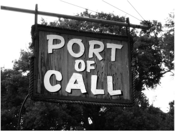
    
  

Questions: 

1. On May 2, 1995, at about 10:20 P.M., Michael Gerardi and Connie Babin left the Port of Call restaurant in the French Quarter of New Orleans. While they were walking to Gerardi's truck, three men followed them, and one of the men shot and killed Gerardi. Shortly afterward, the New Orleans police arrested James Rowell on nine counts of armed robbery. In exchange for reduced charges, Rowell provided information to the police. Among other things, he claimed that 
Shareef Cousin
 
had bragged about killing Gerardi. The police arrested Cousin, and Babin eventually identified him as the killer. In fact, Cousin was playing basketball when Gerardi was killed. The basketball game was videotaped, and a clock showed that it ended at about 10:00 P.M., after which coach Eric White drove Cousin and three other players home. At trial, Jordan not only suppressed Babin's testimony that she was not wearing contact lenses during the murder, but also altered recorded statements made by White in order to suppress the videotape of the basketball game and prevented the other basketball players from testifying. On January 25, 1996, Cousin was convicted of first-degree murder and sentenced to death. The Louisiana Supreme Court reversed Cousins's murder conviction and death sentence in 1998. 
State
 v. 
Cousin
, 710 So. 2d 1065 (La. 1998)
. 
But Cousin had also pleaded guilty to four counts of armed robbery, and was not released from prison until 2005. Cousins told his story in 
CNN
, 
NPR
, 
and 
TIME
, 
among other publications. You can watch a short video of Cousins describing his experiences 
here
. After his release from prison, Cousins began working for Stephen Bright at the Southern Center for Human Rights in Atlanta. Unfortunately, Cousins applied for credit cards in Bright's name and charged $42,000. In 
2008
, 
he pleaded guilty to identity theft and credit card fraud and served three years in prison. He currently lives in New Orleans and is 
active
 
in criminal justice reform advocacy. 

2. The New York Times reported on the Orleans Parish District Attorney Office's long history of prosecutorial misconduct 
here
. 
The Huffington Post reported on prosecutorial misconduct in New Orleans and elsewhere 
here. 
    

    
    
  

3. In assessing Jordan's culpability, the Louisiana Supreme Court found only one aggravating factor and many mitigating factors. How would you assess Jordan's culpability? 

4. The Louisiana Supreme Court sanctioned Jordan by imposing a three-month suspension, deferred. The dissent argued that the suspension should not be deferred. What sanction would you have imposed, if any? 
    

    
    
  

Eric Hillman (2014) 

Hillman v. Nueces County
 (Tex. 2019) 

Summary: 
Eric Hillman was an assistant district attorney in Nueces County, Texas. In 2014, he prosecuted a defendant for intoxicated assault and leaving the scene of an accident. In the course of investigating the case, Hillman interviewed a witness who stated the defendant was not intoxicated. The police report did not identify the witness, so Hillman informed his supervisor that he needed to disclose the witness to the defense, but his supervisor told him not to disclose. Hillman consulted with the State Bar Ethics Hotline and the Texas Center for Legal Ethics. Both told him to disclose, so he did, and he was fired. Hillman filed a wrongful termination action against Nueces County, but the trial court granted the county's motion to dismiss and the appeals court affirmed. The Texas Supreme Court also affirmed, holding that sovereign immunity barred Hillman's action. 

JEFFREY S. BOYD, Justice. 
    

    
    
    
    

    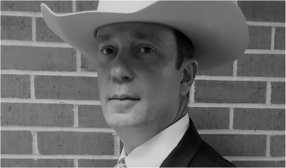
    
  

A former assistant district attorney filed this suit alleging that the county wrongfully terminated his employment because he refused his supervisor's order to withhold exculpatory evidence from a criminal defendant. The trial court dismissed the suit for lack of jurisdiction, and the court of appeals affirmed. Because we agree with those courts that governmental immunity bars the suit, we also affirm. 

I. Background 

Eric Hillman served as an assistant district attorney in Nueces County for two years. While preparing to prosecute a defendant charged with intoxicated assault and leaving the scene of an accident, Hillman discovered and interviewed a witness who said she was with the defendant the night of the incident and he was not intoxicated. Because the police report did not identify this witness, Hillman told his supervisor that he needed to disclose the witness to the defendant's attorney. The supervisor disagreed and instructed Hillman not to disclose the witness. Believing that he was legally required to disclose the witness, Hillman called the State Bar Ethics Hotline and the Texas Center for Legal Ethics for advice. Both told him he should disclose the information. 

Three days before the defendant's trial, the victim confirmed to Hillman that the witness had been present at the scene. Hillman relayed this information to his supervisor and informed her that he had decided to disclose the witness to the defense attorney. On the day of trial, Hillman was fired for "failing to follow instructions." He alleges he was fired solely for refusing to withhold exculpatory evidence. 

Hillman sued the County, the District Attorney's Office, and then-District Attorney Mark Skurka, in his official capacity, seeking actual damages for lost wages and benefits, mental anguish, pain and suffering, and loss of earning capacity, and exemplary damages. The County moved to dismiss on the ground that governmental immunity bars Hillman's claims. The trial court agreed and dismissed the case, and the court of appeals affirmed. 

II. Governmental Immunity 

Sovereign immunity—usually called governmental immunity when referring to political subdivisions—protects governmental entities against suits and legal liabilities. The County pleaded immunity from both suit and liability in this case, but only immunity from suit implicates the courts' jurisdiction. Because the trial court dismissed this case for lack of jurisdiction, we focus here solely on governmental immunity from suit. Because Hillman filed suit seeking money damages against a county and its department and official, governmental immunity bars this suit unless immunity has been waived. 

Like every court of appeals that has addressed the issue, the court of appeals concluded here that governmental immunity applies to Hillman's wrongful-termination claim and has not been waived. Presenting three alternative grounds for reversal, Hillman argues that (1) this Court abrogated or waived the County's immunity from this type of suit in 
Sabine Pilot Service, Inc. v. 

Hauck,
 in which we recognized a cause of action for wrongful termination of an at-will employee for refusal to perform an illegal act, (2) the Texas legislature waived the County's immunity through the Michael Morton Act, or (3) we should abrogate or waive the County's immunity from such suits today. Although Hillman and his supporting amici bolster these grounds with serious and important policy concerns, we ultimately find the grounds themselves unconvincing. 

A. 
Sabine Pilot 

Texas—"steadfastly an at-will employment state"—generally permits both employers and employees to terminate their relationship at any time for any reason unless they contractually agree otherwise. The law recognizes, however, a number of exceptions to this rule. One "very narrow exception to the employment-at-will doctrine," which we adopted in 
Sabine Pilot, prohibits employers from terminating at-will employees "for the sole reason that the employee refused to perform an illegal act." An employer who terminates an employee solely for that reason is liable to the employee for all resulting "reasonable tort damages, including punitive damages." 

Sabine Pilot
 involved claims against a private-sector employer, and this Court's very brief opinion never mentioned the duties or obligations of government employers. Noting that the Court did not expressly limit the exception to private employers or declare it inapplicable to government employers, Hillman argues that 
Sabine Pilot
 prohibits all employers—government as well as private—from terminating at-will employees solely for refusing to perform an illegal act. This argument reads too much into 
Sabine Pilot.
 Nothing in that opinion indicates anything regarding government employers. Because we simply did not consider or address whether the exception applies to government employers in 
Sabine Pilot,
 it provides no controlling principle on that issue here. 

Hillman suggests that even if 
Sabine Pilot
 did not resolve the issue, we can and should clarify today that the 
Sabine Pilot
 exception applies to government employers. We have no problem holding that the exception applies to all Texas employers, in the sense that they all have a common-law-tort duty not to terminate at-will employees solely because the employee refuses to perform an illegal act. But holding that the 
Sabine Pilot
 exception applies to government employers does not help Hillman. Hillman's problem is not that the duty does not apply to government employers, but that immunity bars any suit for a government employer's breach of that duty. 

Governmental immunity protects all governmental entities against suits and liabilities for their governmental actions, even when acting as employers. The legislature has provided a limited waiver of that immunity for certain tort and breach-of-contract actions. These statutes do not create tort or contractual duties or impose them on governmental entities. Those common-law duties preexist the statutes and apply to governmental entities as to anyone else, but immunity bars suits for breach of those duties. 

Instead of creating or imposing duties, the statutes waive the immunity that would otherwise protect the government, removing the barrier that precludes suits or liability for breach of those preexisting common-law duties. So although we can say that the common-law-tort duty we recognized in 
Sabine Pilot
 applies to all Texas employers, Hillman still cannot pursue this suit for the County's alleged breach of that duty unless the legislature has waived the County's governmental immunity. Because 
Sabine Pilot
 did not involve a governmental defendant and did not address governmental immunity or its waiver, it does not support Hillman's argument that the trial court had jurisdiction over his claim. 

B. The Michael Morton Act 

More than fifty-five years ago, the United States Supreme Court held that the Constitution's dueprocess clause prohibits criminal prosecutors from suppressing material evidence that is "favorable to an accused." Just over five years ago, the Texas legislature statutorily addressed "Brady violations" by passing the Michael Morton Act. The Michael Morton Act expressly requires prosecutors to 

disclose to the defendant any exculpatory, impeachment, or mitigating document, item, or information in the possession, custody, or control of the state that tends to negate the guilt of the defendant or would tend to reduce the punishment for the offense charged. 

Prosecutors must disclose such information whenever they discover it, whether "before, during, or after trial." 

Hillman contends that the Michael Morton Act required him to disclose the witness's information in the case he was prosecuting, so the County wrongfully terminated him for refusing to perform an illegal act. But even accepting these assertions as true, the issue here is not whether Hillman has pleaded a valid 
Sabine Pilot
 claim, but whether the Act waives the County's governmental immunity against that claim. 

To waive governmental immunity, a statute must use "clear and unambiguous language" expressing that intent. When deciding whether a statute clearly and unambiguously waives governmental immunity, we 

1. consider "whether the statutory provisions, even if not a model of clarity, waive immunity without doubt"; 

2. resolve any "ambiguity as to waiver in favor of retaining immunity"; 

3. generally find waiver "if the Legislature requires that the governmental entity be joined in a lawsuit even though the entity would otherwise be immune from suit"; 

4. consider whether the legislature "provided an objective limitation on the governmental entity's potential liability"; and 

5. consider "whether the statutory provisions would serve any purpose absent a waiver of immunity." 

Like the 
Sabine Pilot
 opinion, the Michael Morton Act does not address governmental immunity or waiver at all. None of its language waives immunity "without doubt" or even creates any ambiguity on the point. The Act does not require that the government be joined in any lawsuit or impose any limitation on the government's potential liability in such a suit. Implicating only the fifth consideration, Hillman argues that the Act necessarily must waive the County's immunity from his wrongful-termination suit because the Act's sole purpose is to require prosecutors to disclose exculpatory evidence. He contends that the Act would be "illusory" unless it waives immunity from 
Sabine Pilot
 claims, and finding no waiver "would defeat the sole purpose for passing the Michael Morton Act in the first place." As Hillman puts it, "A law making it a crime for a prosecutor to withhold evidence from the defense, but at the same time allowing the prosecutor's supervisor to fire him for refusing to do so is nonsensical and cannot possibly be what the legislature intended when it enacted the Michael Morton Act." 

These arguments read too much into the Michael Morton Act. The Act serves obvious purposes separate and apart from addressing any wrongful-termination issues. It codifies and "supplements" prosecutors' constitutional obligations under 
Brady.
 It requires production of several items that "previously were not discoverable" in criminal cases, including "written witness statements, written communications between the State and its agents, and work product." And violations of the Act may constitute grounds for reversing a conviction. 

Of course, the legislature could always do more to ensure that prosecutors disclose exculpatory information. Presumably, at least, prosecutors would be more likely to disclose such information if the Act authorized civil-damages suits—and waived immunity for such suits— against those who violate its requirements or who terminate subordinates who refuse to violate them. Whether countervailing policy concerns outweigh such benefits, however, "is the very essence of legislative choice." And the mere fact that a statute prohibits a government official from engaging in particular conduct does not establish that the statute also waives governmental immunity whenever a government employer terminates an employee for refusing to engage in that conduct. If that were true, every statutory prohibition would waive immunity from wrongfultermination claims. 

Nothing in the Michael Morton Act indicates a legislative intent to waive governmental immunity from a wrongful-termination suit under 
Sabine Pilot.
 No explicit language or even ambiguous language indicates such an intent. We hold that the Michael Morton Act does not waive the County's governmental immunity from this suit. 

C. Judicial Abrogation of Immunity 

Alternatively, Hillman urges us to abolish the "ancient and antiquated" doctrine of governmental immunity altogether, or at least modify it to allow for 
Sabine Pilot
 claims against governmental entities. He notes that sovereign immunity developed and exists as a common-law doctrine, and "it remains the judiciary's responsibility to define the boundaries of the common-law doctrine and to determine under what circumstances sovereign immunity exists in the first instance." But 

in fulfilling that responsibility, we must respect both our precedent and our limitations under the constitutional separation of powers. 

Having existed for more than six hundred years, the governmental-immunity doctrine is "an established principle of jurisprudence in all civilized nations." We first recognized it as a principle of Texas law more than 170 years ago. Although the justifications for its existence have evolved through the years, we have steadfastly retained it in modern times precisely because it shields "the public from the costs and consequences of improvident actions of their governments," and ensures that the taxes the public pays are used "for their intended purposes." 

We are not blind to the truism that, "just as immunity is inherent to sovereignty, unfairness is inherent to immunity." But as the Court's majority explained in that case, we resolve that concern by deferring to the legislature, as the policy-making branch of government, "to decide whether and to what extent that immunity should be waived." As important as Hillman's and his supporting amici's policy concerns may be, they do not justify discarding these fundamental principles of Texas law. 

We in no way discount the serious policy concerns that Hillman, his supporting amici, and today's concurring opinion express. Governmental immunity from 
Sabine Pilot
 claims eliminates one means by which the law could ensure that prosecutors disclose exculpatory evidence as Brady
 and the Michael Morton Act require. As the amici note, the Act has enjoyed broad, bipartisan support in the legislature, the public, and the press, and the legislature has further strengthened the Act in more recent legislative sessions. But to hold that governmental immunity does not apply to 
Sabine Pilot
 claims, we must trespass across the boundary between defining immunity's scope (a judicial task) and waiving it (a legislative task). The distinction between scope and waiver is "a fine one," and we must "be very hesitant to declare immunity nonexistent in any particular case," lest we use our authority to define the scope as "a ruse for avoiding the Legislature." 

As we have repeatedly confirmed, "it is the Legislature's sole province to waive or abrogate sovereign immunity." That the legislature has recently revised the Michael Morton Act to strengthen its protections illustrates its continuing awareness of the Act and its importance, as well as its willingness to take steps to improve it. Whether waiving immunity from 
Sabine Pilot claims should be the next step in that process is up to the legislature, and we must defer to it to "protect its policymaking function." 

III. Conclusion 

"Sovereign immunity from suit defeats a trial court's subject matter jurisdiction." When, as here, a claim falls within the realm of governmental immunity, courts have no jurisdiction to hear the case unless immunity has been waived. We hold that neither 
Sabine Pilot
 nor the Michael Morton Act waives the County's governmental immunity from Hillman's wrongful-termination claim, and we defer to the legislature to decide whether such a waiver would be appropriate as 

a matter of public policy. We affirm the trial court's judgment granting the County's plea to the jurisdiction and dismissing the case. 

Justice GUZMAN, joined by JUSTICE LEHRMANN and JUSTICE DEVINE, concurring. 

No tyranny is more cruel than the one practiced in the shadow of the laws and under color of justice
.
119 

Imagine being accused, charged, and convicted of bludgeoning your spouse to death. You are innocent but sentenced to life in prison, effectively orphaning your only child. Over the next 24 years, you wage an uphill battle to prove your innocence, eventually discovering that the prosecution held the keys to your jail cell before you ever set foot in it. Eyewitness testimony pointing the finger at someone else and DNA evidence that was never tested would have exculpated you if the prosecutor had not secreted the evidence from those who were constitutionally charged with defending you. Ultimately exonerated after nearly a quarter century in confinement, you walk free. The prosecutor—now a judge—is found in contempt of court for suppressing this evidence. Small comfort. Justice delayed is justice denied. But more than that, justice delayed is life denied. 

While you were locked away for a crime you did not commit, you were denied your unalienable rights of life, liberty, and the pursuit of happiness. You lost your constitutional right to parent your child. To have his love and companionship. To shape who he is and how he became that way. Instead, your beautiful toddler is now a man struggling to reconnect with a person he doesn't know, can't remember as a parent, and spent years thinking was a vicious monster. And worse, the actual perpetrator of this heinous crime continued to walk the streets. Free to kill again. 

Alas, this is not a hypothetical. This is the true story of Michael Morton. Husband. Father. Supermarket manager. An ordinary Texan whose young wife fell victim to a stranger's brutality. And while Morton languished in jail, another young wife—Debra Baker—paid the ultimate price at the hands of the same killer, leaving yet another young child motherless. Foreseeable victims of overzealous prosecution. 

Unfortunately, this is not an isolated incident. Official misconduct has been a factor in more than half of the nationally reported exonerations since 1989—nearly four score of which have occurred in Texas. Wrongful convictions are anathema to our constitution. And suppression of evidence is anathema to the duty of a prosecutor to seek justice. Concealment of exculpatory evidence undermines the integrity of our criminal justice system, which is of vital importance to every one of us: "Society wins not only when the guilty are convicted but when criminal trials are fair. The administration of justice suffers when any accused is treated unfairly." 

119 

Charles de Secondat, Baron de Montesquieu, 
Considerations on the Causes of the Greatness of the Romans and Their Decline
 
130 (David Lowenthal trans., Hackett Pub. Co., 1999) (1965). 

The tragic story of Michael Morton and Debra Baker compelled the Legislature to take affirmative steps to prevent wrongful convictions due to prosecutorial misconduct. In the legislative session following Morton's exoneration, the Texas Legislature unanimously passed the Michael Morton Act. The Morton Act extends, but has not altered, prosecutors' longstanding obligation under 
Brady
 to disclose exculpatory evidence in the prosecution's possession. Before the Morton Act, prosecutors had a constitutional duty under 
Brady
 to disclose all evidence that might exonerate the defendant, but the defense had very limited pretrial discovery rights. Under the Morton Act, if the defense requests discovery, the prosecution is under a statutory duty to continually disclose exculpatory, mitigating, or impeachment evidence. The Act is an important legislative step towards ensuring 
Brady
 compliance and bolstering the integrity of the criminal justice system. 

As this case sadly demonstrates, however, unacceptable gaps remain. When one good man refuses to stay silent, refuses to "just follow orders," and refuses to do the wrong thing under the misguided belief that it's for the greater good, he should not lose his job. While Hillman might have had a viable 
ultra vires
 claim, had he chosen to pursue one, the limited remedies available under that theory are manifestly inadequate to ensure accountability in matters of the highest constitutional dimension. The law must—but currently does not—afford a remedy that advances the Legislature's calculated efforts to secure our constitutional guarantees. 

I 

Injustice anywhere is a threat to justice everywhere
,
120 

In 2013, Eric Hillman, an assistant district attorney in Nueces County, was assigned to prosecute David Sims for intoxication assault and leaving the scene of an accident. Hillman performed a diligent independent investigation and located a witness who was not listed in the police report. The witness told Hillman she was with Sims the entire evening, he had only consumed two alcoholic beverages, and he was not intoxicated when the accident occurred. 

Hillman immediately informed his supervisor that a new witness with exculpatory testimony had been located and he would be releasing that information to Sims's defense counsel. The supervisor demanded Hillman withhold the information, assuring him it was proper to do so. 

Unconvinced, Hillman conducted an independent investigation of his ethical obligations, consulting with both the Texas Center for Legal Ethics and the State Bar of Texas Ethics Hotline. Both admonished him to disclose the information to defense counsel. Hillman therefore reported to his supervisor that he intended to turn over the evidence to the defense because withholding it would be unethical. According to Hillman, his supervisor responded, "Eric, you need to decide if you want to be a prosecutor or a defense attorney." A week after Hillman announced his intention to disclose the information, former District Attorney Mark Skurka summarily terminated Hillman's employment for refusing to "follow instructions." 

Martin Luther King, Jr., 
Letter from Birmingham Jail
 (Apr. 16, 1963). 

Hillman sued the County, District Attorney Skurka, and the District Attorney's Office for wrongful termination, but his case was dismissed on a plea to the jurisdiction. 

I concur in today's judgment and join in much of the Court's reasoning. The gravamen of this case is governmental immunity: whether the County is immune from a wrongful-termination suit alleging a prosecutor was fired because he insisted on doing what the law requires. Under our immunity jurisprudence, this case is fairly straightforward, and the Court's analysis is sound. First, we did not abrogate governmental immunity in 
Sabine Pilot.
 The employer in that case was not a governmental entity, so the issue of governmental immunity was not before us and cannot be inferred 
sub silentio.
 Second, immunity has not been waived. We defer to the Legislature to waive immunity, and I agree with the Court that the Morton Act contains no such waiver because no "clear and unambiguous language" expresses that intent. Third, we should not abrogate immunity here. Although we have the power to abrogate immunity, we have rarely done so, and even then we limited it to offset claims rather than allowing unlimited recovery of monetary damages. Sanctioning the recovery of monetary damages—without any legislatively considered limitations like those in the Texas Tort Claims Act—would have significant public-fisc implications that raise separation-of-powers concerns. Finally, though Hillman arguably has a viable 
ultra vires
 claim, he has disclaimed any intent to assert one. Accordingly, I agree with the Court that the County is immune from suit in this case and that remand is not appropriate. I write separately, however, to highlight a lacuna in the legislative scheme that neuters the Legislature's efforts to forestall prosecutorial misconduct that could lead to wrongful convictions. 

If impunity is not demolished, all efforts to bring an end to corruption are in vain.
m 

Taking Hillman's account as true, he was fired for endeavoring to fulfill constitutional and statutory obligations imposed on all prosecutors. By any measure of law and morality in a civilized country, that is wrongful termination. Those we entrust to pursue justice should not be put to the Hobson's choice of earning a living or doing the right thing. Cloaking governmental employers with absolute immunity in such circumstances erodes public confidence in the criminal justice system and undermines concerted legislative efforts to reform that system. By and large, prosecutors are honorable public servants committed to fairness in the administration of justice, but when unlawful practices are tolerated, encouraged, or rewarded with career advantages, others may be enticed to cross the line or may be cowed by consequences visited on those who resist. It's fair to assume that the Legislature did not envision such a consequence when enacting the Morton Act without adopting measures to ensure prosecutors could comply with the Act without losing their jobs. In light of the underbelly this case exposes, it would be appropriate for the Legislature to do so now. 

Rigoberta Menchu Turn, 
The Plague of Corruption: Overcoming Impunity and Injustice,
 in GLOBAL CORRUPTION REPORT 2001, at 155 (Robin Hodess, Jessie Banfield & Toby Wolfe eds., Transparency Int'l 2001). 

Both 
Brady
 and the Morton Act obligate prosecutors to disclose certain types of evidence to the defense as a function of due process and to stave off wrongful convictions by thwarting pernicious prosecutorial practices. Wrongful convictions, as numerous studies have shown, come at a significant cost to our society. Financial burdens on the taxpayers accumulate through "an appeal, an appellate reversal, a retrial, investigational efforts to trace the real offender, possible civil lawsuits, and compensatory payments." While we can calculate economic losses from wrongful convictions—for example, the state has paid more than $93 million in compensation to 101 men and women who were wrongfully sent to prison over the past 25 years—the true cost is immeasurable. There is simply no way to restore lost time, no reset button that erases the financial and emotional consequences to the wrongfully incarcerated and their families. 

On the other side of the coin, for every innocent person that sits in jail, a criminal roams free. Free to commit more crimes. If DNA-exoneration cases are any kind of indicator, the societal consequences of convicting the wrong person—however it happens—are devastating. For example, out of 325 DNA-exoneration cases from 1989 to 2014, 68 of the true perpetrators later committed an additional 142 violent crimes—including 77 rapes, 34 homicides, and 31 other violent crimes. 

With such grave consequences, the best defense is a good offense. The Morton Act is a strong foundation, but more is required to ensure that those wielding power use it as the founders intended. Prosecutors are on the forefront of avoiding wrongful convictions and ameliorating the ensuing societal costs. Based on data compiled by the National Registry of Exonerations, official misconduct ranks second among the top five factors contributing to exonerations, leading to over half of the 2,401 (and counting) exonerations since 1989. The most common type of official misconduct involves concealing exculpatory evidence. 

While multiple external forces are aimed at ensuring accountability for misconduct—including professional discipline, potential criminal charges, and loss of elected office—this case epitomizes the limits of existing accountability measures. Research shows professional discipline and criminal charges are rarely imposed for prosecutorial misconduct. Even in the rare instances when misconduct is uncovered, it usually does not surface until after an innocent person has stayed in prison for years, presenting time-based challenges to any investigation or prosecution of wrongdoing. The possibility of some adverse consequence in some future public election has even less force as a deterrent and, more importantly, does absolutely nothing to alleviate irreparable harm resulting from the wrong. 

Brady
 violations are difficult to uncover because, by definition, they involve concealment of evidence in the prosecution's exclusive possession and control. Indeed, exposure of 
Brady violations generally requires the prosecution's own admission, some "chance discovery" by the defense team, or "dumb luck." The most effective way to combat prosecutorial misconduct is to provide a disincentive extrinsic to an individual prosecutor's own moral compass. "Ironically, the only one who can act as a check on the prosecution is the prosecution itself." This case places the internal dynamics within the prosecutor's office under a microscope. Although many district 

attorney's offices have implemented internal guidance or best practices, when the pressure to withhold evidence comes from the top, internal guidelines are at best a window dressing. Under circumstances like those alleged here, it is imperative that honest prosecutors not be punished. 

Absent legislative action, the best someone in Hillman's position could hope for is to seek prospective equitable relief under an 
ultra vires
 theory. An 
ultra vires
 claim can be brought against a state official if the officer "acted without legal authority." Although a district attorney has discretion to fire subordinates, one could argue there is no discretion to undertake such an action if it "conflicts with the law." If Hillman had not opposed consideration of his claims under an 
ultra vires
 theory, I would remand in the interest of justice to allow him to pursue that claim. 

However, as a policy matter, I am dubious that a remedy limited to prospective equitable relief is strong enough to deter the egregious conduct alleged here. To be effective, the remedy must be proportional to the wrong. To my mind, the threat of other consequences, including monetary relief, would provide the external pressure required to motivate vigilance and self-policing. The Legislature is better suited, and constitutionally constituted, to weigh the policy interests that bear on whether to waive immunity (and to what extent), but as to that matter, this case makes painfully clear that what's past is prologue. 

# Questions: 

1. Hillman was the first prosecutor represented by the 
Innocence Project
, 
in recognition of his commitment to doing justice. Hillman's action was also covered by the 
ABA Journal
, the 
Houston Chronicle
, 
the 
Austin Statesman
, 
the 
Associated Press
, 
and the 
San Francisco Chronicle
, 
among others. You can watch a video of the oral argument in Hillman v. Nueces County
 (2018) 
here
. 

2. Do you agree with the court's conclusion that sovereign immunity bars Hillman's action? Should the court have construed sovereign immunity differently? Should Hillman have a claim against Skurka? Would absolute prosecutorial immunity bar any such claim? Should it? 

3. Under the circumstances, what should Hillman have done? Did he have any other options? 
 

# Further Reading: 

- 
Bennett L. Gershman, 
The Prosecutor's Duty of Silence,
 79 Alb. L. Rev. 1183 (2016) 
 

# Further Viewing & Listening: 

- 
Last Week Tonight With John Oliver: Prosecutors (2018) 

- 
Carissa Byrne Hessick on the Myth of Common Law Crimes, Ipse Dixit, January 9, 2019 

- 
Rachel Barkow on Criminal Justice Reform, February 4, 2019 

- 
Maybell Romero on Profit-Driven Prosecution, February 28, 2019 

 

# 7.5: Judicial Recusal & Misconduct 

Good morning Judge, why do you look so mean? Sorry Mr. Judge, what can the charges be? If there's been trouble I will plead not guilty. It must be someone else, you know it can't be
 me.
122 

"If I had me job to pick out, " said Mr. Dooley, "I'd be a judge. I've looked over all th' others an' that's th' on'y wan that suits. I have th'judicyal timperamint. I hate wurruk."
123 

Judges must be neutral and impartial at all times. Or at least, they must appear to be neutral and impartial. Accordingly, judicial conduct is regulated by a congeries of constitutional, statutory, and administrative rules intended to ensure neutrality and impartiality. 

Among other things, due process requires judges to recuse themselves to avoid conflicts of interest, and may require disqualification if a judge fails to recuse. Federal law prohibits judges from accepting or soliciting bribes.
124
 But it also requires judges to recuse themselves whenever their impartiality could reasonably be questioned.
125
 The Judicial Conduct and Disability Act of 1980 authorizes complaints alleging that a federal judge "has engaged in conduct prejudicial to the effective and expeditious administration of the business of the courts" or "is unable to discharge all the duties of office by reason of mental or physical disability."
126
 And the Rules for Judicial-Conduct and Judicial-Disability Proceedings govern misconduct and disability proceedings against federal judges under the Act.
127
 States may have similar statutory and administrative provisions. 

Finally, federal and state judicial codes of conduct comprehensively regulate judges. In 1924, the ABA first created and approved its Canons of Judicial Conduct, which were revised in 1972, 1990, and 2007. The ABA canons are currently titled the 
Model Code of Judicial Conduct
, 
and consist of both aspirational principles and specific rules intended to realize those principles. The federal judiciary has adopted the 
Code of Conduct for United States Judges
, 
which includes the ethical canons that apply to federal judges and provides guidance on their performance of official duties and engagement in a variety of outside activities. Most states also have judicial commissions, which are empowered to investigate violations of judicial ethics. 
 

# Judicial Recusal 

Stop eatin' that fudge, cause here comes the judge. Don't nobody buzz, cause here comes the judge. Judge Shorty is presidin' today, and he don't take no stuff from nobody, no kind of
 way.
128 

122 

Wynonie Harris, 
Good Morning Judge
 (1952). 

123 

Finley Peter Dunne, Observations by Mr. Dooley (1902). 

124
 
18 U.S.C. §203(a)(1)(B)
. 

125
 
28 U.S.C. § 455
. 

126
 
28 U.S. Code §§ 351-64. 

127 

Guide to Judiciary Policy, Vol. 2: Ethics and Judicial Conduct, Pt. E: Judicial Conduct and Disability 

Act and Related Materials, Ch. 3: Rules for Judicial-Conduct and Judicial-Disability Proceedings. 

128
 Shorty Long, 
Here Comes the Judge
 (1968). 

 

# Model Code of Judicial Conduct: Canon 1 

A judge shall uphold and promote the independence, integrity, and impartiality of the judiciary, and shall avoid impropriety and the appearance of impropriety. 
 

# Model Rule 1.2: Promoting Confidence in the Judiciary 

A judge shall act at all times in a manner that promotes public confidence in the independence, integrity, and impartiality of the judiciary, and shall avoid impropriety and the appearance of impropriety. 
 

# Model Rule 1.2: Comments 

1. Public confidence in the judiciary is eroded by improper conduct and conduct that creates the appearance of impropriety. This principle applies to both the professional and personal conduct of a judge. 

2. A judge should expect to be the subject of public scrutiny that might be viewed as burdensome if applied to other citizens, and must accept the restrictions imposed by the Code. 

3. Conduct that compromises or appears to compromise the independence, integrity, and impartiality of a judge undermines public confidence in the judiciary. Because it is not practicable to list all such conduct, the Rule is necessarily cast in general terms. 

5. Actual improprieties include violations of law, court rules or provisions of this Code. The test for appearance of impropriety is whether the conduct would create in reasonable minds a perception that the judge violated this Code or engaged in other conduct that reflects adversely on the judge's honesty, impartiality, temperament, or fitness to serve as a judge. 
    

    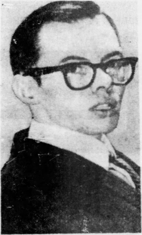
    
    

# RICHARD MAYBERRY <h2 class="calibre2">. 
landmark case </h2>

a 

The Philadelphia Inquirer, Jan. 11, 1972, at 1 

Mayberry v. Pennsylvania,
 400 U.S. 455 (1971) 

Summary: 
Mayberry and two co-defendants were tried in state court for an attempted prison break. They were appointed counsel, but represented by Mayberry. During the trial, Mayberry repeatedly insulted the judge and questioned his impartiality. The jury 
    

    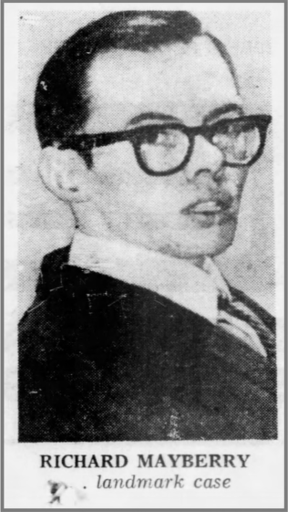
    
  

found the defendants guilty, but before imposing the sentence, the judge pronounced Mayberry guilty of 11 counts of criminal contempt, and sentenced him to 11 to 22 years. The Supreme Court of Pennsylvania affirmed the contempt charges, but the Supreme Court granted Mayberry's pro 
se
 petition for certiorari and reversed, holding that due process entitles a defendant in a criminal contempt proceeding to a trial before a different judge. 

MR. JUSTICE DOUGLAS delivered the opinion of the Court. 

Petitioner and two codefendants were tried in a state court for prison breach and holding hostages in a penal institution. While they had appointed counsel as advisers, they represented themselves. The trial ended with a jury verdict of guilty of both charges on the 21st day, which was a Friday. The defendants were brought in for sentencing on the following Monday. Before imposing sentence on the verdicts the judge pronounced them guilty of criminal contempt. He found that petitioner had committed one or more contempts on 11 of the 21 days of trial and sentenced him to not less than one nor more than two years for each of the 11 contempts or a total of 11 to 22 years. 

The Supreme Court of Pennsylvania affirmed by a divided vote. The case is here on a petition for writ of certiorari. 

Petitioner's conduct at the trial comes as a shock to those raised in the Western tradition that considers a courtroom a hallowed place of quiet dignity as far removed as possible from the emotions of the street. 

On the first day of the trial petitioner came to the sidebar to make suggestions and obtain rulings on trial procedures. Petitioner said: "It seems like the court has the intentions of railroading us" and moved to disqualify the judge. The motion was denied. Petitioner's other motions, including his request that the deputy sheriffs in the courtroom be dressed as civilians, were also denied. Then came the following colloquy: 

Mr. Mayberry: I would like to have a fair trial of this case and like to be granted a fair trial under the Sixth Amendment. 

The Court: You will get a fair trial. 

Mr. Mayberry: It doesn't appear that I am going to get one the way you are overruling all our motions and that, and being like a hatchet man for the State. 

The Court: This side bar is over. 

Mr. Mayberry: Wait a minute, Your Honor. 

The Court: It is over. 

Mr. Mayberry: You dirty sonofabitch." 

The second episode took place on the eighth day of the trial. A co-defendant was crossexamining a prison guard and the court sustained objections to certain questions: 

Mr. Codispoti: Are you trying to protect the prison authorities, Your Honor? Is that your reason? 

The Court: You are out of order, Mr. Codispoti. I don't want any outbursts like that again. This is a court of justice. You don't know how to ask questions. 

Mr. Mayberry: Possibly Your Honor doesn't know how to rule on them. 

The Court: You keep quiet. 

Mr. Mayberry: You ought to be Gilbert and Sullivan the way you sustain the district attorney every time he objects to the questions. 

The Court: Are you through? When your time comes you can ask questions and not make speeches. 

The next charge stemmed from the examination of an inmate about a riot in prison in which petitioner apparently was implicated. There were many questions asked and many objections sustained. At one point the following outburst occurred: 

Mr. Mayberry: Now, I'm going to produce my defense in this case and not be railroaded into any life sentence by any dirty, tyrannical old dog like yourself. 

The Court: You may proceed with your questioning, Mr. Mayberry. 

The fourth charge grew out of an examination of another defense witness: 

By Mr. Mayberry: 

Q. I ask you, Mr. Nardi, is that area, the handball court, is it open to any prisoner who wants to play handball, who cares to go to that area to play handball? 

A. Yes. 

Q. Did you understand the prior question when I asked you if it was freely open and accessible area? 

The Court: He answered your question. Let's go on. 

Mr. Mayberry: I am asking him now if he understands... 

The Court: He answered it. Now, let's go on. 

Mr. Mayberry: I ask Your Honor to keep your mouth shut while I'm questioning my own witness. Will you do that for me? 

The Court: I wish you would do the same. Proceed with your questioning. 

The fifth charge relates to a protest which the defendants made that at the end of each trial day they were denied access to their legal documents—a condition which the trial judge shortly remedied. The following ensued: 

Mr. Mayberry: You're a judge first. What are you working for? The prison authorities, you bum? 

Mr. Livingston: I have a motion pending before Your Honor. 

The Court: I would suggest... 

Mr. Mayberry: Go to hell. I don't give a good God damn what you suggest, you stumbling dog. 

Meanwhile one defendant told the judge if he did not get access to his papers at night he'd "blow your head off." Another defendant said he would not sit still and be "kowtowed and be railroaded into a life imprisonment." Then the following transpired: 

Mr. Mayberry: You started all this bullshit in the beginning. 

The Court: You keep quiet. 

Mr. Mayberry: Wait a minute. 

The Court: You keep quiet. 

Mr. Mayberry: I am my own counsel. 

The Court: You keep quiet. 

Mr. Mayberry. Are you going to gag me? 

The Court: Take these prisoners out of here. We will take a ten minute recess, members of the jury. 

The sixth episode happened when two of the defendants wanted to have some time to talk to a witness whom they had called. The two of them had had a heated exchange with the judge when the following happened: 

Mr. Mayberry: Just one moment, Your Honor. 

The Court: This is not your witness, Mr. Mayberry. Keep quiet. 

Mr. Mayberry: Oh, yes, he is my witness, too. He is my witness, also. Now, we are at the penitentiary and in seclusion. We can't talk to any of our witnesses prior to putting them on the stand like the District Attorney obviously has the opportunity, and as he obviously made use of the opportunity to talk to his witnesses. Now... 

The Court: Now, I have ruled, Mr. Mayberry. 

Mr. Mayberry: I don't care what you ruled. That is unimportant. The fact is... 

The Court: You will remain quiet, sir, and finish the examination of this witness. 

Mr. Mayberry: No, I won't be quiet while you try to deny me the right to a fair trial. The only way I will be quiet is if you have me gagged. Now, if you want to do that, that is up to you; but in the meantime I am going to say what I have to say. Now, we have the right to speak to our witnesses prior to putting them on the stand. This is an accepted fact of law. It is nothing new or unusual. Now, you are going to try to force us to have our witness testify to facts that he has only a hazy recollection of that happened back in 1965. Now, I believe we have the right to confer with our witness prior to putting him on the stand. 

The Court: Are you finished? 

Mr. Mayberry: I am finished. 

The Court: Proceed with your examination. 

The seventh charge grew out of an examination of a codefendant by petitioner. The following outburst took place: 

By Mr. Mayberry: 

Q. No. Don't state a conclusion because Gilbert is going to object and Sullivan will sustain. Give me facts. What leads you to say that? 

Later petitioner said: 

Mr. Mayberry: My witness isn't being in an inquisition, you know. This isn't the Spanish Inquisition. 

Following other exchanges with the court, petitioner said: 

Mr. Mayberry: Now, just what do you call proper? I have asked questions, numerous questions and everyone you said is improper. I have asked questions that my adviser has given me, and I have repeated these questions verbatim as they came out of my adviser's mouth, and you said they are improper. Now just what do you consider proper? The Court: I am not here to educate you, Mr. Mayberry. 

Mr. Mayberry: No. I know you are not. But you're not here to railroad me into no life bit, either. 

Mr. Codispoti: To protect the record... 

The Court: Do you have any other questions to ask this witness? 

Mr. Mayberry: You need to have some kind of psychiatric treatment, I think. You're some kind of a nut. I know you're trying to do a good job for that Warden Maroney back there, but let's keep it looking decent anyway, you know. Don't make it so obvious, Your Honor. 

A codefendant was removed from the courtroom and when he returned petitioner asked for a severance. 

Mr. Mayberry: I have to ask for a severance. 

The Court: I have heard that before. It is denied again. Let's go on. 

(Exception noted.) 

Mr. Mayberry: This is the craziest trial I have ever seen. 

The Court: You may call your next witness, Mr. Mayberry. 

Petitioner wanted to call witnesses from the penitentiary whose names had not been submitted earlier and for whom no subpoenas were issued. The court restricted the witnesses to the list of those subpoenaed: 

Mr. Mayberry: Before I get to that I wish to have a ruling, and I don't care if it is contempt or whatever you want to call it, but I want a ruling for the record that I am being denied these witnesses that I asked for months before this trial ever began. 

The ninth charge arose out of a ruling by the court on a question concerning the availability of tools to prisoners in their cells. 

The Court: I have ruled on that, Mr. Mayberry. Now proceed with your questioning, and don't argue. 

Mr. Mayberry: You're arguing. I'm not arguing, not arguing with fools. 

The court near the end of the trial had petitioner ejected from the courtroom several times. The contempt charge was phrased as follows by the court: 

On December 7, 1966, you have created a despicable scene in refusing to continue calling your witnesses and in creating such consternation and uproar as to cause a termination of the trial. 

As the court prepared to charge the jury, petitioner said: 

Before Your Honor begins the charge to the jury defendant Mayberry wishes to place his objection on the record to the charge and to the whole proceedings from now on, and he wishes to make it known to the Court now that he has no intention of remaining silent while the Court charges the jury, and that he is going to continually object to the charge of the Court to the jury throughout the entire charge, and he is not going to remain silent. He is going to disrupt the proceedings verbally throughout the entire charge of the Court, and also he is going to be objecting to being forced to terminate his defense before he was finished. 

The court thereupon had petitioner removed from the courtroom and later returned gagged. But petitioner caused such a commotion under gag that the court had him removed to an adjacent room where a loudspeaker system made the courtroom proceedings audible. The court phrased this contempt charge as follows: 

On December 9, 1966, you have constantly, boisterously, and insolently interrupted the Court during its attempts to charge the jury, thereby creating an atmosphere of utter confusion and chaos. 

These brazen efforts to denounce, insult, and slander the court and to paralyze the trial are at war with the concept of justice under law. Laymen, foolishly trying to defend themselves, may understandably create awkward and embarrassing scenes. Yet that is not the character of the record revealed here. We have here downright insults of a trial judge, and tactics taken from street brawls and transported to the courtroom. This is conduct not "befitting an American courtroom," and criminal contempt is one appropriate remedy. 

As these separate acts or outbursts took place, the arsenal of authority described in 
Allen
 was available to the trial judge to keep order in the courtroom. He could, with propriety, have instantly acted, holding petitioner in contempt, or excluding him from the courtroom, or otherwise insulating his vulgarity from the courtroom. The Court noted in 
Sacher v. United States,
 that, while instant action may be taken against a lawyer who is guilty of contempt, to 

pronounce him guilty of contempt is "not unlikely to prejudice his client." Those considerations are not pertinent here where petitioner undertook to represent himself. In 
Sacher
 the trial judge waited until the end of the trial to impose punishment for contempt, the Court saying: 

If we were to hold that summary punishment can be imposed only instantly upon the event, it would be an incentive to pronounce, while smarting under the irritation of the contemptuous act, what should be a well-considered judgment. We think it less likely that unfair condemnation of counsel will occur if the more deliberate course be permitted. 

Generalizations are difficult. Instant treatment of contempt where lawyers are involved may greatly prejudice their clients but it may be the only wise course where others are involved. Moreover, we do not say that the more vicious the attack on the judge the less qualified he is to act. A judge cannot be driven out of a case. Where, however, he does not act the instant the contempt is committed, but waits until the end of the trial, on balance, it is generally wise where the marks of the unseemly conduct have left personal stings to ask a fellow judge to take his place. What Chief Justice Taft said in 
Cooke v. United States
 is relevant here: 

The power of contempt which a judge must have and exercise in protecting the due and orderly administration of justice and in maintaining the authority and dignity of the court is most important and indispensable. But its exercise is a delicate one and care is needed to avoid arbitrary or oppressive conclusions. This rule of caution is more mandatory where the contempt charged has in it the element of personal criticism or attack upon the judge. The judge must banish the slightest personal impulse to reprisal, but he should not bend backward and injure the authority of the court by too great leniency. The substitution of another judge would avoid either tendency but it is not always possible. Of course where acts of contempt are palpably aggravated by a personal attack upon the judge in order to drive the judge out of the case for ulterior reasons, the scheme should not be permitted to succeed. But attempts of this kind are rare. All of such cases, however, present difficult questions for the judge. All we can say upon the whole matter is that where conditions do not make it impracticable, or where the delay may not injure public or private right, a judge called upon to act in a case of contempt by personal attack upon him, may, without flinching from his duty, properly ask that one of his fellow judges take his place. 

We conclude that that course should have been followed here, as marked personal feelings were present on both sides. 

Whether the trial be federal or state, the concern of due process is with the fair administration of justice. At times a judge has not been the image of "the impersonal authority of law," but has become so "personally embroiled" with a lawyer in the trial as to make the judge unfit to sit in judgment on the contempt charge. 

"The vital point is that in sitting in judgment on such a misbehaving lawyer the judge should not himself give vent to personal spleen or respond to a personal grievance. These are subtle matters, for they concern the ingredients of what constitutes justice. Therefore, justice must satisfy the appearance of justice." 

Offutt
 does not fit this case, for the state judge in the instant controversy was not an activist seeking combat. Rather, he was the target of petitioner's insolence. Yet a judge, vilified as was this Pennsylvania judge, necessarily becomes embroiled in a running, bitter controversy. No one so cruelly slandered is likely to maintain that calm detachment necessary for fair adjudication. 
In re Murchison
 was a case where a judge acted under state law as a one-man grand jury and later tried witnesses for contempt who refused to answer questions propounded by the "judge-grand jury." We held that since the judge who sat as a one-man grand jury was part of the accusatory process he "cannot be, in the very nature of things, wholly disinterested in the conviction or acquittal of those accused." "Fair trials are too important a part of our free society to let prosecuting judges be trial judges of the charges they prefer." 

It is, of course, not every attack on a judge that disqualifies him from sitting. In 
Ungar v. Sarafite
, we ruled that a lawyer's challenge, though "disruptive, recalcitrant and disagreeable commentary," was still not "an insulting attack upon the integrity of the judge carrying such potential for bias as to require disqualification." Many of the words leveled at the judge in the instant case were highly personal aspersions, even "fighting words"—''dirty sonofabitch," "dirty tyrannical old dog," "stumbling dog," and "fool." He was charged with running a Spanish Inquisition and told to "Go to hell" and "Keep your mouth shut." Insults of that kind are apt to strike "at the most vulnerable and human qualities of a judge's temperament." 

Our conclusion is that by reason of the Due Process Clause of the Fourteenth Amendment a defendant in criminal contempt proceedings should be given a public trial before a judge other than the one reviled by the contemnor. In the present case that requirement can be satisfied only if the judgment of contempt is vacated so that on remand another judge, not bearing the sting of these slanderous remarks and having the impersonal authority of the law, sits in judgment on the conduct of petitioner as shown by the record. 
    

    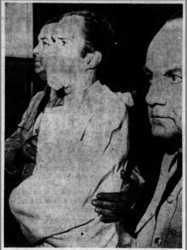
    
    

# CONVICT GOES TO COURT IN STRAITJACKET <h2 class="calibre2">Richard Mayberry restrained after outburst.—(AP) </h2>

I 

Oakland Tribune, Dec. 10, 1966, at 2 

Questions: 

1. On June 27, 1965, Richard O.J. Mayberry, Dominick Codispopi, and Herbert Langes tried to escape from Western State Penitentiary in Pittsburgh, Pennsylvania. Mayberry was originally convicted of armed robbery in 1957, and was serving 3.5 to 10 years for a 
    

    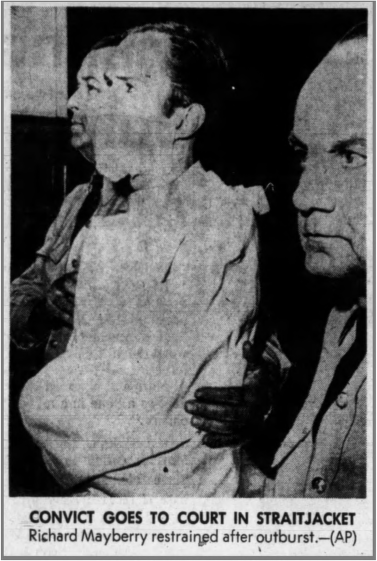
    
  

previous escape attempt in 1961. Mayberry, Codispoti, and Langes armed themselves with zip guns and homemade bombs, and took two guards hostage in the prison hospital. They surrendered after 90 minutes, when the state police bombarded them with tear gas, and released their hostages unharmed. Mayberry's hand was injured when one of the bombs exploded while he was throwing it. Mayberry became a legendary "jailhouse lawyer." Two of his petitions for certiorari were accepted by the Supreme Court, and several of the actions he filed led to significant prison reform. Today, 

Mayberry is still incarcerated in the Pennsylvania State Correctional Institution at Huntingdon. 

2. Why did the Court hold that due process required the judge to recuse himself from deciding the criminal contempt charges? Did Mayberry receive any due process on those charges? 

3. Mayberry, Codispoti, and Langes were all charged with contempt. On remand, all three were convicted of criminal contempt of court in non-jury trials, and sentenced to multiple consecutive terms, amounting to about 3 years. The Pennsylvania Supreme Court affirmed, but the Supreme Court granted certiorari and reversed, holding that criminal defendants in a contempt proceeding are entitled to a jury trial if the cumulative sentence could exceed 6 months. 
Codispoti
 v. 
Pennsylvania,
 418 U.S. 506 (1974)
. 
    

    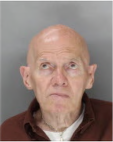
    
  

Richard Mayberry (2018) 
    

    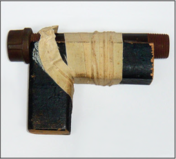
    
  

Zip gun used in prison escape attempt 

Further Reading: 

- 
Steven R. Jenkins, 
Mayberry v. Pennsylvania: Due Process Limitation in Summary 

Punishments for Contempt of Court,
 
25 Sw L.J. 805 (1971) 

- 
Contempt: Mayberry v. Pennsylvania,
 
400 U.S. 455 (1971), 62 J. Crim. L. Criminology & 

Police Sci. 525 (1971) 

Caperton v. A.T. Massey Coal Co., Inc.,
 556 U.S. 868 (2009) 

Summary: 
In 2002, Caperton won a business tort action against Massey and Blankenship, and received a $50 million damages award, which Massey and Blankenship appealed. In the meantime, Benjamin ran for a seat on the Supreme Court of Appeals of West Virginia. Blankenship spent about $3 million campaigning for Benjamin. When Benjamin won, Caperton filed a motion to disqualify Benjamin from the appeal, which Benjamin denied. The Supreme Court of Appeals granted the appeal and reversed. Benjamin also declined to recuse on rehearing, and the court once again reversed. The Supreme Court granted certiorari and reversed, holding that due process requires recusal when the facts create an objective appearance of impropriety. The dissent argued that the standard adopted by the majority was arbitrary and unworkable. 

Justice KENNEDY delivered the opinion of the Court. 

In this case the Supreme Court of Appeals of West Virginia reversed a trial court judgment, which had entered a jury verdict of $50 million. Five justices heard the case, and the vote to reverse was 3 to 2. The question presented is whether the Due Process Clause of the Fourteenth Amendment was violated when one of the justices in the majority denied a recusal motion. The basis for the motion was that the justice had received campaign contributions in an 
    

    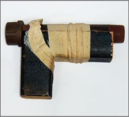
    
  

extraordinary amount from, and through the efforts of, the board chairman and principal officer of the corporation found liable for the damages. 

Under our precedents there are objective standards that require recusal when "the probability of actual bias on the part of the judge or decisionmaker is too high to be constitutionally tolerable." Applying those precedents, we find that, in all the circumstances of this case, due process requires recusal. 

I 

In August 2002 a West Virginia jury returned a verdict that found respondents A.T. Massey Coal Co. and its affiliates liable for fraudulent misrepresentation, concealment, and tortious interference with existing contractual relations. The jury awarded petitioners Hugh Caperton, Harman Development Corp., Harman Mining Corp., and Sovereign Coal Sales the sum of $50 million in compensatory and punitive damages. 

In June 2004 the state trial court denied Massey's post-trial motions challenging the verdict and the damages award, finding that Massey "intentionally acted in utter disregard of Caperton's rights and ultimately destroyed Caperton's businesses because, after conducting cost-benefit analyses, Massey concluded it was in its financial interest to do so." In March 2005 the trial court denied Massey's motion for judgment as a matter of law. 

Don Blankenship is Massey's chairman, chief executive officer, and president. After the verdict but before the appeal, West Virginia held its 2004 judicial elections. Knowing the Supreme Court of Appeals of West Virginia would consider the appeal in the case, Blankenship decided to support an attorney who sought to replace Justice McGraw. Justice McGraw was a candidate for reelection to that court. The attorney who sought to replace him was Brent Benjamin. 

In addition to contributing the $1,000 statutory maximum to Benjamin's campaign committee, Blankenship donated almost $2.5 million to "And For The Sake Of The Kids." The § 527 organization opposed McGraw and supported Benjamin. Blankenship's donations accounted for more than two-thirds of the total funds it raised. This was not all. Blankenship spent, in addition, just over $500,000 on independent expenditures—for direct mailings and letters soliciting donations as well as television and newspaper advertisements—"to support Brent Benjamin." 

To provide some perspective, Blankenship's $3 million in contributions were more than the total amount spent by all other Benjamin supporters and three times the amount spent by Benjamin's own committee. Caperton contends that Blankenship spent $1 million more than the total amount spent by the campaign committees of both candidates combined. 

Benjamin won. He received 382,036 votes (53.3%), and McGraw received 334,301 votes (46.7%). 

In October 2005, before Massey filed its petition for appeal in West Virginia's highest court, Caperton moved to disqualify now-Justice Benjamin under the Due Process Clause and the West Virginia Code of Judicial Conduct, based on the conflict caused by Blankenship's campaign involvement. Justice Benjamin denied the motion in April 2006. He indicated that he "carefully considered the bases and accompanying exhibits proffered by the movants." But he found "no objective information to show that this Justice has a bias for or against any litigant, that this Justice has prejudged the matters which comprise this litigation, or that this Justice will be anything but fair and impartial." In December 2006 Massey filed its petition for appeal to challenge the adverse jury verdict. The West Virginia Supreme Court of Appeals granted review. 

In November 2007 that court reversed the $50 million verdict against Massey. The majority opinion, authored by then-Chief Justice Davis and joined by Justices Benjamin and Maynard, found that "Massey's conduct warranted the type of judgment rendered in this case." It reversed, nevertheless, based on two independent grounds—first, that a forum-selection clause contained in a contract to which Massey was not a party barred the suit in West Virginia, and, second, that res judicata barred the suit due to an out-of-state judgment to which Massey was not a party. Justice Starcher dissented, stating that the "majority's opinion is morally and legally wrong." Justice Albright also dissented, accusing the majority of "misapplying the law and introducing sweeping 'new law' into our jurisprudence that may well come back to haunt us." 

Caperton sought rehearing, and the parties moved for disqualification of three of the five justices who decided the appeal. Photos had surfaced of Justice Maynard vacationing with Blankenship in the French Riviera while the case was pending. Justice Maynard granted Caperton's recusal motion. On the other side Justice Starcher granted Massey's recusal motion, apparently based on his public criticism of Blankenship's role in the 2004 elections. In his recusal memorandum Justice Starcher urged Justice Benjamin to recuse himself as well. He noted that "Blankenship's bestowal of his personal wealth, political tactics, and 'friendship' have created a cancer in the affairs of this Court." Justice Benjamin declined Justice Starcher's suggestion and denied Caperton's recusal motion. 

The court granted rehearing. Justice Benjamin, now in the capacity of acting chief justice, selected Judges Cookman and Fox to replace the recused justices. Caperton moved a third time for disqualification, arguing that Justice Benjamin had failed to apply the correct standard under West Virginia law—i.e., whether "a reasonable and prudent person, knowing these objective facts, would harbor doubts about Justice Benjamin's ability to be fair and impartial." Caperton also included the results of a public opinion poll, which indicated that over 67% of West Virginians doubted Justice Benjamin would be fair and impartial. Justice Benjamin again refused to withdraw, noting that the "push poll" was "neither credible nor sufficiently reliable to serve as the basis for an elected judge's disqualification." 

In April 2008 a divided court again reversed the jury verdict, and again it was a 3-to-2 decision. Justice Davis filed a modified version of her prior opinion, repeating the two earlier holdings. 

She was joined by Justice Benjamin and Judge Fox. Justice Albright, joined by Judge Cookman, dissented: "Not only is the majority opinion unsupported by the facts and existing 

case law, but it is also fundamentally unfair. Sadly, justice was neither honored nor served by the majority." The dissent also noted "genuine due process implications arising under federal law" with respect to Justice Benjamin's failure to recuse himself. 

Four months later—a month after the petition for writ of certiorari was filed in this Court—Justice Benjamin filed a concurring opinion. He defended the merits of the majority opinion as well as his decision not to recuse. He rejected Caperton's challenge to his participation in the case under both the Due Process Clause and West Virginia law. Justice Benjamin reiterated that he had no '"direct, personal, substantial, pecuniary interest' in this case." Adopting "a standard merely of 'appearances,'" he concluded, "seems little more than an invitation to subject West Virginia's justice system to the vagaries of the day—a framework in which predictability and stability yield to supposition, innuendo, half-truths, and partisan manipulations." 

We granted certiorari. 

It is axiomatic that "a fair trial in a fair tribunal is a basic requirement of due process." As the Court has recognized, however, "most matters relating to judicial disqualification do not rise to a constitutional level." The early and leading case on the subject is 
Turney v. Ohio
 (1927). There, the Court stated that "matters of kinship, personal bias, state policy, remoteness of interest, would seem generally to be matters merely of legislative discretion." 

The 
Turney
 Court concluded that the Due Process Clause incorporated the common-law rule that a judge must recuse himself when he has "a direct, personal, substantial, pecuniary interest" in a case. This rule reflects the maxim that "no man is allowed to be a judge in his own cause; because his interest would certainly bias his judgment, and, not improbably, corrupt his integrity." Under this rule, "disqualification for bias or prejudice was not permitted"; those matters were left to statutes and judicial codes. Personal bias or prejudice "alone would not be sufficient basis for imposing a constitutional requirement under the Due Process Clause." 

As new problems have emerged that were not discussed at common law, however, the Court has identified additional instances which, as an objective matter, require recusal. These are circumstances "in which experience teaches that the probability of actual bias on the part of the judge or decisionmaker is too high to be constitutionally tolerable." To place the present case in proper context, two instances where the Court has required recusal merit further discussion. 

A 

The first involved the emergence of local tribunals where a judge had a financial interest in the outcome of a case, although the interest was less than what would have been considered personal or direct at common law. 

This was the problem addressed in 
Turney.
 There, the mayor of a village had the authority to sit as a judge (with no jury) to try those accused of violating a state law prohibiting the possession of alcoholic beverages. Inherent in this structure were two potential conflicts. First, the mayor received a salary supplement for performing judicial duties, and the funds for that compensation derived from the fines assessed in a case. No fines were assessed upon acquittal. The mayorjudge thus received a salary supplement only if he convicted the defendant. Second, sums from the criminal fines were deposited to the village's general treasury fund for village improvements and repairs. 

The Court held that the Due Process Clause required disqualification "both because of the mayor-judge's direct pecuniary interest in the outcome, and because of his official motive to convict and to graduate the fine to help the financial needs of the village." It so held despite observing that "there are doubtless mayors who would not allow such a consideration as $12 costs in each case to affect their judgment in it." The Court articulated the controlling principle: 

Every procedure which would offer a possible temptation to the average man as a judge to forget the burden of proof required to convict the defendant, or which might lead him not to hold the balance nice, clear and true between the State and the accused, denies the latter due process of law. 

The Court was thus concerned with more than the traditional common-law prohibition on direct pecuniary interest. It was also concerned with a more general concept of interests that tempt adjudicators to disregard neutrality. 

This concern with conflicts resulting from financial incentives was elaborated in 
Ward v. Monroeville
 (1972), which invalidated a conviction in another mayor's court. In 
Monroeville
, unlike in 
Turney,
 the mayor received no money; instead, the fines the mayor assessed went to the town's general fisc. The Court held that "the fact that the mayor in 
Turney
 shared directly in the fees and costs did not define the limits of the principle." The principle, instead, turned on the "possible temptation" the mayor might face; the mayor's "executive responsibilities for village finances may make him partisan to maintain the high level of contribution to those finances from the mayor's court." As the Court reiterated in another case that Term, "the judge's financial stake need not be as direct or positive as it appeared to be in 
Turney." 

The Court in 
Lavoie
 further clarified the reach of the Due Process Clause regarding a judge's financial interest in a case. There, a justice had cast the deciding vote on the Alabama Supreme Court to uphold a punitive damages award against an insurance company for bad-faith refusal to pay a claim. At the time of his vote, the justice was the lead plaintiff in a nearly identical lawsuit pending in Alabama's lower courts. His deciding vote, this Court surmised, "undoubtedly 'raised the stakes'" for the insurance defendant in the justice's suit. 

The Court stressed that it was "not required to decide whether in fact the justice was influenced." The proper constitutional inquiry is "whether sitting on the case then before the Supreme Court of Alabama "would offer a possible temptation to the average judge to lead him 

not to hold the balance nice, clear and true." The Court underscored that "what degree or kind of interest is sufficient to disqualify a judge from sitting cannot be defined with precision." In the Court's view, however, it was important that the test have an objective component. 

The 
Lavoie
 Court proceeded to distinguish the state-court justice's particular interest in the case, which required recusal, from interests that were not a constitutional concern. For instance, "while the other justices might conceivably have had a slight pecuniary interest" due to their potential membership in a class-action suit against their own insurance companies, that interest is "too remote and insubstantial to violate the constitutional constraints." 

B 

The second instance requiring recusal that was not discussed at common law emerged in the criminal contempt context, where a judge had no pecuniary interest in the case but was challenged because of a conflict arising from his participation in an earlier proceeding. This Court characterized that first proceeding (perhaps pejoratively) as a "one-man grand jury." 

In that first proceeding, and as provided by state law, a judge examined witnesses to determine whether criminal charges should be brought. The judge called the two petitioners before him. One petitioner answered questions, but the judge found him untruthful and charged him with perjury. The second declined to answer on the ground that he did not have counsel with him, as state law seemed to permit. The judge charged him with contempt. The judge proceeded to try and convict both petitioners. 

This Court set aside the convictions on grounds that the judge had a conflict of interest at the trial stage because of his earlier participation followed by his decision to charge them. The Due Process Clause required disqualification. The Court recited the general rule that "no man can be a judge in his own case," adding that "no man is permitted to try cases where he has an interest in the outcome." It noted that the disqualifying criteria "cannot be defined with precision. Circumstances and relationships must be considered." These circumstances and the prior relationship required recusal: "Having been a part of the one-man grand jury process a judge cannot be, in the very nature of things, wholly disinterested in the conviction or acquittal of those accused." That is because "as a practical matter it is difficult if not impossible for a judge to free himself from the influence of what took place in his 'grand-jury' secret session." 

The 
Murchison
 Court was careful to distinguish the circumstances and the relationship from those where the Constitution would not require recusal. It noted that the single-judge grand jury is "more a part of the accusatory process than an ordinary lay grand juror," and that "adjudication by a trial judge of a contempt committed in a judge's presence in open court cannot be likened to the proceedings here." The judge's prior relationship with the defendant, as well as the information acquired from the prior proceeding, was of critical import. 

Following 
Murchison
 the Court held in 
Mayberry v. Pennsylvania
 (1971), "that by reason of the Due Process Clause of the Fourteenth Amendment a defendant in criminal contempt 

proceedings should be given a public trial before a judge other than the one reviled by the contemnor." The Court reiterated that this rule rests on the relationship between the judge and the defendant: "A judge, vilified as was this Pennsylvania judge, necessarily becomes embroiled in a running, bitter controversy. No one so cruelly slandered is likely to maintain that calm detachment necessary for fair adjudication." 

Again, the Court considered the specific circumstances presented by the case. It noted that "not every attack on a judge disqualifies him from sitting." The Court distinguished the case from Ungarv. Sarafite
 (1964), in which the Court had "ruled that a lawyer's challenge, though 'disruptive, recalcitrant and disagreeable commentary,' was still not 'an insulting attack upon the integrity of the judge carrying such potential for bias as to require disqualification.'" The inquiry is an objective one. The Court asks not whether the judge is actually, subjectively biased, but whether the average judge in his position is "likely" to be neutral, or whether there is an unconstitutional "potential for bias." 

Based on the principles described in these cases we turn to the issue before us. This problem arises in the context of judicial elections, a framework not presented in the precedents we have reviewed and discussed. 

Caperton contends that Blankenship's pivotal role in getting Justice Benjamin elected created a constitutionally intolerable probability of actual bias. Though not a bribe or criminal influence, Justice Benjamin would nevertheless feel a debt of gratitude to Blankenship for his extraordinary efforts to get him elected. That temptation, Caperton claims, is as strong and inherent in human nature as was the conflict the Court confronted in 
Turney
 and 
Monroeville when a mayor-judge (or the city) benefited financially from a defendant's conviction, as well as the conflict identified in 
Murchison
 and 
Mayberry
 when a judge was the object of a defendant's contempt. 

Justice Benjamin was careful to address the recusal motions and explain his reasons why, on his view of the controlling standard, disqualification was not in order. In four separate opinions issued during the course of the appeal, he explained why no actual bias had been established. He found no basis for recusal because Caperton failed to provide "objective evidence" or "objective information," but merely "subjective belief" of bias. Nor could anyone "point to any actual conduct or activity on his part which could be termed 'improper.'" In other words, based on the facts presented by Caperton, Justice Benjamin conducted a probing search into his actual motives and inclinations; and he found none to be improper. We do not question his subjective findings of impartiality and propriety. Nor do we determine whether there was actual bias. 

Following accepted principles of our legal tradition respecting the proper performance of judicial functions, judges often inquire into their subjective motives and purposes in the ordinary course of deciding a case. This does not mean the inquiry is a simple one. "The work of deciding cases goes on every day in hundreds of courts throughout the land. Any judge, one might suppose, 

would find it easy to describe the process which he had followed a thousand times and more. Nothing could be farther from the truth." 

The judge inquires into reasons that seem to be leading to a particular result. Precedent and stare decisis and the text and purpose of the law and the Constitution; logic and scholarship and experience and common sense; and fairness and disinterest and neutrality are among the factors at work. To bring coherence to the process, and to seek respect for the resulting judgment, judges often explain the reasons for their conclusions and rulings. There are instances when the introspection that often attends this process may reveal that what the judge had assumed to be a proper, controlling factor is not the real one at work. If the judge discovers that some personal bias or improper consideration seems to be the actuating cause of the decision or to be an influence so difficult to dispel that there is a real possibility of undermining neutrality, the judge may think it necessary to consider withdrawing from the case. 

The difficulties of inquiring into actual bias, and the fact that the inquiry is often a private one, simply underscore the need for objective rules. Otherwise there may be no adequate protection against a judge who simply misreads or misapprehends the real motives at work in deciding the case. The judge's own inquiry into actual bias, then, is not one that the law can easily superintend or review, though actual bias, if disclosed, no doubt would be grounds for appropriate relief. In lieu of exclusive reliance on that personal inquiry, or on appellate review of the judge's determination respecting actual bias, the Due Process Clause has been implemented by objective standards that do not require proof of actual bias. In defining these standards the Court has asked whether, "under a realistic appraisal of psychological tendencies and human weakness," the interest "poses such a risk of actual bias or prejudgment that the practice must be forbidden if the guarantee of due process is to be adequately implemented." 

We turn to the influence at issue in this case. Not every campaign contribution by a litigant or attorney creates a probability of bias that requires a judge's recusal, but this is an exceptional case. We conclude that there is a serious risk of actual bias—based on objective and reasonable perceptions—when a person with a personal stake in a particular case had a significant and disproportionate influence in placing the judge on the case by raising funds or directing the judge's election campaign when the case was pending or imminent. The inquiry centers on the contribution's relative size in comparison to the total amount of money contributed to the campaign, the total amount spent in the election, and the apparent effect such contribution had on the outcome of the election. 

Applying this principle, we conclude that Blankenship's campaign efforts had a significant and disproportionate influence in placing Justice Benjamin on the case. Blankenship contributed some $3 million to unseat the incumbent and replace him with Benjamin. His contributions eclipsed the total amount spent by all other Benjamin supporters and exceeded by 300% the amount spent by Benjamin's campaign committee. Caperton claims Blankenship spent $1 million more than the total amount spent by the campaign committees of both candidates combined. 

Massey responds that Blankenship's support, while significant, did not cause Benjamin's victory. In the end the people of West Virginia elected him, and they did so based on many reasons other than Blankenship's efforts. Massey points out that every major state newspaper, but one, endorsed Benjamin. It also contends that then-Justice McGraw cost himself the election by giving a speech during the campaign, a speech the opposition seized upon for its own advantage. 

Justice Benjamin raised similar arguments. He asserted that "the outcome of the 2004 election was due primarily to his own campaign's message," as well as McGraw's "devastating" speech in which he "made a number of controversial claims which became a matter of statewide discussion in the media, on the internet, and elsewhere." 

Whether Blankenship's campaign contributions were a necessary and sufficient cause of Benjamin's victory is not the proper inquiry. Much like determining whether a judge is actually biased, proving what ultimately drives the electorate to choose a particular candidate is a difficult endeavor, not likely to lend itself to a certain conclusion. This is particularly true where, as here, there is no procedure for judicial factfinding and the sole trier of fact is the one accused of bias. Due process requires an objective inquiry into whether the contributor's influence on the election under all the circumstances "would offer a possible temptation to the average judge to lead him not to hold the balance nice, clear and true." In an election decided by fewer than 50,000 votes (382,036 to 334,301), Blankenship's campaign contributions—in comparison to the total amount contributed to the campaign, as well as the total amount spent in the election—had a significant and disproportionate influence on the electoral outcome. And the risk that Blankenship's influence engendered actual bias is sufficiently substantial that it "must be forbidden if the guarantee of due process is to be adequately implemented." 

The temporal relationship between the campaign contributions, the justice's election, and the pendency of the case is also critical. It was reasonably foreseeable, when the campaign contributions were made, that the pending case would be before the newly elected justice. The $50 million adverse jury verdict had been entered before the election, and the Supreme Court of Appeals was the next step once the state trial court dealt with post-trial motions. So it became at once apparent that, absent recusal, Justice Benjamin would review a judgment that cost his biggest donor's company $50 million. Although there is no allegation of a 
quid pm quo agreement, the fact remains that Blankenship's extraordinary contributions were made at a time when he had a vested stake in the outcome. Just as no man is allowed to be a judge in his own cause, similar fears of bias can arise when—without the consent of the other parties—a man chooses the judge in his own cause. And applying this principle to the judicial election process, there was here a serious, objective risk of actual bias that required Justice Benjamin's recusal. 

Justice Benjamin did undertake an extensive search for actual bias. But, as we have indicated, that is just one step in the judicial process; objective standards may also require recusal whether or not actual bias exists or can be proved. Due process "may sometimes bar trial by judges who have no actual bias and who would do their very best to weigh the scales of justice equally between contending parties." The failure to consider objective standards requiring 

recusal is not consistent with the imperatives of due process. We find that Blankenship's significant and disproportionate influence—coupled with the temporal relationship between the election and the pending case—"offers a possible temptation to the average judge to lead him not to hold the balance nice, clear and true." On these extreme facts the probability of actual bias rises to an unconstitutional level. 

IV 

Our decision today addresses an extraordinary situation where the Constitution requires recusal. Massey and its 
amici
 predict that various adverse consequences will follow from recognizing a constitutional violation here—ranging from a flood of recusal motions to unnecessary interference with judicial elections. We disagree. The facts now before us are extreme by any measure. The parties point to no other instance involving judicial campaign contributions that presents a potential for bias comparable to the circumstances in this case. 

It is true that extreme cases often test the bounds of established legal principles, and sometimes no administrable standard may be available to address the perceived wrong. But it is also true that extreme cases are more likely to cross constitutional limits, requiring this Court's intervention and formulation of objective standards. This is particularly true when due process is violated. 

This Court's recusal cases are illustrative. In each case the Court dealt with extreme facts that created an unconstitutional probability of bias that "cannot be defined with precision." Yet the Court articulated an objective standard to protect the parties' basic right to a fair trial in a fair tribunal. The Court was careful to distinguish the extreme facts of the cases before it from those interests that would not rise to a constitutional level. In this case we do nothing more than what the Court has done before. 

As such, it is worth noting the effects, or lack thereof, of the Court's prior decisions. Even though the standards announced in those cases raised questions similar to those that might be asked after our decision today, the Court was not flooded with 
Monroeville
 or 
Murchison
 motions. That is perhaps due in part to the extreme facts those standards sought to address. Courts proved quite capable of applying the standards to less extreme situations. 

One must also take into account the judicial reforms the States have implemented to eliminate even the appearance of partiality. Almost every State—West Virginia included—has adopted the American Bar Association's objective standard: "A judge shall avoid impropriety and the appearance of impropriety." The ABA Model Code's test for appearance of impropriety is "whether the conduct would create in reasonable minds a perception that the judge's ability to carry out judicial responsibilities with integrity, impartiality and competence is impaired." 

The West Virginia Code of Judicial Conduct also requires a judge to "disqualify himself or herself in a proceeding in which the judge's impartiality might reasonably be questioned." Under Canon 3E(1), "the question of disqualification focuses on whether an objective assessment of 

the judge's conduct produces a reasonable question about impartiality, not on the judge's subjective perception of the ability to act fairly." Indeed, some States require recusal based on campaign contributions similar to those in this case. 

These codes of conduct serve to maintain the integrity of the judiciary and the rule of law. The Conference of the Chief Justices has underscored that the codes are "the principal safeguard against judicial campaign abuses" that threaten to imperil "public confidence in the fairness and integrity of the nation's elected judges." This is a vital state interest: 

Courts, in our system, elaborate principles of law in the course of resolving disputes. The power and the prerogative of a court to perform this function rest, in the end, upon the respect accorded to its judgments. The citizen's respect for judgments depends in turn upon the issuing court's absolute probity. Judicial integrity is, in consequence, a state interest of the highest order. 

It is for this reason that States may choose to "adopt recusal standards more rigorous than due process requires." 

"The Due Process Clause demarks only the outer boundaries of judicial disqualifications. Congress and the states, of course, remain free to impose more rigorous standards for judicial disqualification than those we find mandated here today." Because the codes of judicial conduct provide more protection than due process requires, most disputes over disqualification will be resolved without resort to the Constitution. Application of the constitutional standard implicated in this case will thus be confined to rare instances. 

The judgment of the Supreme Court of Appeals of West Virginia is reversed, and the case is remanded for further proceedings not inconsistent with this opinion. 

Chief Justice ROBERTS, with whom Justice SCALIA, Justice THOMAS, and Justice AUTO join, dissenting. 

I, of course, share the majority's sincere concerns about the need to maintain a fair, independent, and impartial judiciary—and one that appears to be such. But I fear that the Court's decision will undermine rather than promote these values. 

Until today, we have recognized exactly two situations in which the Federal Due Process Clause requires disqualification of a judge: when the judge has a financial interest in the outcome of the case, and when the judge is trying a defendant for certain criminal contempts. Vaguer notions of bias or the appearance of bias were never a basis for disqualification, either at common law or under our constitutional precedents. Those issues were instead addressed by legislation or court rules. 

Today, however, the Court enlists the Due Process Clause to overturn a judge's failure to recuse because of a "probability of bias." Unlike the established grounds for disqualification, a 

"probability of bias" cannot be defined in any limited way. The Court's new "rule" provides no guidance to judges and litigants about when recusal will be constitutionally required. This will inevitably lead to an increase in allegations that judges are biased, however groundless those charges may be. The end result will do far more to erode public confidence in judicial impartiality than an isolated failure to recuse in a particular case. 

I 

There is a "presumption of honesty and integrity in those serving as adjudicators." All judges take an oath to uphold the Constitution and apply the law impartially, and we trust that they will live up to this promise. We have thus identified only two situations in which the Due Process Clause requires disqualification of a judge: when the judge has a financial interest in the outcome of the case, and when the judge is presiding over certain types of criminal contempt proceedings. 

It is well established that a judge may not preside over a case in which he has a "direct, personal, substantial, pecuniary interest." This principle is relatively straightforward, and largely tracks the longstanding common-law rule regarding judicial recusal. For example, a defendant's due process rights are violated when he is tried before a judge who is "paid for his service only when he convicts the defendant." 

It may also violate due process when a judge presides over a criminal contempt case that resulted from the defendant's hostility towards the judge. In 
Mayberry
, the defendant directed a steady stream of expletives and 
ad hominem
 attacks at the judge throughout the trial. When that defendant was subsequently charged with criminal contempt, we concluded that he "should be given a public trial before a judge other than the one reviled by the contemnor." 

Our decisions in this area have also emphasized when the Due Process Clause does not require recusal: 

All questions of judicial qualification may not involve constitutional validity. Thus matters of kinship, personal bias, state policy, remoteness of interest, would seem generally to be matters merely of legislative discretion. 

Subject to the two well-established exceptions described above, questions of judicial recusal are regulated by "common law, statute, or the professional standards of the bench and bar." 

In any given case, there are a number of factors that could give rise to a "probability" or "appearance" of bias: friendship with a party or lawyer, prior employment experience, membership in clubs or associations, prior speeches and writings, religious affiliation, and countless other considerations. We have never held that the Due Process Clause requires recusal for any of these reasons, even though they could be viewed as presenting a "probability of bias." Many state statutes require recusal based on a probability or appearance of bias, but "that alone would not be sufficient basis for imposing a constitutional requirement under the Due 

Process Clause." States are, of course, free to adopt broader recusal rules than the Constitution requires—and every State has—but these developments are not continuously incorporated into the Due Process Clause. 

In departing from this clear line between when recusal is constitutionally required and when it is not, the majority repeatedly emphasizes the need for an "objective" standard. The majority's analysis is "objective" in that it does not inquire into Justice Benjamin's motives or decisionmaking process. But the standard the majority articulates—"probability of bias"—fails to provide clear, workable guidance for future cases. At the most basic level, it is unclear whether the new probability of bias standard is somehow limited to financial support in judicial elections, or applies to judicial recusal questions more generally. 

But there are other fundamental questions as well. With little help from the majority, courts will now have to determine: 

1. How much money is too much money? What level of contribution or expenditure gives rise to a "probability of bias"? 

2. How do we determine whether a given expenditure is "disproportionate"? Disproportionate to what? 

3. Are independent, non-coordinated expenditures treated the same as direct contributions to a candidate's campaign? What about contributions to independent outside groups supporting a candidate? 

4. Does it matter whether the litigant has contributed to other candidates or made large expenditures in connection with other elections? 

5. Does the amount at issue in the case matter? What if this case were an employment dispute with only $10,000 at stake? What if the plaintiffs only sought non-monetary relief such as an injunction or declaratory judgment? 

6. Does the analysis change depending on whether the judge whose disqualification is sought sits on a trial court, appeals court, or state supreme court? 

7. How long does the probability of bias last? Does the probability of bias diminish over time as the election recedes? Does it matter whether the judge plans to run for reelection? 

8. What if the "disproportionately" large expenditure is made by an industry association, trade union, physicians' group, or the plaintiffs' bar? Must the judge recuse in all cases that affect the association's interests? Must the judge recuse in all cases in which a party or lawyer is a member of that group? Does it matter how much the litigant contributed to the association? 

9. What if the case involves a social or ideological issue rather than a financial one? Must a judge recuse from cases involving, say, abortion rights if he has received "disproportionate" support from individuals who feel strongly about either side of that issue? If the supporter wants to help elect judges who are "tough on crime," must the judge recuse in all criminal cases? 

10. What if the candidate draws "disproportionate" support from a particular racial, religious, ethnic, or other group, and the case involves an issue of particular importance to that group? 

11. What if the supporter is not a party to the pending or imminent case, but his interests will be affected by the decision? Does the Court's analysis apply if the supporter "chooses the judge" not in his case, but in someone else's? 

12. What if the case implicates a regulatory issue that is of great importance to the party making the expenditures, even though he has no direct financial interest in the outcome (e.g.,
 a facial challenge to an agency rulemaking or a suit seeking to limit an agency's jurisdiction)? 

13. Must the judge's vote be outcome determinative in order for his non-recusal to constitute a due process violation? 

14. Does the due process analysis consider the underlying merits of the suit? Does it matter whether the decision is clearly right (or wrong) as a matter of state law? 

15. What if a lower court decision in favor of the supporter is affirmed on the merits on appeal, by a panel with no "debt of gratitude" to the supporter? Does that "moot" the due process claim? 

16. What if the judge voted against the supporter in many other cases? 

17. What if the judge disagrees with the supporter's message or tactics? What if the judge expressly disclaims the support of this person? 

18. Should we assume that elected judges feel a "debt of hostility" towards major opponents of their candidacies? Must the judge recuse in cases involving individuals or groups who spent large amounts of money trying unsuccessfully to defeat him? 

19. If there is independent review of a judge's recusal decision, e.g., by a panel of other judges, does this completely foreclose a due process claim? 

20. Does a debt of gratitude for endorsements by newspapers, interest groups, politicians, or celebrities also give rise to a constitutionally unacceptable probability of bias? How would we measure whether such support is disproportionate? 

21. Does close personal friendship between a judge and a party or lawyer now give rise to a probability of bias? 

22. Does it matter whether the campaign expenditures come from a party or the party's attorney? If from a lawyer, must the judge recuse in every case involving that attorney? 

23. Does what is unconstitutional vary from State to State? What if particular States have a history of expensive judicial elections? 

24. Under the majority's "objective" test, do we analyze the due process issue through the lens of a reasonable person, a reasonable lawyer, or a reasonable judge? 

25. What role does causation play in this analysis? The Court sends conflicting signals on this point. The majority asserts that "whether Blankenship's campaign contributions were a necessary and sufficient cause of Benjamin's victory is not the proper inquiry." But elsewhere in the opinion, the majority considers "the apparent effect such contribution had on the outcome of the election," and whether the litigant has been able to "choose the judge in his own cause." If causation is a pertinent factor, how do we know whether the contribution or expenditure had any effect on the outcome of the election? What if 

the judge won in a landslide? What if the judge won primarily because of his opponent's missteps? 

26. Is the due process analysis less probing for incumbent judges—who typically have a great advantage in elections—than for challengers? 

27. How final must the pending case be with respect to the contributor's interest? What if, for example, the only issue on appeal is whether the court should certify a class of plaintiffs? Is recusal required just as if the issue in the pending case were ultimate liability? 

28. Which cases are implicated by this doctrine? Must the case be pending at the time of the election? Reasonably likely to be brought? What about an important but unanticipated case filed shortly after the election? 

29. When do we impute a probability of bias from one party to another? Does a contribution from a corporation get imputed to its executives, and vice-versa? Does a contribution or expenditure by one family member get imputed to other family members? 

30. What if the election is nonpartisan? What if the election is just a yes-or-no vote about whether to retain an incumbent? 

31. What type of support is disqualifying? What if the supporter's expenditures are used to fund voter registration or get-out-the-vote efforts rather than television advertisements? 

32. Are contributions or expenditures in connection with a primary aggregated with those in the general election? What if the contributor supported a different candidate in the primary? Does that dilute the debt of gratitude? 

33. What procedures must be followed to challenge a state judge's failure to recuse? May Caperton
 
claims only be raised on direct review? Or may such claims also be brought in federal district court under 42 U.S.C. § 1983, which allows a person deprived of a federal right by a state official to sue for damages? If § 1983 claims are available, who are the proper defendants? The judge? The whole court? The clerk of court? 

34. What about state-court cases that are already closed? Can the losing parties in those cases now seek collateral relief in federal district court under § 1983? What statutes of limitation should be applied to such suits? 

35. What is the proper remedy? After a successful 
Caperton
 
motion, must the parties start from scratch before the lower courts? Is any part of the lower court judgment retained? 

36. Does a litigant waive his due process claim if he waits until after decision to raise it? Or would the claim only be ripe after decision, when the judge's actions or vote suggest a probability of bias? 

37. Are the parties entitled to discovery with respect to the judge's recusal decision? 

38. If a judge erroneously fails to recuse, do we apply harmless-error review? 

39. Does the judge get to respond to the allegation that he is probably biased, or is his reputation solely in the hands of the parties to the case? 

40. What if the parties settle a 
Caperton
 
claim as part of a broader settlement of the case? Does that leave the judge with no way to salvage his reputation? 

These are only a few uncertainties that quickly come to mind. Judges and litigants will surely encounter others when they are forced to, or wish to, apply the majority's decision in different circumstances. Today's opinion requires state and federal judges simultaneously to act as 

political scientists (why did candidate X win the election?), economists (was the financial support disproportionate?), and psychologists (is there likely to be a debt of gratitude?). 

The Court's inability to formulate a "judicially discernible and manageable standard" strongly counsels against the recognition of a novel constitutional right. The need to consider these and countless other questions helps explain why the common law and this Court's constitutional jurisprudence have never required disqualification on such vague grounds as "probability" or "appearance" of bias. 

A 

To its credit, the Court seems to recognize that the inherently boundless nature of its new rule poses a problem. But the majority's only answer is that the present case is an "extreme" one, so there is no need to worry about other cases. The Court repeats this point over and over. 

But this is just so much whistling past the graveyard. Claims that have little chance of success are nonetheless frequently filed. The success rate for certiorari petitions before this Court is approximately 1.1%, and yet the previous Term some 8,241 were filed. Every one of the "Caperton
 
motions" or appeals or § 1983 actions will claim that the judge is biased, or probably biased, bringing the judge and the judicial system into disrepute. And all future litigants will assert that their case is really the most extreme thus far. 

Extreme cases often test the bounds of established legal principles. There is a cost to yielding to the desire to correct the extreme case, rather than adhering to the legal principle. That cost has been demonstrated so often that it is captured in a legal aphorism: "Hard cases make bad law." 

Consider the cautionary tale of our decisions in 
United States v. Halper
 
and 
Hudson v. United States.
 
Historically, we have held that the Double Jeopardy Clause only applies to criminal penalties, not civil ones. But in 
Halper
, the Court held that a civil penalty could violate the Clause if it were "overwhelmingly disproportionate to the damages the defendant has caused" and resulted in a "clear injustice." We acknowledged that this inquiry would not be an "exact pursuit," but the Court assured litigants that it was only announcing "a rule for the rare case, the case such as the one before us." 

Just eight years later, we granted certiorari in 
Hudson
 
"because of concerns about the wide variety of novel double jeopardy claims spawned in the wake of 
Halper."
 
The novel claim that we had recognized in 
Halper
 
turned out not to be so "rare" after all, and the test we adopted in that case—"overwhelmingly disproportionate"—had "proved unworkable." We thus abandoned the 
Halper
 
rule, ruing our "ill considered" "deviation from longstanding double jeopardy principles." 

The deja vu is enough to make one swoon. Today, the majority again departs from a clear, longstanding constitutional rule to accommodate an "extreme" case involving "grossly disproportionate" amounts of money. I believe we will come to regret this decision as well, when courts are forced to deal with a wide variety of 
Caperton
 motions, each claiming the title of "most extreme" or "most disproportionate." 

B 

And why is the Court so convinced that this is an extreme case? It is true that Don Blankenship spent a large amount of money in connection with this election. But this point cannot be emphasized strongly enough: Other than a $1,000 direct contribution from Blankenship, Justice Benjamin and his campaign had no control over how this money was spent. Campaigns go to great lengths to develop precise messages and strategies. An insensitive or ham-handed ad campaign by an independent third party might distort the campaign's message or cause a backlash against the candidate, even though the candidate was not responsible for the ads. The majority repeatedly characterizes Blankenship's spending as "contributions" or "campaign contributions," but it is more accurate to refer to them as "independent expenditures." Blankenship only "contributed" $1,000 to the Benjamin campaign. 

Moreover, Blankenship's independent expenditures do not appear "grossly disproportionate" compared to other such expenditures in this very election. "And for the Sake of the Kids"—an independent group that received approximately two-thirds of its funding from Blankenship—spent $3,623,500 in connection with the election. But large independent expenditures were also made in support of Justice Benjamin's opponent. "Consumers for Justice"—an independent group that received large contributions from the plaintiffs' bar—spent approximately $2 million in this race. And Blankenship has made large expenditures in connection with several previous West Virginia elections, which undercuts any notion that his involvement in this election was "intended to influence the outcome" of particular pending litigation. 

It is also far from clear that Blankenship's expenditures affected the outcome of this election. Justice Benjamin won by a comfortable 7-point margin (53.3% to 46.7%). Many observers believed that Justice Benjamin's opponent doomed his candidacy by giving a well-publicized speech that made several curious allegations; this speech was described in the local media as "deeply disturbing" and worse. Justice Benjamin's opponent also refused to give interviews or participate in debates. All but one of the major West Virginia newspapers endorsed Justice Benjamin. Justice Benjamin just might have won because the voters of West Virginia thought he would be a better judge than his opponent. Unlike the majority, I cannot say with any degree of certainty that Blankenship "chose the judge in his own cause." I would give the voters of West Virginia more credit than that. 

It is an old cliche, but sometimes the cure is worse than the disease. I am sure there are cases where a "probability of bias" should lead the prudent judge to step aside, but the judge fails to do so. Maybe this is one of them. But I believe that opening the door to recusal claims under the Due Process Clause, for an amorphous "probability of bias," will itself bring our judicial system 

into undeserved disrepute, and diminish the confidence of the American people in the fairness and integrity of their courts. I hope I am wrong. 

Justice SCALIA, dissenting. 

The principal purpose of this Court's exercise of its certiorari jurisdiction is to clarify the law. As THE CHIEF JUSTICE'S dissent makes painfully clear, the principal consequence of today's decision is to create vast uncertainty with respect to a point of law that can be raised in all litigated cases in (at least) those 39 States that elect their judges. This course was urged upon us on grounds that it would preserve the public's confidence in the judicial system. 

The decision will have the opposite effect. What above all else is eroding public confidence in the Nation's judicial system is the perception that litigation is just a game, that the party with the most resourceful lawyer can play it to win, that our seemingly interminable legal proceedings are wonderfully self-perpetuating but incapable of delivering real-world justice. The Court's opinion will reinforce that perception, adding to the vast arsenal of lawyerly gambits what will come to be known as the Caperton claim. The facts relevant to adjudicating it will have to be litigated—and likewise the law governing it, which will be indeterminate for years to come, if not forever. Many billable hours will be spent in poring through volumes of campaign finance reports, and many more in contesting nonrecusal decisions through every available means. 

A Talmudic maxim instructs with respect to the Scripture: "Turn it over, and turn it over, for all is therein." Divinely inspired text may contain the answers to all earthly questions, but the Due Process Clause most assuredly does not. The Court today continues its quixotic quest to right all wrongs and repair all imperfections through the Constitution. Alas, the quest cannot succeed—which is why some wrongs and imperfections have been called nonjusticiable. In the best of all possible worlds, should judges sometimes recuse even where the clear commands of our prior due process law do not require it? Undoubtedly. The relevant question, however, is whether we do more good than harm by seeking to correct this imperfection through expansion of our constitutional mandate in a manner ungoverned by any discernable rule. The answer is obvious. 

Questions: 

1. You can watch some of the television advertisements that 
Don Blankenship
 
and "And For the Sake of the Kids" ran opposing Justice Warren McGraw 
here
, 
here
, 
here
, 
here
, here
, 
here
, 
here
, 
here
, 
and 
here
. 
In 2009, the Supreme Court of Appeals of West Virginia reheard the appeal, with Justice Benjamin recused, and once again overturned the lower court verdict, holding 4-1 that the contract required Caperton to file his action in Virginia. Caperton refiled his action in Virginia, where it is still pending. The 

2. On April 5, 2010, an explosion at Massey's Upper Big Branch mine killed 29 miners. In the wake of the disaster, Blankenship resigned as CEO of Massey. On December 6, 

2011, Mine Safety and Health Administration concluded that flagrant safety violations contributed to a coal dust explosion, and imposed $10.8 million in penalties on Massey. 

Blankenship was indicted on criminal charges, convicted of misdemeanor conspiracy to violate federal mine safety standards, and sentenced to one year in prison. Caperton's action against Massey and the Upper Big Branch disaster were widely reported, including in the 
New York Times
, 
the 
Daily Beast
, 
Mother Jones
, 
and elsewhere. 

3. After his release from prison, Blankenship became a Republican candidate for the United States Senate in West Virginia in 2018, but lost in the primary. You can see one of his campaign ads, in which he refers to Senate Majority Leader Mitch McConnell as "Cocaine Mitch" and makes other questionable comments 
here
. 
When Blankenship lost, the McConnell campaign 
tweeted
 
the following image. 
    

    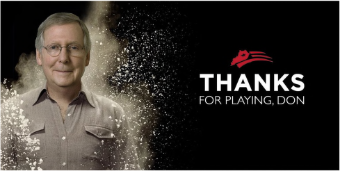
    
  

4. In 
Caperton v. Massey,
 Justice Kennedy's majority opinion held that due process requires recusal when the facts present a "serious, objective risk of actual bias." The Roberts and Scalia dissents argued that the standard adopted by the majority is meaningless and unworkable, and would erode public confidence in the judiciary. Which argument do you find more compelling? 

Further Reading: 

- 
Charles Gardner Geyh, 
Judicial Disqualification: An Analysis of Federal Law,
 Federal 

Judicial Center (2010) 

- 
John P. Frank, 
Disqualification of Judges,
 56 Yale L.J. 605 (1947) 

- 
Hearing on Examining the State of Judicial Recusals after Caperton v. A.T. Massey, Hearing before the Subcomm. on Courts and Competition Policy of the H. Comm, on the 

Judiciary, 111th Cong. (2009) 

- 
Bruce A. Green, 
Fear of the Unknown: Judicial Ethics after Caperton,
 60 Syracuse L. 

Rev. 229 (2010) 
    

    
    
  

- 
Jeffrey W. Stempel, 
Playing Forty Questions: Responding to Justice Roberts' Concerns 

in Caperton and Some Tentative Answers About Operationalizing Judicial Recusal and 

Due Process
, 39 Southwestern L. Rev. 1 (2009) 

- 
Pamela S. Karlan, 
Electing Judges, Judging Elections, and the Lessons
 of Caperton, 

123 Harv. L. Rev. 80 (2009) 

- 
Kenneth L. Karst, 
Caperton's Amici,
 33 Seattle U. L. Rev. 633 (2010) 

- 
Ronald D. Rotunda, 
Judicial Disqualification in the Aftermath of Caperton v. A.T. Massey 

Coal Co.,
 60 Syracuse L. Rev. 247 (2010) 

- 
Jed H. Shugerman, 
In Defense of Appearances: What Caperton
 v. 
Massey Should Have 

Said
, 59 DePaul L. Rev. 529 (2010) <h3 class="calibre28">Judicial Misconduct </h3>

Order, now my court is in session, will you please stand? First, allow me to introduce myself, my name is Judge Hundredyears. Some people call me Judge Dread. Now, I have come here to whoop you, to try all you rudeboys for shooting black people. In my court only we talk, cause I'm vexed, and I am the rudeboy today
.
129 <h3 class="calibre28">Model Code of Judicial Conduct: Canon 2 </h3>

A judge shall perform the duties of judicial office impartially, competently, and diligently. <h3 class="calibre28">Model Rule 2.3: Bias, Prejudice, and Harassment </h3>

A. A judge shall perform the duties of judicial office, including administrative duties, without bias or prejudice. 

B. A judge shall not, in the performance of judicial duties, by words or conduct manifest bias or prejudice, or engage in harassment, including but not limited to bias, prejudice, or harassment based upon race, sex, gender, religion, national origin, ethnicity, disability, age, sexual orientation, marital status, socioeconomic status, or political affiliation, and shall not permit court staff, court officials, or others subject to the judge's direction and control to do so. 

C. A judge shall require lawyers in proceedings before the court to refrain from manifesting bias or prejudice, or engaging in harassment, based upon attributes including but not limited to race, sex, gender, religion, national origin, ethnicity, disability, age, sexual orientation, marital status, socioeconomic status, or political affiliation, against parties, witnesses, lawyers, or others. 

D. The restrictions of paragraphs (B) and (C) do not preclude judges or lawyers from making legitimate reference to the listed factors, or similar factors, when they are relevant to an issue in a proceeding. 

129 

Prince Buster (Cecil Bustamente Campbell / Muhammed Yusef Ali), 
Judge Dread
 (1967). 
    

    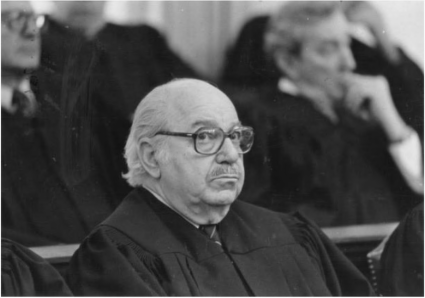
    
  

Judge Alvin D. Lichtenstein (1984) 

In re Inquiry Concerning Lichtenstein,
 685 P. 2d 204 (Colo. 1984) 

Summary: 
Burns shot and killed his wife when he learned she was planning to leave him, and pleaded guilty to second-degree murder. At the sentencing hearing, Judge Lichtenstein observed, among other things, that Burns's mental state was affected by "highly provoking acts on the part of the victim," and imposed a two-year work release sentence. The Commission on Judicial Discipline found misconduct and recommended a public reprimand. The Colorado Supreme Court rejected the recommendation and dismissed the complaint. 

PER CURIAM. 

Pursuant to Article VI, Section 23(3)(e) of the Colorado Constitution, the Commission on Judicial Discipline certified the record of these proceedings to this court and recommended that a public reprimand be issued to District Judge Alvin D. Lichtenstein because he violated Canon 2A of the Colorado Code of Judicial Conduct. Having reviewed the record of the proceedings, we conclude that the conduct of Judge Lichtenstein did not violate Canon 2A of the Code. We therefore reject the Commission's recommendation of a public reprimand and return the case to the Commission with directions to dismiss the complaint. 
    

    
    
  

On December 5, 1983, a formal complaint was filed with the Commission, alleging that on June 22, 1983, while serving as a district judge in the Denver District Court and presiding over a criminal action, Judge Lichtenstein made remarks during a sentencing hearing which "undermined public confidence in the integrity and impartiality of the judiciary" and "tended to bring the judiciary into disrepute" in violation of Canon 2A of the Code.
130
 The facts are not in dispute. Judge Lichtenstein was appointed a district judge of the Second Judicial District on January 4, 1978. In November 1980 he was elected to serve a six year term and is currently serving that term of office. During the events in question he was assigned to the criminal division of the Denver District Court. As part of his judicial responsibilities, Judge Lichtenstein heard various motions in the case of 
People v. Clarence Burns,
 in which Burns was charged with the first degree murder of his wife on August 15,1982. During the pendency of the case, the defendant filed a motion to suppress a confession, which was heard by Judge Lichtenstein on April 4, 1983. Various witnesses testified at the suppression hearing, including a clinical psychologist who described the defendant's condition on August 15, the day of the shooting, as one of severe and suicidal depression resulting from the fact that he and his wife had separated earlier in the month. The judge granted the motion, ruling that the defendant's state of depression preexisted and continued after his arrest and "caused a cognitive impairment which prevented the Defendant from understanding his 
Miranda
 rights and from intelligently waiving them." Thereafter, a plea agreement was reached between the defendant and the district attorney's office and, on May 2, 1983, the defendant entered a plea of guilty to second degree murder in exchange for a dismissal of the first degree murder charge. The defendant's guilty plea was accepted, and the case was continued for a sentencing hearing on June 22, 1983. 

During the sentencing hearing the judge received the stipulated testimony of one witness, considered the testimony of five additional witnesses, reviewed the videotaped deposition of the defendant's and victim's fifteen-year-old son, and considered the statements of counsel. Judge Lichtenstein began his remarks by stating that he had thoroughly reviewed the presentence report and had considered the matters presented by both sides during the sentencing hearing. Noting that Colorado case law required him to state on the record the reasons for the imposition of a sentence, the judge proceeded to describe the various degrees of homicide, the presumptive sentence of eight to twelve years for second degree murder, the statutory provision authorizing a sentence outside the presumptive range for extraordinary mitigating or aggravating circumstances, and concluded that extraordinary mitigating circumstances existed in this case. After stating that he was incorporating the specific findings of fact which he had previously made in ruling on the defendant's motion to suppress, the judge found that the defendant's capacity to appreciate the wrongfulness of his conduct was significantly impaired by a state of severe depression arising from his inability to understand why his wife had left him. 

130 

After the formal complaint was filed and during the preliminary investigation of this matter by the Commission, other complaints were filed alleging that Judge Lichtenstein exhibited a bias in favor of criminal defendants, particularly those who allegedly committed crimes against women, and that he had a bias against women. These charges were investigated by the Commission and found to be without substance or merit. We therefore limit our consideration to the sentencing remarks made by Judge Lichtenstein. 

The judge then made the following remarks which formed the basis of the formal complaint filed against him: 

The Court finds that this mental state, his mental and emotional condition, combined with the sudden heat of passion caused by a series of highly provoking acts on the part of the victim of leaving him without any warning; in fact, based on the testimony that the Court has heard, in a sense deceiving him as to her intentions by being extremely loving and caring up to and through the morning that she left the family home with the full intention of obtaining a divorce and proceeding with a separation from him without even giving him any knowledge of her whereabouts or that of their son, the Court finds that this affected the Defendant sufficiently so that it excited an irresistible passion as it would in any reasonable person under the circumstances and, consequently, would warrant a sentence under the extraordinary mitigating terms of the statute. 

The judge imposed a sentence of four years plus one year of parole, suspended the sentence, and ordered the defendant to undergo supervision by the Probation Department under various conditions including a two-year work release sentence to the county jail and the successful completion of a program of psychotherapy.
131
 The sentencing comments of the judge and the four-year suspended sentence generated extensive publicity. The formal complaint was thereafter filed with the Commission. 

The Commission found that Judge Lichtenstein's sentencing remarks "did not convey his intended meaning, and, as a direct result, the public questioned his impartiality on the bench and his ability and willingness to faithfully adhere to the law." The Commission concluded that, although not constituting willful misconduct, the judge's remarks nonetheless violated Canon 2A by bringing the judiciary into disrepute and undermining public confidence in the integrity and impartiality of the judiciary. The Commission, with three members dissenting, recommended a public reprimand. 

Because we have not previously addressed the matter of judicial discipline under Article VI, Section 23 of the Colorado Constitution, we take this occasion to delineate the constitutional basis of our responsibility in this matter. Article VI, Section 23(3), which became effective on July 1, 1983, states in pertinent part: 

131 

After the sentencing hearing, the judge on June 28, 1983, 
sua sponte
, vacated the suspended sentence and imposed a sentence of four years imprisonment plus one year of parole. Thereafter, the defendant and the district attorney filed original proceedings in this court directed to the June 22 and June 28 sentences. The defendant requested that the sentence of June 28 be vacated and that the original sentence of June 22 be reinstated. The district attorney, on the other hand, requested that both sentences be vacated and that the district judge be directed to impose a sentence within the aggravated range or at least a sentence within the presumptive range for second degree murder. We held that the sentence of June 22 was an illegal sentence and remanded the case for resentencing. 

(d) A justice or judge of any court of record of this state, in accordance with the procedure set forth in this subsection (3), may be removed or disciplined for willful misconduct in office, willful or persistent failure to perform his duties, intemperance, or violation of any canon of the Colorado code of judicial conduct, or he may be retired for disability interfering with the performance of his duties which is, or is likely to become, of a permanent character. 

(e) The commission may, after such investigation as it deems necessary, order informal remedial action; order a formal hearing to be held before it concerning the removal, retirement, suspension, censure, reprimand, or other discipline of a justice or a judge; or request the supreme court to appoint three special masters, who shall be justices or judges of courts of record, to hear and take evidence in any such matter and to report thereon to the commission. After a formal hearing or after considering the record and report of the masters, if the commission finds good cause therefor, it may take informal remedial action, or it may recommend to the supreme court the removal, retirement, suspension, censure, reprimand, or discipline, as the case may be, of the justice or judge. The commission may also recommend that the costs of its investigation and hearing be assessed against such justice or judge. 

(f) Following receipt of a recommendation from the commission, the supreme court shall review the record of the proceedings on the law and facts and in its discretion may permit the introduction of additional evidence and shall order removal, retirement, suspension, censure, reprimand, or discipline, as it finds just and proper, or wholly reject the recommendation. Upon an order for retirement, the justice or judge shall thereby be retired with the same rights and privileges as if he retired pursuant to statute. Upon an order for removal, the justice or judge shall thereby be removed from office, and his salary shall cease from the date of such order. On the entry of an order for retirement or for removal of a judge, his office shall be deemed vacant. 

(g) Prior to the filing of a recommendation to the supreme court by the commission against any justice or judge, all papers filed with and proceedings before the commission on judicial discipline or masters appointed by the supreme court, pursuant to this subsection (3), shall be confidential, and the filing of papers with and the giving of testimony before the commission or the masters shall be privileged; but no other publication of such papers or proceedings shall be privileged in any action for defamation; except that the record filed by the commission in the supreme court continues privileged and a writing which was privileged prior to its filing with the commission or the masters does not lose such privilege by such filing. 

Canon 2A of the Code states that "a judge should respect and comply with the law and should conduct himself at all times in a manner that promotes public confidence in the integrity and impartiality of the judiciary." This canon includes within its scope statements made by a judge 

during judicial proceedings. Judicial misconduct creating the need for discipline may thus arise from the same source as judicial conduct that is within the scope of appellate review. The former seeks to prevent potential prejudice to the judicial system itself, while the latter seeks to correct erroneous legal rulings prejudicial to a particular party. 

The question of whether Judge Lichtenstein's remarks were violative of Canon 2A must be evaluated in the context of the entire sentencing hearing. Section 18-1-105(7), which was applicable to the sentencing hearing in issue, requires a judge in imposing a sentence outside the presumptive range to "make specific findings on the record of the case, detailing the specific extraordinary circumstances which constitute the reasons for varying from the presumptive sentence." Judge Lichtenstein's remarks were made in an effort to place on record the extraordinary mitigating circumstances that he believed justified a sentence below the presumptive sentence of eight to twelve years applicable to second degree murder. The judge was attempting to describe how the victim's conduct, as perceived and interpreted by the defendant, brought about an emotional state in the defendant similar to the "irresistible passion" required for voluntary manslaughter. Although the sentencing comments contain some phraseology which, when read in isolation, might have offended the sensibilities of others, the full context of the sentencing hearing indicates that the choice of words was no more than an awkwardly executed effort to place on record the confused and highly emotional state of the defendant at the time of the killing, which, in the judge's opinion, constituted a mitigating circumstance justifying a sentence below the presumptive range. The judge's comments were not intended to be disrespectful of the law, the victim, or anyone else; nor do they reasonably lend themselves to such a connotation in the full context of the hearing. We thus conclude that the judge's remarks were not such as to bring the judiciary into disrepute or to undermine public confidence in the integrity or impartiality of the judicial system within the intendment of Canon 2A. 

The recommendation of the Commission for a public reprimand is rejected and the case is returned to the Commission with directions to dismiss the formal complaint. 

Questions: 

1. On August 15, 1982, Clarence Burns shot and killed his estranged wife Patricia Ann Burns. Burns saw Patricia Ann's car parked near her parents' house, and climbed into the trunk. Eventually, she drove their son Darren to her new apartment. When they arrived, Burns emerged from the trunk and followed them into the apartment. An argument ensued, and Burns shot Patricia Ann five times in the face, killing her. Lichtenstein's comments provoked considerable outrage and were widely reported, including in the 
New York Times
. 
Burns was eventually sentenced to 10 years in prison, and served 6. You can watch a short video about the case 
here
. 
After the misconduct investigation, Lichtenstein requested and received a transfer to civil court. However, he continued to hear criminal cases on occasion, and made some other 
controversial decisions
. 
In 2000, the Colorado Criminal Defense Bar established the 
Alvin D. 

Lichtenstein Award
 
"for remarkable accomplishments over a lifetime of distinguished service." 

2. Was the objection to Lichtenstein's conduct the sentence he imposed, his explanation of the sentence, or both? Should judges be censured for imposing lenient sentences? 

3. The Colorado Supreme Court rejected the Commission's recommendation to reprimand Lichtenstein. Do you agree with its decision? Why or why not? 

